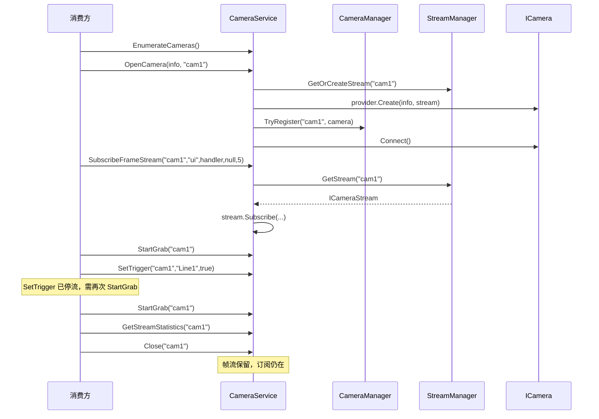

# ICameraService门面

<cite>
**本文引用的文件**
- [Junevy.EasyCamera.Core/Common/ICameraService.cs](file://Junevy.EasyCamera.Core/Common/ICameraService.cs)
- [Junevy.EasyCamera/Common/CameraService.cs](file://Junevy.EasyCamera/Common/CameraService.cs)
</cite>

## 目录
1. [接口定位](#接口定位)
2. [成员清单](#成员清单)
3. [cameraKey 语义](#camerakey-语义)
4. [生命周期语义](#生命周期语义)
5. [链路探测与统计](#链路探测与统计)
6. [典型调用序列](#典型调用序列)
7. [错误约定](#错误约定)

## 接口定位

`ICameraService` 是消费方的唯一主入口（定义在 `Junevy.EasyCamera.Core/Common/ICameraService.cs`，实现 `Junevy.EasyCamera/Common/CameraService.cs`）。它把"厂商差异 + 相机实例注册表 + 帧流表"三件事收敛成按 `cameraKey` 寻址的扁平 API：消费方不需要知道相机品牌，也不需要自己持有 `ICamera` 实例。

实现类构造签名为 `CameraService(ICameraProvider provider, ICameraManager cameraManager, IStreamManager streamManager, IStreamOptions streamOptions = null)`；`streamOptions` 为 `null` 时内部创建默认 `StreamOptions`。

`ICameraService` 不继承 `IDisposable`——相机与帧流的释放由注入的 `ICameraManager` / `IStreamManager` 负责（容器或 `EasyCameraHost` 负责它们的生命周期）。

**章节来源**
- [Junevy.EasyCamera.Core/Common/ICameraService.cs](file://Junevy.EasyCamera.Core/Common/ICameraService.cs)
- [Junevy.EasyCamera/Common/CameraService.cs](file://Junevy.EasyCamera/Common/CameraService.cs)

## 成员清单

共 22 个成员（`SetParam` 的 4 个重载各计一次；`docs/代码审查报告-2026-10-06.md` 里写的"25 个"是误数）。

| 成员 | 返回 | 说明 |
| --- | --- | --- |
| `EnumerateCameras(CameraInterfaceType type = CameraInterfaceType.All)` | `IEnumerable<ICameraInfo>` | 默认枚举全部接口类型 |
| `OpenCamera(ICameraInfo info, string cameraKey)` | `CameraResult` | 注册 + 连接 |
| `SubscribeFrameStream(cameraKey, subscriberKey, Func<string, IFrame, Task> processFrame, Action<Exception> whenException = null, int capacity = 0)` | `bool` | `capacity <= 0` 回落 `IStreamOptions.StreamCapacity` |
| `UnsubscribeFrameStream(cameraKey, subscriberKey)` | `bool` | 找不到流或 key 为空均返回 `false` |
| `StartGrab(cameraKey)` | `CameraResult` | 幂等 |
| `StopGrab(cameraKey)` | `CameraResult` | 幂等 |
| `Close(cameraKey)` | `CameraResult` | 释放相机，保留帧流 |
| `GetSerialNumber(cameraKey)` | `string` | 未找到返回空字符串 |
| `SetParam(cameraKey, paramName, value)` ×4 | `CameraResult` | `string` / `int` / `bool` / `float` 重载 |
| `SetEnumParam(cameraKey, paramName, value)` | `CameraResult` | 值为枚举符号名 |
| `ExecuteCommand(cameraKey, command)` | `CameraResult` | 命令名 |
| `SetTrigger(cameraKey, triggerSource, enableTrigger)` | `CameraResult` | 会先停流 |
| `GetParam<T>(cameraKey, paramName)` | `T` | 薄封装，失败返回 `default(T)` |
| `TryGetParam<T>(cameraKey, paramName, out T value)` | `bool` | 推荐使用 |
| `GetEnumParam(cameraKey, paramName)` | `string` | 薄封装，失败返回空串 |
| `TryGetEnumParam(cameraKey, paramName, out string value)` | `bool` | 推荐使用 |
| `IsSerialConnected(serial)` | `bool` | 遍历 `ICameraManager.Snapshot()` 按序列号匹配，任意 key 命中即 `true` |
| `ProbeCameraLinkStatus(info, CancellationToken cancellationToken = default)` | `CameraLinkStatus` | 见下文 |
| `GetStreamStatistics(cameraKey)` | `FrameStreamStatistics` | 相机未打开/从未订阅/流管理器已释放时返回 `FrameStreamStatistics.Empty` |
| `event CameraDisconnected` | `EventHandler<CameraDisconnectedEventArgs>` | 1.2.0 新增。相机实现 `IConnectionMonitor` 时由门面转发，`CameraKey` 为掉线相机的操作 Key；线程池线程触发；订阅者异常被吞掉 |

参数与命令类成员**不**持有 per-key 锁（只有生命周期与取流类成员持锁），它们只做"查注册表 → 判 `IsConnected` → 转发"。查不到或未连接时统一返回 `CameraResult.Fail(-1, "Camera not open or found")`。

**章节来源**
- [Junevy.EasyCamera.Core/Common/ICameraService.cs](file://Junevy.EasyCamera.Core/Common/ICameraService.cs)
- [Junevy.EasyCamera/Common/CameraService.cs](file://Junevy.EasyCamera/Common/CameraService.cs)

## cameraKey 语义

`cameraKey` 是**相机与帧流的共同主键**：

- `OpenCamera` 用它 `ICameraManager.TryRegister`，同时用它 `IStreamManager.GetOrCreateStream` 创建帧流。
- 因此 `SubscribeFrameStream` / `UnsubscribeFrameStream` / `StartGrab` / `Close` / `SetParam` 等必须使用与 `OpenCamera` 完全相同的 `cameraKey`。
- `StreamManager` 以 `cameraKey` 为键缓存 `CameraStream` 实例（`GetOrAdd`），同 key 重复打开复用同一条流。

> [!warning] `ICameraInfo` 与 `cameraKey` 是两回事：`ICameraInfo` 描述"物理设备是什么"，`cameraKey` 描述"本进程用哪个名字占用它"。同一台物理相机可用不同 `cameraKey` 重复打开，因此库无法靠 `cameraKey` 去重物理设备——要判断"本进程是否已持有这台物理相机"，用 `IsSerialConnected(serial)` 或 `ProbeCameraLinkStatus` 返回的 `Connected`（`Occupied` 表示被**其它**客户端独占，不是本进程自己持有），见 [[公共契约/数据模型与枚举]]。

**章节来源**
- [Junevy.EasyCamera/Common/CameraService.cs](file://Junevy.EasyCamera/Common/CameraService.cs)
- [Junevy.EasyCamera/Common/StreamManager.cs](file://Junevy.EasyCamera/Common/StreamManager.cs)

## 生命周期语义

`OpenCamera` **不幂等**：若注册表中已有该 key 且实例 `IsConnected`，直接返回 `CameraResult.Fail(-1, "The camera has been opened")`。内部竞争路径做了完整清理：新建实例若 `TryRegister` 失败（其它服务实例抢先注册）则 `Close`+`Dispose` 候选实例并改用已注册实例；`Connect()` 失败且本次是本方法注册的实例，则 `cameraManager.Remove(cameraKey)` 让后续重试不被残留实例阻塞。

`StartGrab` 幂等：已在取流直接返回 `CameraResult.Success(0)`；异常路径会先 `SafeStopGrab` 补偿再返回 `Fail(-2, e.Message)`。`StopGrab` 也幂等，且调用后额外校验 `camera.IsGrabbing`：若仍为取流状态则返回 `Fail(-1, camera.LastError ?? "Camera stop grabbing failed")`，不伪装成已停止。1.2.0 起 `StopGrab` 对"已注册但未连接（掉线）"的相机同样交给相机层处理（相机层幂等，掉线后返回成功），仅"未注册的 key"仍返回 `Fail(-1, "Camera not open or found")`。

**掉线与重连（1.2.0）**：掉线相机保持注册（不可用）。`OpenCamera` 对已注册的 key 是**重连**：`camera.IsConnected` 为 false 时直接 `Connect()`，相机内部释放旧句柄并由 `deviceFactory` 重建；沿用注册时的设备信息（设备 IP 变化时应先 `Close(key)` 再用新 `info` 打开）。`Close(key)` 对掉线相机同样走 `CameraManager.Remove`，成功释放（关闭过程中掉线同样按释放成功处理；释放后再次 `Close` 幂等成功）。

`SetTrigger` 语义链：停流 → 校验确实停了 → `SetEnumParam("TriggerMode", "On"/"Off")` → `SetEnumParam("TriggerSource", triggerSource)`。**设置成功不代表在取流**，调用方必须重新 `StartGrab`。

`Close` 只移除并释放相机，**不触碰帧流**——重开同名 key 后原订阅自动继续生效。返回 `CameraResult` 的映射来自 `ICameraManager.Remove`：`Removed → Success(0)`、`NotFound → Fail(-1, "Camera not open or found")`、`ReleaseFailed → Fail(-1, "The camera has been removed from the registry and released, but the release reported errors: {LastError}")`（1.1.2 起的文案，明确相机已不在注册表中）。注意"释放失败"也仍会调用 `Dispose`，以保证资源不被拖延。

**章节来源**
- [Junevy.EasyCamera/Common/CameraService.cs](file://Junevy.EasyCamera/Common/CameraService.cs)
- [Junevy.EasyCamera/Common/CameraManager.cs](file://Junevy.EasyCamera/Common/CameraManager.cs)

## 链路探测与统计

`ProbeCameraLinkStatus` 的判定顺序（不可交换）：

1. `info == null` 或 `SerialNumber` 为空 → `Unknown`。
2. `IsSerialConnected(info.SerialNumber)` → `Connected`。必须先判，因为独占模式下本进程自己就会让可达性检查失败。
3. 注入的 provider 是 `ILinkStatusProbeProvider` 且**确有厂商能探测这台相机** → 调它做非侵入探测，**返回值（含厂商如实报告的 `Unknown`）即为最终结论**；探测抛异常（除 `OperationCanceledException`）一律当"无此能力"，继续回退。
   > [!note] 聚合层的 `Unknown` 为什么回退（1.1.2 起）：DI/Builder 注入的恒为 `AggregateCameraProvider`，它实现 `ILinkStatusProbeProvider`；无厂商具备能力时它返回 `Unknown`，能力厂商判定不了时也返回 `Unknown`。`TryProbeByVendor` 对两者统一返回 `null`，走第 4 步的侵入式回退（`Unknown` 不再被当作终态）。该调用同处 `try`，厂商抛异常同样降级回退。1.1.2 之前 `Unknown` 被当终态，生产组合下回退不可达；见 [[公共契约/能力接口与扩展点]]，记录见 [[变更与决策/审查与修复记录]]。
4. 回退侵入式探测（provider 未实现能力、聚合层无人能探测、厂商探测抛异常、或厂商返回 `Unknown`（1.1.2 起视为回退信号）时到达）：以临时 key 前缀 `"probe:"` + 序列号打开相机，成功即 `Idle` 并立即 `Close`、失败按 `Occupied` 保守表达；`finally` 中必定 `cameraManager.Remove(probeKey)` 与 `streamManager.RemoveStream(probeKey)`，探测连接不留在注册表。

> [!warning] 回退路径会真的打开/关闭相机，且临时占用 per-key 锁。`ProbeCameraLinkStatus` 契约注释要求"在后台线程调用"，不要放在 UI 线程轮询。`CancellationToken` 只在步骤之间检查，厂商调用本身不可中途取消。

**章节来源**
- [Junevy.EasyCamera.Core/Common/ICameraService.cs](file://Junevy.EasyCamera.Core/Common/ICameraService.cs)
- [Junevy.EasyCamera/Common/CameraService.cs](file://Junevy.EasyCamera/Common/CameraService.cs)

## 典型调用序列

**图表来源**
- [Junevy.EasyCamera/Common/CameraService.cs](file://Junevy.EasyCamera/Common/CameraService.cs)
- [Junevy.EasyCamera.Core/Common/ICameraService.cs](file://Junevy.EasyCamera.Core/Common/ICameraService.cs)

## 错误约定

- 失败一律通过 `CameraResult` 表达，**异常不得穿透**给消费方：`OpenCamera`/`StartGrab` 在 `CameraService` 内 `try/catch` 翻成 `Fail(-2, e.Message)`；参数/命令路径（`SetParam`、`ExecuteCommand`、`TryGetParam` 等）门面层**没有** `try/catch`，依赖厂商相机的守卫（海康 `ExecuteGuarded`/`TryExecuteGuarded`）保证不抛——新厂商若漏了守卫，异常会直接穿到消费方。
- `SubscribeFrameStream` 用 `bool` 而非 `CameraResult`：仅捕获 `ObjectDisposedException`（流随服务释放的竞态）并返回 `false`，其余参数非法（`processFrame` 为 `null`、key 为空、无此流）也返回 `false`。
- `TryGetParam` / `TryGetEnumParam` 用 `bool` + `out` 表达"值恰为 default"与"读取失败"的区别，详见 [[公共契约/参数访问与错误通道]]。
- 并发约束（per-key 串行锁覆盖范围）见 [[并发与资源/并发纪律]]。