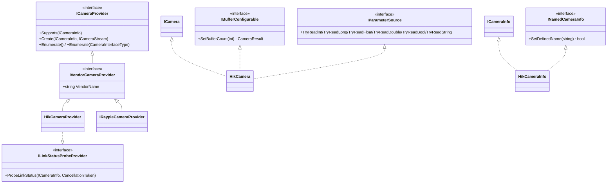

# 能力接口与扩展点

<cite>
**本文引用的文件**
- [Junevy.EasyCamera.Core/Abstractions/ICameraProvider.cs](file://Junevy.EasyCamera.Core/Abstractions/ICameraProvider.cs)
- [Junevy.EasyCamera.Core/Abstractions/ILinkStatusProbeProvider.cs](file://Junevy.EasyCamera.Core/Abstractions/ILinkStatusProbeProvider.cs)
- [Junevy.EasyCamera.Core/Abstractions/IBufferConfigurable.cs](file://Junevy.EasyCamera.Core/Abstractions/IBufferConfigurable.cs)
- [Junevy.EasyCamera.Core/Abstractions/INamedCameraInfo.cs](file://Junevy.EasyCamera.Core/Abstractions/INamedCameraInfo.cs)
- [Junevy.EasyCamera.Core/Abstractions/IParameterSource.cs](file://Junevy.EasyCamera.Core/Abstractions/IParameterSource.cs)
- [Junevy.EasyCamera.Core/Abstractions/IVendorCameraProvider.cs](file://Junevy.EasyCamera.Core/Abstractions/IVendorCameraProvider.cs)
- [Junevy.EasyCamera.Core/Abstractions/ILineScanCamera.cs](file://Junevy.EasyCamera.Core/Abstractions/ILineScanCamera.cs)
- [Junevy.EasyCamera/Common/AggregateCameraProvider.cs](file://Junevy.EasyCamera/Common/AggregateCameraProvider.cs)
- [Junevy.EasyCamera/Common/IProbeAvailability.cs](file://Junevy.EasyCamera/Common/IProbeAvailability.cs)
- [Junevy.EasyCamera/Common/CameraService.cs](file://Junevy.EasyCamera/Common/CameraService.cs)
</cite>

## 目录
1. [接口隔离原则](#接口隔离原则)
2. [ILinkStatusProbeProvider](#ilinkstatusprobeprovider)
3. [IBufferConfigurable](#ibufferconfigurable)
4. [INamedCameraInfo](#inamedcamerainfo)
5. [IParameterSource 与泛型分发](#iparametersource-与泛型分发)
6. [IVendorCameraProvider 与聚合](#ivendorcameraprovider-与聚合)
7. [扩展关系图](#扩展关系图)
8. [新增厂商检查表](#新增厂商检查表)

## 接口隔离原则

`ICameraProvider` 只保留**所有厂商都必须支持**的最小集合：`Supports(ICameraInfo)`、`Create(ICameraInfo, ICameraStream)`、`Enumerate()`、`Enumerate(CameraInterfaceType)`。厂商独有能力一律用独立接口表达——这是 1.1.0 确立的纪律，也是本库接口演进安全的前提。

> [!danger] 历史教训：`ProbeLinkStatus` 曾被放进 `ICameraProvider`。net48 不支持默认接口实现，于是 1.0.0 → 1.0.1 变成**破坏性变更**，且所有实现者（含第三方品牌）都被迫修改。新增能力必须新增接口，而不是往基础接口加成员。

已拆分出的能力接口：

| 接口 | 语义 | 海康 | IRayple |
| --- | --- | --- | --- |
| `ILinkStatusProbeProvider` | 非侵入链路探测 | `HikCameraProvider` 实现 | 未实现 |
| `IBufferConfigurable` | 采集端缓冲配置 | `HikCamera` 显式实现 | `IRaypleCamera` 显式实现 |
| `INamedCameraInfo` | 本地改名 | `HikCameraInfo` 显式实现 | `IRaypleCameraInfo` 显式实现 |
| `IParameterSource` | 取参原语 | `HikCamera` 显式实现 | `IRaypleCamera` 显式实现 |
| `ILineScanCamera` | 线阵标记 | 未实现 | 未实现 |

**章节来源**
- [Junevy.EasyCamera.Core/Abstractions/ICameraProvider.cs](file://Junevy.EasyCamera.Core/Abstractions/ICameraProvider.cs)
- [Junevy.EasyCamera/Vendors/HikVision/HikCameraProvider.cs](file://Junevy.EasyCamera/Vendors/HikVision/HikCameraProvider.cs)
- [Junevy.EasyCamera/Vendors/HikVision/HikCamera.cs](file://Junevy.EasyCamera/Vendors/HikVision/HikCamera.cs)

## ILinkStatusProbeProvider

`CameraLinkStatus ProbeLinkStatus(ICameraInfo info, CancellationToken cancellationToken = default)`——可选能力。海康 `HikCameraProvider` 实现它；未实现的厂商不会被要求实现，"没有任何厂商能探测该相机"时 `CameraService.ProbeCameraLinkStatus` 会回退到侵入式打开/关闭探测（打开失败按 `Occupied` 保守处理）；DI/`EasyCamera.Create` 经聚合层后同样成立（见下方 `IProbeAvailability`）。

两条实现约束：

- **不信任 `info` 携带的原生引用**。`ICameraInfo` 可能来自很早的枚举、可能已失效；实现方应自行重新枚举取新鲜设备信息。
- **异常不得抛给界面线程**。`CameraService` 只放行 `OperationCanceledException`，其余异常一律当"无此能力"并回退侵入式探测。

多厂商场景由 `AggregateCameraProvider` 自身实现 `ILinkStatusProbeProvider`：它只向同时满足 `vendor is ILinkStatusProbeProvider` 且 `vendor.Supports(info)` 的厂商转发；所有厂商都不支持（或 `info` 为 null）时返回 `CameraLinkStatus.Unknown`（返回类型是枚举，不是可空，也**不会**返回 `null`）。

> [!note] 聚合层如何向门面表达"无人能探测"（`IProbeAvailability`，2026-10-06 起）
> 门面在 DI/Builder 下持有的恒为 `AggregateCameraProvider`，它自身实现了 `ILinkStatusProbeProvider`，仅凭该接口无法区分"没有厂商能探测这台相机"与"厂商如实报告 `Unknown`"。两者的处置相反：前者应回退侵入式探测，后者是终态结论、不得回退。区分靠 **internal** 接口 `IProbeAvailability { bool CanProbe(ICameraInfo) }`：
> - 聚合层以**显式接口实现**提供（不进入公共 API 面），语义 = "存在同时满足 `vendor is ILinkStatusProbeProvider` 与 `vendor.Supports(info)` 的厂商"；与 `ProbeLinkStatus` 共用私有 `FindProbeProvider` 判据，二者不会分歧。
> - `CameraService.TryProbeByVendor` 在 `provider is IProbeAvailability a && !a.CanProbe(info)` 时返回 `null`（→ 侵入式 `ProbeByOpenClose`）；`CanProbe` 与探测调用同处 `try`，`Supports` 抛异常也降级为回退。
> - 能力厂商如实返回 `Unknown` → 仍为 `Unknown`，不打开相机；直接调用 `AggregateCameraProvider.ProbeLinkStatus` 的外部调用方仍只看到 `Unknown`。
> - 不改 `ILinkStatusProbeProvider`/`ICameraProvider`（net48 无默认接口实现），也不按具体类型嗅探。选型背景见 [[变更与决策/设计决策记录]] ADR-06，修复记录见 [[变更与决策/审查与修复记录]]。
>
> 回归测试：`CameraServiceProbeTests` 的 `Probe_Aggregate_*` 五项（聚合层组合：无能力回退得 `Idle` / 打开失败得 `Occupied` / 能力厂商 `Unknown` 不回退 / 仅不匹配厂商具备能力时回退 / 能力厂商抛异常仍回退）与 `AggregateCameraProviderTests.CanProbe_RequiresCapableVendorThatSupportsTheInfo`。

五态含义与 `Unknown` 默认值约束见 [[公共契约/数据模型与枚举]]。

**章节来源**
- [Junevy.EasyCamera.Core/Abstractions/ILinkStatusProbeProvider.cs](file://Junevy.EasyCamera.Core/Abstractions/ILinkStatusProbeProvider.cs)
- [Junevy.EasyCamera/Common/AggregateCameraProvider.cs](file://Junevy.EasyCamera/Common/AggregateCameraProvider.cs)
- [Junevy.EasyCamera/Vendors/HikVision/HikCameraProvider.cs](file://Junevy.EasyCamera/Vendors/HikVision/HikCameraProvider.cs)

## IBufferConfigurable

`CameraResult SetBufferCount(int count)` 配置的是**相机内部采集缓冲**（SDK 侧），不是帧流队列——两者不要混淆，帧流队列容量是 `IStreamOptions.StreamCapacity`，见 [[并发与资源/背压与丢帧统计]]。

调用方是 `HikCameraProvider` / `IRaypleCameraProvider`，形式为 `if (this.streamOptions.CameraBufferCapacity > 0 && camera is IBufferConfigurable configurable) configurable.SetBufferCount(...)`，因此：

- 相机**未实现**该接口时，`CameraBufferCapacity` 被**静默忽略**（无报错、无日志）。配置项文档已注明"未实现 `IBufferConfigurable` 的相机会忽略"。
- `count < 1` 返回 `CameraResult.Fail(-1, "The buffer count must be greater than zero")`；相机未打开时只记录配置，`Connect()` 成功后应用。
- 接口是**显式实现**（`CameraResult IBufferConfigurable.SetBufferCount(int)`），必须通过接口引用调用。

**章节来源**
- [Junevy.EasyCamera.Core/Abstractions/IBufferConfigurable.cs](file://Junevy.EasyCamera.Core/Abstractions/IBufferConfigurable.cs)
- [Junevy.EasyCamera/Vendors/HikVision/HikCameraProvider.cs](file://Junevy.EasyCamera/Vendors/HikVision/HikCameraProvider.cs)
- [Junevy.EasyCamera/Vendors/HikVision/HikCamera.cs](file://Junevy.EasyCamera/Vendors/HikVision/HikCamera.cs)

## INamedCameraInfo

`bool SetDefinedName(string name)` 是对 `ICameraInfo` 的能力扩展。**只更新本地副本，不下发设备**——设备上的用户名不受影响，重启后仍为设备原值。

`HikCameraInfo` 与 `IRaypleCameraInfo` 都以显式实现方式提供（`bool INamedCameraInfo.SetDefinedName(string name)`），消费方只能用 `if (cameraInfo is INamedCameraInfo named) named.SetDefinedName("工位A-顶视");` 形式调用。`ICameraInfo.UserDefinedName` 只是读取属性，改名能力不在基础接口上。

**章节来源**
- [Junevy.EasyCamera.Core/Abstractions/INamedCameraInfo.cs](file://Junevy.EasyCamera.Core/Abstractions/INamedCameraInfo.cs)
- [Junevy.EasyCamera/Vendors/HikVision/HikCameraInfo.cs](file://Junevy.EasyCamera/Vendors/HikVision/HikCameraInfo.cs)
- [Junevy.EasyCamera/Vendors/IRayple/IRaypleCameraInfo.cs](file://Junevy.EasyCamera/Vendors/IRayple/IRaypleCameraInfo.cs)

## IParameterSource 与泛型分发

`IParameterSource` 定义 6 个读取原语：`TryReadInt` / `TryReadLong` / `TryReadFloat` / `TryReadDouble` / `TryReadBool` / `TryReadString`，签名统一为 `bool TryReadXxx(string paramName, out T value)`。

设计意图：**厂商只实现原语，泛型分发由库统一**。`ICamera.TryGetParam<T>` / `ICameraService.TryGetParam<T>` 内部最终都走 `ParameterReader.TryRead<T>(IParameterSource source, string paramName, out T value)`，因此所有厂商的 `TryGetParam<T>` 行为完全一致（支持 int/long/float/double/bool/string，其它类型返回 `false`；厂商异常一律按失败处理；字符串 `null` 兜底为空串）。

海康的 `TryReadDouble` 由 `TryReadFloat` 结果提升而来（SDK 中没有独立的 double 参数节点）。细节与历史缺陷见 [[公共契约/参数访问与错误通道]]。

**章节来源**
- [Junevy.EasyCamera.Core/Abstractions/IParameterSource.cs](file://Junevy.EasyCamera.Core/Abstractions/IParameterSource.cs)
- [Junevy.EasyCamera.Core/Common/ParameterReader.cs](file://Junevy.EasyCamera.Core/Common/ParameterReader.cs)
- [Junevy.EasyCamera/Vendors/HikVision/HikCamera.cs](file://Junevy.EasyCamera/Vendors/HikVision/HikCamera.cs)

## IVendorCameraProvider 与聚合

`IVendorCameraProvider : ICameraProvider`，只加一个 `string VendorName`（海康返回 `"HikVision"`，IRayple 返回 `"iRAYPLE"`）。多厂商聚合场景用它标识厂商来源。

`AggregateCameraProvider : ICameraProvider, ILinkStatusProbeProvider`（另以显式实现提供 internal 的 `IProbeAvailability`）持有 `IReadOnlyList<IVendorCameraProvider> Vendors`：`Enumerate` 聚合所有厂商结果；`Supports` 任一厂商支持即为支持；`Create` 转发给支持该 `info` 的厂商；能力接口按"能力接口"探测转发，而不是把能力塞进 `ICameraProvider`。

DI 注册（`ServiceCollectionExtensions`）把每个厂商注册为**单例** `IVendorCameraProvider`；`AggregateCameraProvider` 则是多厂商场景的聚合入口。

**章节来源**
- [Junevy.EasyCamera.Core/Abstractions/IVendorCameraProvider.cs](file://Junevy.EasyCamera.Core/Abstractions/IVendorCameraProvider.cs)
- [Junevy.EasyCamera/Common/AggregateCameraProvider.cs](file://Junevy.EasyCamera/Common/AggregateCameraProvider.cs)
- [Junevy.EasyCamera/Extensions/ServiceCollectionExtensions.cs](file://Junevy.EasyCamera/Extensions/ServiceCollectionExtensions.cs)

## 扩展关系图

**图表来源**
- [Junevy.EasyCamera.Core/Abstractions/ICameraProvider.cs](file://Junevy.EasyCamera.Core/Abstractions/ICameraProvider.cs)
- [Junevy.EasyCamera.Core/Abstractions/ILinkStatusProbeProvider.cs](file://Junevy.EasyCamera.Core/Abstractions/ILinkStatusProbeProvider.cs)
- [Junevy.EasyCamera.Core/Abstractions/IBufferConfigurable.cs](file://Junevy.EasyCamera.Core/Abstractions/IBufferConfigurable.cs)
- [Junevy.EasyCamera.Core/Abstractions/INamedCameraInfo.cs](file://Junevy.EasyCamera.Core/Abstractions/INamedCameraInfo.cs)
- [Junevy.EasyCamera/Vendors/HikVision/HikCameraProvider.cs](file://Junevy.EasyCamera/Vendors/HikVision/HikCameraProvider.cs)

## 新增厂商检查表

1. 新建 `XxxCameraInfo : ICameraInfo`（若支持改名再加 `, INamedCameraInfo` 显式实现）。
2. 新建 `XxxCamera : ICamera, IParameterSource, IBufferConfigurable`，遵守 [[并发与资源/并发纪律]]（`operationGate` + 单一状态枚举 + 失败回滚 + 回调排空）。
3. 新建 `XxxFrameWrapper : IFrame`，遵守 [[并发与资源/帧所有权与内存]]（构造时快照元数据、`AddRef`/`Dispose` 串行化）。
4. 新建 `XxxCameraProvider : IVendorCameraProvider`，实现 `VendorName`、`Supports`、`Create`、`Enumerate`×2；若支持非侵入探测再实现 `ILinkStatusProbeProvider`（不实现则门面对该品牌相机走侵入式 `probe:{serial}` 回退，会短暂 Open/Close，独占型相机需留意）。
5. 能力差异一律新增接口，**不要**修改 `ICameraProvider` / `ICamera` / `ICameraInfo` / `IFrame`（net48 无默认接口实现，改基础接口即破坏性变更）。
6. 帧包装与帧流接入方式参照 [[公共契约/ICamera与ICameraStream契约]]。