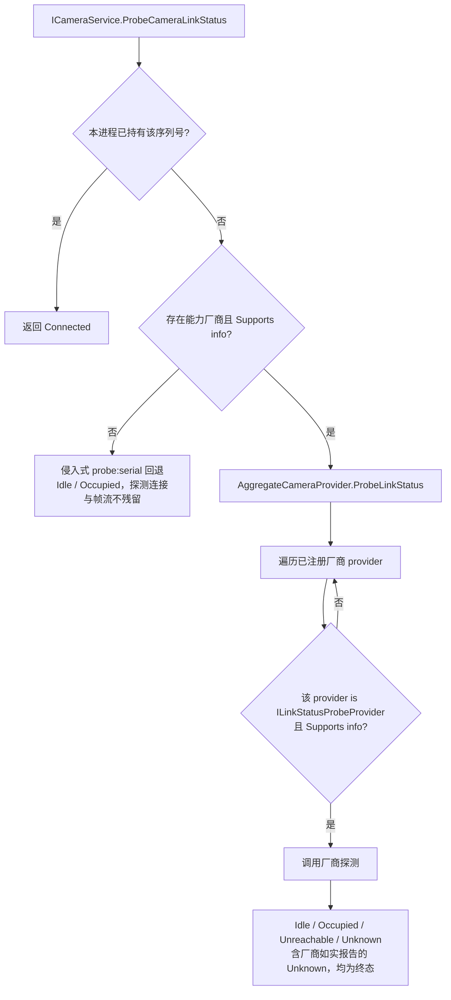

# 厂商能力实现指南

<cite>
**本文引用的文件**
- [Junevy.EasyCamera.Core/Abstractions/ILinkStatusProbeProvider.cs](file://Junevy.EasyCamera.Core/Abstractions/ILinkStatusProbeProvider.cs)
- [Junevy.EasyCamera.Core/Abstractions/IBufferConfigurable.cs](file://Junevy.EasyCamera.Core/Abstractions/IBufferConfigurable.cs)
- [Junevy.EasyCamera.Core/Abstractions/INamedCameraInfo.cs](file://Junevy.EasyCamera.Core/Abstractions/INamedCameraInfo.cs)
- [Junevy.EasyCamera.Core/Abstractions/IParameterSource.cs](file://Junevy.EasyCamera.Core/Abstractions/IParameterSource.cs)
- [Junevy.EasyCamera.Core/Abstractions/ICameraProvider.cs](file://Junevy.EasyCamera.Core/Abstractions/ICameraProvider.cs)
- [Junevy.EasyCamera.Core/Abstractions/IVendorCameraProvider.cs](file://Junevy.EasyCamera.Core/Abstractions/IVendorCameraProvider.cs)
- [Junevy.EasyCamera.Core/Abstractions/CameraLinkStatus.cs](file://Junevy.EasyCamera.Core/Abstractions/CameraLinkStatus.cs)
- [Junevy.EasyCamera.Core/Abstractions/IStreamOptions.cs](file://Junevy.EasyCamera.Core/Common/IStreamOptions.cs)
- [Junevy.EasyCamera.Core/Common/ParameterReader.cs](file://Junevy.EasyCamera.Core/Common/ParameterReader.cs)
- [Junevy.EasyCamera/Vendors/HikVision/HikCameraProvider.cs](file://Junevy.EasyCamera/Vendors/HikVision/HikCameraProvider.cs)
- [Junevy.EasyCamera/Vendors/HikVision/HikCamera.cs](file://Junevy.EasyCamera/Vendors/HikVision/HikCamera.cs)
- [Junevy.EasyCamera/Vendors/HikVision/HikCameraInfo.cs](file://Junevy.EasyCamera/Vendors/HikVision/HikCameraInfo.cs)
- [Junevy.EasyCamera/Common/AggregateCameraProvider.cs](file://Junevy.EasyCamera/Common/AggregateCameraProvider.cs)
- [AGENTS.md](file://AGENTS.md)
</cite>

## 目录
1. [接口隔离原则](#接口隔离原则)
2. [能力总览](#能力总览)
3. [ILinkStatusProbeProvider](#ilinkstatusprobeprovider)
4. [IBufferConfigurable](#ibufferconfigurable)
5. [INamedCameraInfo](#inamedcamerainfo)
6. [IParameterSource](#iparametersource)
7. [聚合层的能力探测分发](#聚合层的能力探测分发)

## 接口隔离原则

1.1.0 的核心设计决定：**厂商独有能力一律用独立接口表达，禁止加进基础接口**。原因很直接——`ICameraProvider` 每加一个成员，所有实现者（含第三方品牌）都被迫修改，是破坏性变更。`ILinkStatusProbeProvider` 就是这么从 `ICameraProvider` 迁出来的。

判断某项能力该放哪：

| 情形 | 归宿 |
| --- | --- |
| 所有厂商都必须支持 | 加进基础接口（但要有充分理由） |
| 只有部分厂商支持 | 新增独立能力接口 |
| 只是某个品牌的配置手段 | 该品牌私有成员，不要进公共契约 |

## 能力总览

| 接口 | 谁实现 | 不实现的后果 |
| --- | --- | --- |
| `ICameraProvider` | 所有厂商 provider（必需） | 无法枚举/创建 |
| `IVendorCameraProvider` | 所有厂商 provider | 多厂商聚合无法标识来源 |
| `ILinkStatusProbeProvider` | 海康 provider | 聚合层在无厂商具备能力时返回 `Unknown`，`CameraService` 把 `Unknown` 视为回退信号，**自动回退**侵入式 `probe:{serial}` 探测（会短暂 Open/Close，独占型相机需留意）；见 [[公共契约/能力接口与扩展点]] |
| `IBufferConfigurable` | 海康、华睿相机 | `IStreamOptions.CameraBufferCapacity` 被**静默忽略** |
| `INamedCameraInfo` | 海康、华睿 info | 无法在应用内给相机起本地别名 |
| `IParameterSource` | 海康、华睿相机 | `TryGetParam<T>` 无法走原语路径 |

## ILinkStatusProbeProvider

**什么时候实现**：厂商 SDK 提供**非侵入式**可达性查询（不打开设备就能问"在不在、能不能连"）时才实现。侵入式探测（真的 `Connect` 再 `Close`）不属于本接口——那由门面按回退策略处理。

**怎么实现**（海康 `HikCameraProvider.ProbeLinkStatus` 的四步）：

1. `info` 为 null 或 `info.SerialNumber` 为空 → 直接 `CameraLinkStatus.Unknown`。
2. 按 `info.InterfaceType` 缩小枚举范围；只有 `Unknown` 时才全量 `All`（显著降低单次探测成本）。
3. **重新枚举**，按序列号（`StringComparison.Ordinal`）匹配取新鲜 info；找不到 → `Unreachable`。
4. 调厂商可达性查询（海康 `DeviceEnumerator.IsDeviceAccessible(fresh.Native, DeviceAccessMode.AccessExclusive)`）：`true` → `Idle`，`false` → `Occupied`。

**常见坑**：

- 不要信任传入的原生引用——调用方手里的 `IDeviceInfo` 可能已过期（掉线、重连、枚举缓存）。
- 查询模式要与实际打开的权限对齐。海康取独占模式，正是因为 `HikCamera` 调 `IDevice.Open()` 无参重载的默认权限也是独占；不一致就会把"可连接"误报成"被占用"。
- **无法判定时返回 `Unknown`，不要抛异常**。`CameraLinkStatus.Unknown = 0` 是刻意设计：未初始化/漏赋值的变量必须落在"未知"而不是"已连接"上。同理禁止把任何"确定状态"排到 0。
- 不要把"枚举中消失"归入 `Occupied`——界面会把"相机没插"显示成"被占用"。枚举不到就是 `Unreachable`。
- 本进程已独占持有的相机会被可达性查询报成 `Occupied`，因此门面 `ProbeCameraLinkStatus` 的"自持早退 `Connected`"必须先行。

## IBufferConfigurable

**什么时候实现**：厂商 SDK 支持配置**采集端**（相机内部）缓冲区数量时才实现。注意与订阅者侧容量区分：后者是 `IStreamOptions.StreamCapacity`，所有厂商都生效。

**怎么实现**：相机类**显式实现** `SetBufferCount(int count)`：

1. `count < 1` → `CameraResult.Fail(-1, "The buffer count must be greater than zero")`。
2. 记录 `bufferCount`。
3. 相机已打开 → 经统一守卫立即调厂商 API（海康 `grabber.SetImageNodeNum`）。
4. 未打开 → 只记录，延迟到 `Connect` 成功后应用（海康 `TryApplyBufferCount`）。
5. 延迟应用属**可选优化项**，失败不影响相机可用性，因此 `TryApplyBufferCount` 内部 `catch` 后不上抛。

provider 侧在 `Create` 时应用 `IStreamOptions.CameraBufferCapacity`（海康 `HikCameraProvider.Create`）：`if (streamOptions.CameraBufferCapacity > 0 && camera is IBufferConfigurable configurable) configurable.SetBufferCount(...)`。

**常见坑**：

- 不实现这个接口时 `CameraBufferCapacity` 是**静默失效**的——用户配了 10 帧却什么都没发生，没有任何提示。所以 provider 侧的 `is IBufferConfigurable` 判定不要省（它同时是"该配置对本厂商无效"的自然表达）。
- 别把采集缓冲和订阅队列容量混为一谈，两者解决的是不同层的丢帧。

## INamedCameraInfo

**什么时候实现**：允许应用内给相机起别名（UI 上按别名展示）时实现。

**怎么实现**：`SetDefinedName(string name)` 返回 `bool`，`name` 为空或长度 > 64 返回 false，否则写 `UserDefinedName` 的 setter。信息类的属性用 `get; private set;` 或构造只读 + 显式实现接口。

**常见坑**：

- **只改本地副本，不下发相机设备**。"名字改了所以设备上的名字也变了"是常见误解——设备侧命名要走相机参数接口（海康是 `DeviceUserID` 这样的参数节点）。接口 XML 注释里已明确写了这一点，实现时别越界。
- `INamedCameraInfo`/`IBufferConfigurable` 这类对象级能力要用**显式实现**，不要让 `SetDefinedName` 出现在具体类的公开面上。

## IParameterSource

**什么时候实现**：任何支持参数读写的厂商相机都要实现——它是 `TryGetParam<T>` 的唯一入口。

**怎么实现**：只写 6 个原语，泛型分发交给 `ParameterReader.TryRead<T>`：

| 原语 | 海康实现 | 备注 |
| --- | --- | --- |
| `TryReadInt` | `GetIntValue` → `TryConvertToInt64ToInt32` | SDK 是 64 位，须受检转换 |
| `TryReadLong` | `GetIntValue` → `CurValue` | |
| `TryReadFloat` | `GetFloatValue` | |
| `TryReadDouble` | 复用 `TryReadFloat` 提升 | 海康无独立 `double` 节点 |
| `TryReadBool` | `GetBoolValue` | |
| `TryReadString` | `GetStringValue` | 原生为 null 时由分发层兜底为空串 |

**常见坑**：

- **不要自己写 `typeof` 链**。1.1.0 之前海康与华睿各写了一遍，重复且语义不一致；现在统一由 `ParameterReader` 承担。新增厂商照抄原语即可。
- **`long`→`int` 必须受检转换**，越界按"取值失败"返回 false，禁止静默回绕（海康曾因此让越界值变成垃圾数）。
- 原语里失败一律 `false`，让 `TryGetParam<T>` 能区分"值恰为 default"与"获取失败"。`ParameterReader.TryRead` 内部还会兜住异常，一律按失败处理。
- 厂商没有某精度时**提升**，不要伪造精度（返回 `float` 冒充 `double` 之外的场景需在注释里写明）。
- 读路径也要经相机守卫——海康的 `TryGetParam<T>` 走 `TryExecuteGuarded`，否则与 `Dispose` 并发会读到已释放的原生参数对象。

## 聚合层的能力探测分发

`AggregateCameraProvider` 同时实现 `ICameraProvider` 与 `ILinkStatusProbeProvider`，用**能力探测**而非 `is` 硬编码来分发：

要点：

- 没有厂商具备能力时 `ProbeLinkStatus` 返回 `CameraLinkStatus.Unknown`，**不抛异常、不返回 null**——公共契约不变，外部直接调用方仍只看到 `Unknown`。门面（`CameraService.TryProbeByVendor`）把 `Unknown` 统一视为回退信号（1.1.2 起）：无论是"无人能探测"还是厂商"确实判定不了"，都回退侵入式探测。**因此厂商若能判定"被占用/不可达"，必须返回 `Occupied`/`Unreachable`，不要用 `Unknown` 表达；若本品牌没有可达性查询手段，不要实现 `ILinkStatusProbeProvider`，让门面直接回退。** 1.1.2 之前 `Unknown` 被当作终态，回退路径在生产环境不可达，见 [[变更与决策/审查与修复记录]]。
- `info` 为 null 直接返回 `Unknown`。
- 分发时同时检查 `vendor is ILinkStatusProbeProvider` 与 `vendor.Supports(info)`，命中第一个即返回；无命中时返回 `Unknown`。
- **新增能力接口不需要改动聚合层**：只要约定"缺能力时返回中性值"，`AggregateCameraProvider` 天然兼容。

**章节来源**
- [Junevy.EasyCamera.Core/Abstractions/ILinkStatusProbeProvider.cs](file://Junevy.EasyCamera.Core/Abstractions/ILinkStatusProbeProvider.cs)
- [Junevy.EasyCamera.Core/Abstractions/IBufferConfigurable.cs](file://Junevy.EasyCamera.Core/Abstractions/IBufferConfigurable.cs)
- [Junevy.EasyCamera.Core/Abstractions/INamedCameraInfo.cs](file://Junevy.EasyCamera.Core/Abstractions/INamedCameraInfo.cs)
- [Junevy.EasyCamera.Core/Abstractions/IParameterSource.cs](file://Junevy.EasyCamera.Core/Abstractions/IParameterSource.cs)
- [Junevy.EasyCamera.Core/Common/ParameterReader.cs](file://Junevy.EasyCamera.Core/Common/ParameterReader.cs)
- [Junevy.EasyCamera/Vendors/HikVision/HikCameraProvider.cs](file://Junevy.EasyCamera/Vendors/HikVision/HikCameraProvider.cs)
- [Junevy.EasyCamera/Common/AggregateCameraProvider.cs](file://Junevy.EasyCamera/Common/AggregateCameraProvider.cs)

**图表来源**
- [Junevy.EasyCamera/Common/AggregateCameraProvider.cs](file://Junevy.EasyCamera/Common/AggregateCameraProvider.cs)
- [Junevy.EasyCamera.Core/Abstractions/CameraLinkStatus.cs](file://Junevy.EasyCamera.Core/Abstractions/CameraLinkStatus.cs)
- [CHANGELOG.md](file://CHANGELOG.md)
