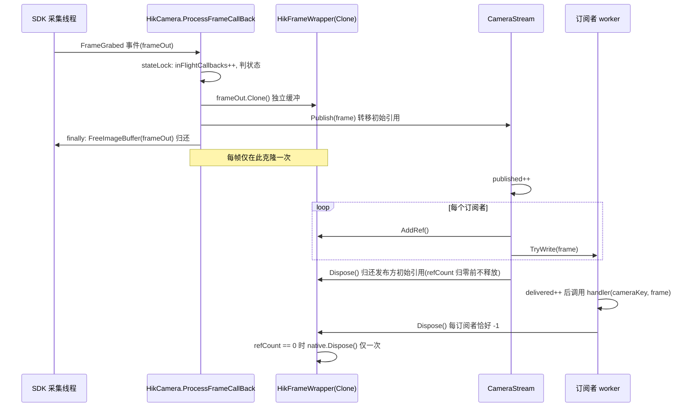

# 帧所有权与内存

<cite>
**本文引用的文件**
- [Junevy.EasyCamera/Vendors/HikVision/HikFrameWrapper.cs](file://Junevy.EasyCamera/Vendors/HikVision/HikFrameWrapper.cs)
- [Junevy.EasyCamera/Vendors/HikVision/HikCamera.cs](file://Junevy.EasyCamera/Vendors/HikVision/HikCamera.cs)
- [Junevy.EasyCamera/Common/CameraStream.cs](file://Junevy.EasyCamera/Common/CameraStream.cs)
- [Junevy.EasyCamera/Common/CameraStreamSubscriber.cs](file://Junevy.EasyCamera/Common/CameraStreamSubscriber.cs)
- [Junevy.EasyCamera.Core/Abstractions/IFrame.cs](file://Junevy.EasyCamera.Core/Abstractions/IFrame.cs)
- [Junevy.EasyCamera.Core/Abstractions/ICameraStream.cs](file://Junevy.EasyCamera.Core/Abstractions/ICameraStream.cs)
- [Junevy.EasyCamera/Vendors/IRayple/IRaypleFrameWrapper.cs](file://Junevy.EasyCamera/Vendors/IRayple/IRaypleFrameWrapper.cs)
</cite>

## 目录
1. [三条铁律](#三条铁律)
2. [一帧的完整流转](#一帧的完整流转)
3. [引用计数账本](#引用计数账本)
4. [HikFrameWrapper 的快照策略](#hikframewrapper-的快照策略)
5. [refLock 与并发访问](#reflock-与并发访问)
6. [释放后的行为约定](#释放后的行为约定)
7. [少分配纪律](#少分配纪律)

## 三条铁律

1. **SDK 回调帧必须在回调内归还**。海康 `frameOut` 的所有权在进入 `ProcessFrameCallBack` 时已由 SDK 交给本方法，必须在 `finally` 里用回调来源取流器（或进入时捕获的 `streamGrabber`）调用 `FreeImageBuffer` 归还——即使相机正在 Dispose，否则 SDK 内部缓冲队列会耗尽。
2. **发布给订阅者的帧必须是对 SDK 缓冲的独立克隆**。海康在回调里 `frameOut.Clone()` 一次，包成 `HikFrameWrapper`；订阅者拿到的内存与 SDK 内部队列无关，SDK 缓冲可以立刻归还。
3. **多订阅者通过引用计数浅共享同一克隆**。不逐订阅者深拷贝——订阅者是只读消费者；克隆缓冲由**最后一个归零的引用持有者**物理释放。

> [!danger] 铁律 3 的反面错误：把物理释放固定在"发布者"身上。这样发布者释放后，其余订阅者手里的浅引用全部悬空——读已释放的 5MB 非托管内存，表现是随机花屏或进程崩溃，且难以复现。

**章节来源**
- [Junevy.EasyCamera/Vendors/HikVision/HikCamera.cs](file://Junevy.EasyCamera/Vendors/HikVision/HikCamera.cs)
- [Junevy.EasyCamera/Common/CameraStream.cs](file://Junevy.EasyCamera/Common/CameraStream.cs)

## 一帧的完整流转



**图表来源**
- [Junevy.EasyCamera/Vendors/HikVision/HikCamera.cs](file://Junevy.EasyCamera/Vendors/HikVision/HikCamera.cs)
- [Junevy.EasyCamera/Vendors/HikVision/HikFrameWrapper.cs](file://Junevy.EasyCamera/Vendors/HikVision/HikFrameWrapper.cs)
- [Junevy.EasyCamera/Common/CameraStream.cs](file://Junevy.EasyCamera/Common/CameraStream.cs)

## 引用计数账本

`HikFrameWrapper.refCount` 初始为 `1`（发布方持有的初始引用）：

| 步骤 | 计数变化 | 执行者 |
| --- | --- | --- |
| 构造 `HikFrameWrapper(Clone)` | `= 1` | 相机回调 |
| 每个订阅者成功入队 | `+1`（`AddRef`） | `CameraStream.Publish` |
| 消费完成（handler 返回） | `-1`（`Dispose`） | 订阅 worker 的 `finally` |
| 背压淘汰（`itemDropped` 回调） | `-1` | `OnFrameDropped` |
| `TryWrite` 返回 `false`（已取消 / `RejectNewest`） | `-1` | `Publish` 归还刚取得的引用 |
| `AddRef` 抛 `ObjectDisposedException` | 无变化（**没有取得引用**，无需归还；该订阅者被跳过，也不计 `Dropped`） | `Publish` 的 `catch` 吞掉异常 |
| `AddRef` 成功但 `TryWrite` 意外抛异常 | `-1`（归还刚取得的引用，计 `Dropped`） | `Publish` 的 `catch` |
| `Publish` 结束 | `-1`（初始引用） | `Publish` 末尾 |
| 订阅 worker 结束时排空剩余帧 | `-1`（每帧） | `ConsumeAsync` 的 `finally` |
| 引用归零 | `native.Dispose()` 一次 | 最后一个持有者 |

> [!tip] 订阅者侧的动作很简单：`handler` 内若要转交给他人，先 `AddRef()`，用完 `Dispose()`；不想持有就别 `AddRef`，让它随 handler 返回自动释放。**不要**在 handler 里缓存帧对象给 UI 线程异步用而不 `AddRef`。

**章节来源**
- [Junevy.EasyCamera/Common/CameraStream.cs](file://Junevy.EasyCamera/Common/CameraStream.cs)
- [Junevy.EasyCamera/Vendors/HikVision/HikFrameWrapper.cs](file://Junevy.EasyCamera/Vendors/HikVision/HikFrameWrapper.cs)

## HikFrameWrapper 的快照策略

构造时从原生帧**一次性快照**固有元数据，此后全是字段读取：

```csharp
var image = nativeFrame.Image;
this.width = image.Width;
this.height = image.Height;
this.imageSize = image.ImageSize;
this.pixelType = ConvertFormat(image.PixelType);
this.stride = this.height > 0 ? (int)(this.imageSize / this.height) : 0;
```

好处有两个，都不是"性能优化"那么轻描淡写：

1. 免除每帧重复穿透 SDK 读取元数据的开销。
2. **消除 check-then-use 竞态**。若 `Width` 每次现读，就出现"先判 `disposed == 0`、再读原生内存"的窗口，最后一次 `Dispose` 可能在两步之间发生 → 读已释放内存。快照让 `Width`/`Height`/`Stride`/`PixelType`/`ImageSize` 成为纯字段读，天然线程安全。

仍需触碰原生内存的只有三个成员：`Data`、`PixelDataPtr`、`GetBitmap()`，它们统一在 `refLock` 内执行。

`Data` 是**懒缓存**的托管副本：首次访问时缓存 `native.Image.PixelData`（注释指出 SDK 的 `PixelData` 可能每次访问都重新拷贝，缓存把成本变成一次性）；已释放的帧若此前已缓存过，仍可安全读取该托管副本，从未访问过则返回 `Array.Empty<byte>()`。

`stride` 由 `imageSize / height` 推出而非直接读原生步长字段，这是本实现的事实，写文档时不要写成"SDK 步长快照"。

**章节来源**
- [Junevy.EasyCamera/Vendors/HikVision/HikFrameWrapper.cs](file://Junevy.EasyCamera/Vendors/HikVision/HikFrameWrapper.cs)
- [Junevy.EasyCamera/Vendors/IRayple/IRaypleFrameWrapper.cs](file://Junevy.EasyCamera/Vendors/IRayple/IRaypleFrameWrapper.cs)

## refLock 与并发访问

```csharp
private readonly object refLock = new();
private int refCount = 1;
private int disposed;
```

- `AddRef` 在 `refLock` 内检查 `disposed == 1 || refCount <= 0` → 抛 `ObjectDisposedException`；否则 `refCount++`。
- `Dispose` 在 `refLock` 内 `refCount--`；`> 0` 直接返回；`< 0`（重复释放）回加并返回以保持幂等；否则用 `Interlocked.Exchange(ref disposed, 1) == 1` 保证原生帧只释放一次。`native.Dispose()` 在**锁外**执行，成功后 `GC.SuppressFinalize(this)`；若 `native.Dispose()` 抛异常则不撤销终结器。
- `PixelDataPtr` / `Data` / `GetBitmap` 的原生访问都在 `refLock` 内，与"最后一次 Dispose"互斥。

`refLock` 的作用是串行化 `AddRef` 与最后一次 `Dispose` 的竞态：引用计数为 1 时若 `AddRef` 与 `Dispose` 并发，可能出现"计数被读到 0 之后又加 1"或"加 1 之后立刻被释放"的 use-after-free。

> [!warning] `AddRef` 在已释放帧上**抛异常**是刻意设计，不是缺陷：防止下游继续访问已释放的原生图像。`CameraStream.Publish` 会捕获该异常并跳过该订阅者（此时没有取得引用，不需要归还），所以发布线程不会因此崩溃。实际路径上发布期间发布方仍持有初始引用，帧不会已被释放，该分支是防御性的。

**章节来源**
- [Junevy.EasyCamera/Vendors/HikVision/HikFrameWrapper.cs](file://Junevy.EasyCamera/Vendors/HikVision/HikFrameWrapper.cs)

## 释放后的行为约定

| 成员 | 帧已释放时 |
| --- | --- |
| `PixelDataPtr` | `IntPtr.Zero` |
| `Data` | 已缓存过则返回托管副本；从未访问过则 `Array.Empty<byte>()` |
| `Width`/`Height`/`Stride`/`PixelType`/`ImageSize` | 仍返回构造时快照的值 |
| `GetBitmap()` | `null` |
| `AddRef()` | 抛 `ObjectDisposedException` |
| `Dispose()` | 幂等，不重复释放原生帧 |

终结器兜底：`~HikFrameWrapper` 在引用方忘记 `Dispose` 时释放克隆帧的非托管缓冲（终结器内不抛异常）。正常路径已在 `Dispose` 中释放并撤销终结器。

**章节来源**
- [Junevy.EasyCamera/Vendors/HikVision/HikFrameWrapper.cs](file://Junevy.EasyCamera/Vendors/HikVision/HikFrameWrapper.cs)
- [Junevy.EasyCamera.Core/Abstractions/IFrame.cs](file://Junevy.EasyCamera.Core/Abstractions/IFrame.cs)

## 少分配纪律

单帧可达 5MB+，因此框架层面坚持：

- 每帧**只克隆一次**（在相机回调中），之后全程浅共享。
- 不逐订阅者深拷贝——若 N 个订阅者各持一份独立缓冲，内存占用与 GC 压力都是 N 倍。
- 背压淘汰与拒收的帧由流**立即释放其引用**，不排队等待（详见 [[并发与资源/背压与丢帧统计]]）。
- 帧级重活（`AddRef`/`TryWrite`/释放）全部在 `operationLock` 之外，避免阻塞订阅管理与发布线程（详见 [[并发与资源/并发纪律]]）。

> [!tip] 判断实现是否合规的三个问题：① 这一帧被 Clone 了几次？② 每订阅者是否持有独立缓冲？③ 淘汰/取消路径上，引用是否都被归还了？任何一个答错都会表现为内存缓慢增长或偶发花屏。