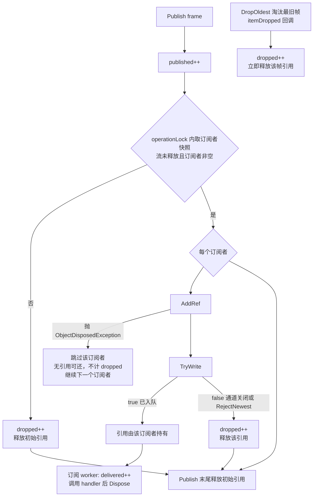

# 背压与丢帧统计

<cite>
**本文引用的文件**
- [Junevy.EasyCamera/Common/CameraStream.cs](file://Junevy.EasyCamera/Common/CameraStream.cs)
- [Junevy.EasyCamera/Common/CameraStreamSubscriber.cs](file://Junevy.EasyCamera/Common/CameraStreamSubscriber.cs)
- [Junevy.EasyCamera/Common/StreamOptions.cs](file://Junevy.EasyCamera/Common/StreamOptions.cs)
- [Junevy.EasyCamera/Common/CameraService.cs](file://Junevy.EasyCamera/Common/CameraService.cs)
- [Junevy.EasyCamera.Core/Abstractions/FrameStreamStatistics.cs](file://Junevy.EasyCamera.Core/Abstractions/FrameStreamStatistics.cs)
- [Junevy.EasyCamera.Core/Common/BackpressureMode.cs](file://Junevy.EasyCamera.Core/Common/BackpressureMode.cs)
- [Junevy.EasyCamera.Core/Common/IStreamOptions.cs](file://Junevy.EasyCamera.Core/Common/IStreamOptions.cs)
- [Junevy.EasyCamera.Tests/Common/CameraStreamBackpressureTests.cs](file://Junevy.EasyCamera.Tests/Common/CameraStreamBackpressureTests.cs)
</cite>

## 目录
1. [订阅队列](#订阅队列)
2. [背压策略映射](#背压策略映射)
3. [三种丢帧情形](#三种丢帧情形)
4. [计数器语义](#计数器语义)
5. [容量配置](#容量配置)
6. [排错手册](#排错手册)
7. [丢帧决策流](#丢帧决策流)

## 订阅队列

每个订阅者一条**有界** `Channel<IFrame>`，在 `CameraStream.Subscribe` 中一次性创建：

```csharp
Channel.CreateBounded<IFrame>(
    new BoundedChannelOptions(capacity)
    {
        FullMode = ToFullMode(options.BackpressureMode),
        SingleReader = true,
        SingleWriter = false,
        AllowSynchronousContinuations = false
    },
    frame => OnFrameDropped(frame, whenException));
```

- `SingleReader = true`：每个订阅者只有一个 worker 消费。
- `SingleWriter = false`：`Publish` 可来自 SDK 采集线程，也可能有多个发布来源。
- `AllowSynchronousContinuations = false`：消费端的续体不内联到写入方线程上，避免 SDK 采集线程被消费者的处理时间拖住。
- 第三个参数是**淘汰回调**：被背压淘汰的帧由流立即释放其引用。

消费者是一个 `Task`（`CameraStreamSubscriber.StartWorker` → `CameraStream.ConsumeAsync`），循环 `WaitToReadAsync` + 内层 `TryRead`。

**章节来源**
- [Junevy.EasyCamera/Common/CameraStream.cs](file://Junevy.EasyCamera/Common/CameraStream.cs)
- [Junevy.EasyCamera/Common/CameraStreamSubscriber.cs](file://Junevy.EasyCamera/Common/CameraStreamSubscriber.cs)

## 背压策略映射

| `BackpressureMode` | `BoundedChannelFullMode` | 队列满时的行为 |
| --- | --- | --- |
| `DropOldest`（默认） | `DropOldest` | 淘汰最旧帧，保留最新画面；淘汰帧触发 `itemDropped` 回调 |
| `RejectNewest` | `Wait` | `TryWrite` 直接返回 `false`：不阻塞、不覆盖、不触发淘汰回调 |

`RejectNewest` 映射为 `Wait` 是因为配合 `TryWrite` 使用：`Wait` 语义下非阻塞写入在队列满时返回 `false`，恰好实现"拒收新帧"，且不触发 `itemDropped`（该回调只在真正丢帧时释放引用，这里由发布方自己释放）。

> [!warning] 库**刻意不提供"丢新帧"模式**。实测 .NET `System.Threading.Channels` 的 `BoundedChannelFullMode.DropNewest` 与 `DropOldest` 行为完全一致——都淘汰最旧帧、保留最新帧。暴露该选项只会让调用方以为"我在丢新帧"，实际行为相反。

**章节来源**
- [Junevy.EasyCamera/Common/CameraStream.cs](file://Junevy.EasyCamera/Common/CameraStream.cs)
- [Junevy.EasyCamera.Core/Common/BackpressureMode.cs](file://Junevy.EasyCamera.Core/Common/BackpressureMode.cs)

## 三种丢帧情形

计入 `Dropped` 的三种情形：

| 情形 | 触发点 | 引用如何处理 |
| --- | --- | --- |
| 无订阅者时发布 | `Publish` 中快照为 `null` 或长度为 0 | `dropped++` 后 `DisposeFrame(frame)` |
| `TryWrite` 返回 `false` | 订阅者已取消（`Channel.Writer.TryComplete`）或 `RejectNewest` 拒收 | `dropped++` 后释放该订阅者刚取得的引用 |
| 通道 `itemDropped` 回调 | `DropOldest` 淘汰最旧帧 | `OnFrameDropped`：`dropped++` 后释放该帧引用 |

另有两条边角路径：① `frame.AddRef()` 抛 `ObjectDisposedException`（帧已被释放，防御性分支）：`Publish` 的 `catch` 吞掉异常、跳过该订阅者继续处理其余订阅者——此时**没有取得引用，既无需归还，也不计入 `Dropped`**（统计盲区）；② `AddRef` 成功但 `TryWrite` 意外抛异常：归还刚取得的引用并 `dropped++`。发布线程都不会被单个订阅者拖垮。

> [!warning] 背压淘汰/拒收的帧由流**立即释放**其引用，绝不排队等待；也**绝不阻塞 SDK 采集线程**。宁可丢帧，也不拖慢采集——这是工业相机场景的基本取舍：采集节奏由硬件时序决定，被软件阻塞会导致丢的是"整段"而不是"单帧"。相关锁边界见 [[并发与资源/并发纪律]]，引用记账见 [[并发与资源/帧所有权与内存]]。

**章节来源**
- [Junevy.EasyCamera/Common/CameraStream.cs](file://Junevy.EasyCamera/Common/CameraStream.cs)

## 计数器语义

`FrameStreamStatistics`（只读 struct）：`long Published`、`long Delivered`、`long Dropped`，静态 `Empty`。

| 计数器 | 递增时机 |
| --- | --- |
| `Published` | 每次 `Publish` 入口（`frame == null` 除外） |
| `Delivered` | 调用订阅 `handler` **之前**（表示"已投递给消费者"，不代表消费完成） |
| `Dropped` | 上表三种情形；另含"`AddRef` 成功后 `TryWrite` 意外抛异常"。**`AddRef` 本身失败不计入** |

**计数口径**：`Published` 按**帧**计，`Delivered`/`Dropped` 按**（帧 × 订阅者）**计（无订阅者时按帧计一次 `Dropped`）。单订阅者时近似 `Published ≈ Delivered + Dropped + 在途`；多订阅者时 `Delivered`、`Dropped` 成倍累计，该等式不成立，`Delivered` 甚至可能大于 `Published`。看速率时把三条曲线按"订阅者数"折算，别直接做加减。

实现用 `Interlocked.Increment` 累加、`Interlocked.Read` 快照（`long` 在 32 位平台需要 64 位原子读）。累计值只增不减，进程生命周期内不重置；要看瞬时速率需自行做差分。

读取入口：

- `ICameraStream.Statistics`（直接持有流时）。
- `ICameraService.GetStreamStatistics(cameraKey)`——相机未打开、从未订阅、或流管理器已释放时返回 `FrameStreamStatistics.Empty`。

**章节来源**
- [Junevy.EasyCamera.Core/Abstractions/FrameStreamStatistics.cs](file://Junevy.EasyCamera.Core/Abstractions/FrameStreamStatistics.cs)
- [Junevy.EasyCamera/Common/CameraStream.cs](file://Junevy.EasyCamera/Common/CameraStream.cs)
- [Junevy.EasyCamera/Common/CameraService.cs](file://Junevy.EasyCamera/Common/CameraService.cs)

## 容量配置

`IStreamOptions.StreamCapacity`（实现默认 **5**）：

- `SubscribeFrameStream(..., capacity)` 的 `capacity <= 0` → 服务层回落到 `IStreamOptions.StreamCapacity`。
- 流层再兜一次：`capacity < 1` 抬为 `1`。
- 容量单位是**帧数**，不是字节。

不要把 `IStreamOptions.CameraBufferCapacity` 与它混为一谈：前者是**相机 SDK 侧**的采集缓冲，仅对实现 `IBufferConfigurable` 的相机生效（见 [[公共契约/能力接口与扩展点]]）。

**章节来源**
- [Junevy.EasyCamera/Common/StreamOptions.cs](file://Junevy.EasyCamera/Common/StreamOptions.cs)
- [Junevy.EasyCamera/Common/CameraService.cs](file://Junevy.EasyCamera/Common/CameraService.cs)
- [Junevy.EasyCamera.Core/Common/IStreamOptions.cs](file://Junevy.EasyCamera.Core/Common/IStreamOptions.cs)

## 排错手册

| 现象 | 判据 | 处理 |
| --- | --- | --- |
| `Dropped` 持续增长、`Published` 正常 | 消费慢于采集 | 加大 `StreamCapacity`（或 `SubscribeFrameStream` 的 `capacity`），或优化 `handler` |
| `Published` 不增长 | 上游没发布 | 查 `IsGrabbing` 与状态枚举；参见 [[并发与资源/并发纪律]] 的静默丢帧缺陷 |
| 单订阅者下 `Delivered` 落后 `Published` 且队列不积压 | 正在丢帧（差值 ≈ `Dropped`） | 属预期行为（背压生效），不是错误。多订阅者时口径不同，见上"计数口径" |
| 订阅"莫名消失"、帧不再到达 | 未提供 `whenException`，`handler` 抛异常终止 worker（抛 `OperationCanceledException`/`TaskCanceledException` 时 worker 同样退出，但订阅者**不会**被摘除，`SubscriberCount` 不减） | 始终提供 `whenException`，把异常上报到日志 |
| `Delivered` 增长但画面卡住 | handler 内部阻塞（同步等待 UI） | `handler` 内只做轻量处理，重活丢到后台；注意 `Delivered` 在调用 handler 前就计了 |
| `GetStreamStatistics` 全 0 | key 错/未打开/从未订阅 | 确认 `cameraKey` 与 `OpenCamera` 一致 |

> [!tip] 心跳式监控建议：固定间隔采样 `GetStreamStatistics` 并做差分，得到 `published/s`、`delivered/s`、`dropped/s` 三条曲线。丢帧率持续不为 0 就该扩容量或提速 handler，而不是加大 `CameraBufferCapacity`（那只会让 SDK 侧积更多帧、内存更高）。

**章节来源**
- [Junevy.EasyCamera/Common/CameraStream.cs](file://Junevy.EasyCamera/Common/CameraStream.cs)
- [Junevy.EasyCamera.Tests/Common/CameraStreamBackpressureTests.cs](file://Junevy.EasyCamera.Tests/Common/CameraStreamBackpressureTests.cs)
- [Junevy.EasyCamera.Tests/Abstractions/CameraStreamRegressionTests.cs](file://Junevy.EasyCamera.Tests/Abstractions/CameraStreamRegressionTests.cs)

## 丢帧决策流



**图表来源**
- [Junevy.EasyCamera/Common/CameraStream.cs](file://Junevy.EasyCamera/Common/CameraStream.cs)
- [Junevy.EasyCamera/Common/CameraStreamSubscriber.cs](file://Junevy.EasyCamera/Common/CameraStreamSubscriber.cs)