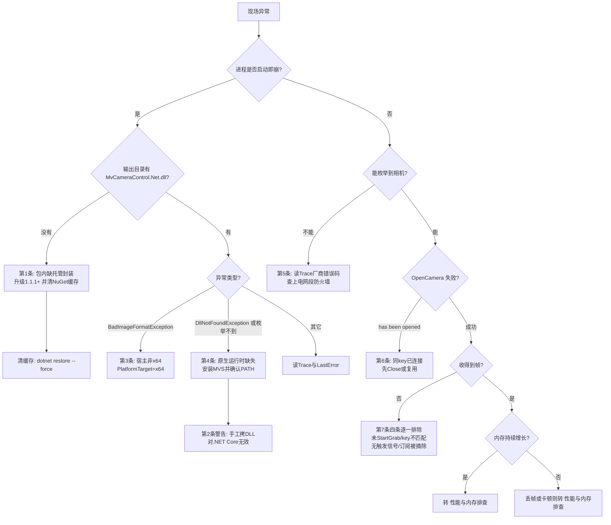

# 常见故障与误判

<cite>
**本文引用的文件**
- [README.md](file://README.md)
- [CHANGELOG.md](file://CHANGELOG.md)
- [AGENTS.md](file://AGENTS.md)
- [Junevy.EasyCamera/Junevy.EasyCamera.csproj](file://Junevy.EasyCamera/Junevy.EasyCamera.csproj)
- [Junevy.EasyCamera/Common/CameraService.cs](file://Junevy.EasyCamera/Common/CameraService.cs)
- [Junevy.EasyCamera/Common/CameraStream.cs](file://Junevy.EasyCamera/Common/CameraStream.cs)
- [Junevy.EasyCamera/Common/StreamManager.cs](file://Junevy.EasyCamera/Common/StreamManager.cs)
- [Junevy.EasyCamera/Vendors/HikVision/HikCameraProvider.cs](file://Junevy.EasyCamera/Vendors/HikVision/HikCameraProvider.cs)
- [Junevy.EasyCamera/Properties/PlatformCompatibility.cs](file://Junevy.EasyCamera/Properties/PlatformCompatibility.cs)
- [Junevy.EasyCamera.Tests/Junevy.EasyCamera.Tests.csproj](file://Junevy.EasyCamera.Tests/Junevy.EasyCamera.Tests.csproj)
- [Junevy.EasyCamera.Core/Abstractions/CameraLinkStatus.cs](file://Junevy.EasyCamera.Core/Abstractions/CameraLinkStatus.cs)
- [skills/using-junevy-easycamera/SKILL.md](file://skills/using-junevy-easycamera/SKILL.md)
</cite>

## 目录
1. [故障对照总表](#故障对照总表)
2. [程序集加载类](#程序集加载类)
3. [枚举与打开类](#枚举与打开类)
4. [收不到帧](#收不到帧)
5. [状态显示与探测类](#状态显示与探测类)
6. [编译与测试类](#编译与测试类)
7. [分流流程](#分流流程)

## 故障对照总表

| # | 现象 | 真实原因 | 处理 |
| --- | --- | --- | --- |
| 1 | `AggregateException: The type initializer for 'HikCameraSdkSystem' threw an exception`，或 `FileNotFoundException('MvCameraControl.Net, Version=4.5.0.2')` | 用了 ≤1.1.0 的包，厂商**托管封装**未随包分发 | 升级到 1.1.1+，**并清理 NuGet 缓存** |
| 2 | 手工把厂商 DLL 拷到 exe 旁边仍然崩 | 对 .NET Core **无效**：程序集解析走 `deps.json` 的 TPA 列表，默认加载器不探测 exe 目录 | 必须靠 NuGet 依赖分发（升级到 1.1.1）；不要手工拷贝 |
| 3 | `BadImageFormatException` | 宿主非 x64 | 宿主设 `PlatformTarget=x64`（库本身已固定 x64） |
| 4 | `Initialize` 抛 `DllNotFoundException`，或枚举不到设备，**但托管封装已在输出目录** | 厂商**原生**运行时（MVS）未安装，或其 `Runtime\Win64_x64` 不在 PATH | 安装厂商运行时，确认 `...\Common Files\MVS\Runtime\Win64_x64` 在 PATH |
| 5 | 枚举结果为空集合 | 相机未上电 / 网段不通 / GigE 带宽被防火墙拦截 | 检查物理连接与网络；库会 `Trace.TraceWarning` 输出厂商错误码，**读 Trace 输出** |
| 6 | `OpenCamera` 返回 "The camera has been opened" | 同 `cameraKey` 已有连接，`OpenCamera` **不幂等** | 先 `Close` 该 key，或复用已有连接 |
| 7 | 收不到帧 | 见下方"收不到帧"四条 | 逐条排除 |
| 8 | 界面显示"被占用"但相机根本没插 | 1.0.x 把"重新枚举中消失"也归入 `Occupied` | 1.1.0+ 区分 `Occupied`（在线但被独占）与 `Unreachable`（枚举不到/掉线）；确认使用的是 ≥1.1.0 |
| 9 | 内存持续增长 | 帧 `Dispose`/`AddRef` 未配对；或 handler 抛异常且未传 `whenException` | 见 [[故障排查/性能与内存排查]] |
| 10 | 订阅时抛 `ObjectDisposedException` | 服务释放与订阅竞态，服务按契约返回 `false`；若是自定义 `ICameraStream` 抛出则属实现问题 | 检查订阅方自身生命周期 |
| 11 | 升到 1.1.1 后仍然崩 | NuGet 按 `id + version` 缓存，同版本重发不会被采用 | 删 `junevy.easycamera*` 缓存目录，或 `dotnet restore --force` |
| 12 | `Initialize` 抛 `InvalidOperationException`（"…initialize failed with error code 0x…"），DI 路径下为 `AggregateException` | 海康原生初始化返回非 0 错误码；1.1.2 起不再静默忽略（此前表现为枚举为空，被误判为"没有相机"） | 按错误码查厂商 SDK 文档；先排查 MVS 运行时安装、x64 与 PATH |
| 13 | CA1416 告警突然暴增 | `GenerateAssemblyInfo=false` 会连带跳过 csproj 的 `<AssemblyAttribute>` 项，平台标注静默失效 | 平台标注必须写在 `Properties/PlatformCompatibility.cs` |
| 13 | 测试"全绿"但新测试好像没跑 | 新增测试文件未加入 Tests csproj 的 `Compile` 清单 | 核对 `[TestMethod]` 总数 == 执行数，见 [[测试/测试]] |

> [!danger]
> 第 1 条与第 4 条的报错文本相似，成因与处理**完全相反**。排错第一步永远是确认 `MvCameraControl.Net.dll` 在不在消费方输出目录：在 → 报的是原生层（第 4 条）；不在 → 报的是托管层（第 1 条）。厂商**原生驱动**（`MvCameraControl.dll`）不在 NuGet 包内，属消费方环境前置条件，与"托管封装随包分发"是两件独立的事。

> [!warning]
> 第 2 条是本仓库踩过的最贵误判："我已经把 DLL 拷过去了"。对 .NET Framework（net48）默认加载器会探测 exe 目录，手工拷贝可能"碰巧有效"；但对 .NET Core 无效，会让人误以为路径问题而放弃正确修法（升级包版本）。README 已专门写明这一点。

**章节来源**
- [README.md](file://README.md)
- [CHANGELOG.md](file://CHANGELOG.md)
- [Junevy.EasyCamera/Junevy.EasyCamera.csproj](file://Junevy.EasyCamera/Junevy.EasyCamera.csproj)

## 程序集加载类

### 第 1 条：包内缺厂商托管封装

主工程曾用 `<Reference HintPath=..\Libs\... Private=true>` 引用 `MvCameraControl.Net.dll` / `MVSDK_Net.dll`。`Private=true` 只让本仓库自己的输出目录拿到 DLL；`dotnet pack` **既不把文件引用放进包内，也不产生依赖声明**。消费方还原后必然失败：`Initialize()` 抛类型初始化异常，`EnumerateCameras()` 抛 `FileNotFoundException`，未捕获即崩溃。

1.1.1 的修法是无条件 `Pack` 项把两份封装打进 `lib/net48;lib/net8.0`。两条硬约束（写进了 csproj 注释）：

1. `PackagePath` 必须逐 TFM 写全。写成与 TFM 无关的 `"lib/"` 时，NuGet 会因为包内已存在 `lib/<tfm>/` 目录而**整体忽略**根目录文件。
2. 打包 `ItemGroup` **不能**按 `$(TargetFramework)` 分条件：多目标项目打包走外层构建，该时刻 `$(TargetFramework)` 为空，条件恒不成立，DLL 会被静默漏掉。

刻意不采用"依赖 nuget.org 上的 `MvCameraControl.Net`"——那里只有第三方未验证转包，版本与本仓库 pin 的 4.5.0.2 对不上。

### 第 11 条：升级后仍然崩

NuGet 按 `id + version` 缓存。消费方还原过 1.1.0 后，开发者重发同版本不会被采用（本次验证过程中即被该缓存误导过一次）。删除 `junevy.easycamera*` 相关缓存目录，或显式 `dotnet restore --force`。

**章节来源**
- [CHANGELOG.md](file://CHANGELOG.md)
- [README.md](file://README.md)
- [Junevy.EasyCamera/Junevy.EasyCamera.csproj](file://Junevy.EasyCamera/Junevy.EasyCamera.csproj)

## 枚举与打开类

**第 5 条**：枚举为空时，库不会静默返回空集合——`HikCameraProvider.Enumerate` 在厂商调用失败时会 `Trace.TraceWarning` 输出错误码。没有 Trace 监听器的话这个信息就丢了，现场只能看到"0 台相机"。**排错时先开 Trace**。

**第 6 条**：`OpenCamera` 对同一 `cameraKey` **不幂等**，第二次调用直接返回失败（"The camera has been opened"）。这是刻意的——同一 key 背后是同一个设备句柄，重复打开会导致引用计数错乱与 use-after-free。需要"确保已打开"语义时应自行判断或先 `Close`。

**第 10 条**：服务释放与订阅竞态时，服务按契约返回 `false`（用例 `CameraService_SubscribeFrameStream_WhenStreamDisposedMidFlight_ReturnsFalse`）。若抛的是 `ObjectDisposedException`，说明是自定义 `ICameraStream` 抛的，属实现问题而非库问题。

**章节来源**
- [Junevy.EasyCamera/Common/CameraService.cs](file://Junevy.EasyCamera/Common/CameraService.cs)
- [Junevy.EasyCamera/Vendors/HikVision/HikCameraProvider.cs](file://Junevy.EasyCamera/Vendors/HikVision/HikCameraProvider.cs)
- [Junevy.EasyCamera.Tests/Common/CameraManagerServiceRegressionTests.cs](file://Junevy.EasyCamera.Tests/Common/CameraManagerServiceRegressionTests.cs)

## 收不到帧

四个独立原因，逐条排除：

| # | 原因 | 判据 | 处理 |
| --- | --- | --- | --- |
| 1 | 没调 `StartGrab` | `ICameraService.GetStreamStatistics(key)` 的 `Published` 为 0 | `StartGrab(cameraKey)` |
| 2 | `cameraKey` 与订阅 key 不匹配 | 统计全 0 | 订阅与取消订阅必须用 `OpenCamera` 时传入的**同一个** `cameraKey` |
| 3 | 触发模式下无触发信号 | `Published` 为 0，但 `StartGrab` 已成功 | `SetTrigger` 指定的触发源需实际有信号；`SetTrigger` 后需重新 `StartGrab` 才生效 |
| 4 | 订阅因 handler 异常被自动摘除 | 曾经收到帧、之后停止 | handler 抛异常且未传 `whenException` 时，该订阅会被终止并自动摘除。**变体**：若抛的是 `OperationCanceledException`/`TaskCanceledException`，worker 同样停止，但订阅**不会**被摘除（`SubscriberCount` 仍为原值、`Delivered` 不再增长）——见 [[架构设计/帧数据流与生命周期]] |

> [!tip]
> 第 4 条最容易误判为"相机掉线"。现象是"跑了一会儿就不收帧了，重启相机才好"——实际是某个 handler 抛异常（例如图像格式转换失败）导致订阅被摘除，相机本身一直正常。**始终提供 `whenException`** 把异常上报到日志，即可立刻区分。用例见 [[测试/回归清单与测试替身]] 的"帧生命周期回归"。另外"释放后参数访问失败"与"关闭失败后仍可重新取流"这些状态机行为见 [[架构设计/帧数据流与生命周期]]。

**章节来源**
- [Junevy.EasyCamera/Common/CameraStream.cs](file://Junevy.EasyCamera/Common/CameraStream.cs)
- [Junevy.EasyCamera/Common/CameraService.cs](file://Junevy.EasyCamera/Common/CameraService.cs)
- [README.md](file://README.md)

## 状态显示与探测类

**第 8 条**是 1.1.0 修掉的语义缺陷。1.1.0 之前 `CameraLinkStatus` 只有 `Connected/Idle/Occupied` 三态，且 `Connected = 0` 是枚举默认值——未初始化的变量会谎报"已连接"；"枚举中消失"（相机没插、未上电、被拔出）被归入 `Occupied`，界面于是把"相机没插"显示成"被占用"，用户会一直去排查"谁占着相机"。

1.1.0 起是五态，且 `Unknown = 0`：

| 成员 | 值 | 含义 |
| --- | --- | --- |
| `Unknown` | 0 | 未能判定（相机信息无效/无序列号，或厂商具备探测能力却如实报告判定不了——后者不会触发回退） |
| `Connected` | 1 | 本进程已持有该相机连接（任意 key 注册且序列号匹配） |
| `Idle` | 2 | 在线、未被本进程持有且可达——当前可打开 |
| `Occupied` | 3 | 在线但不可达：可达性检查未通过，通常被其它客户端独占 |
| `Unreachable` | 4 | 重新枚举中不存在（掉线、被拔出、未上电） |

> [!warning]
> `CameraLinkStatus` 是破坏性变更：从三态迁到五态，且 `Connected` 不再是默认值。消费方若有 `switch (status) { case Connected: ... }` 且依赖"默认值等于 Connected"的隐式逻辑，需要一并改。缺失厂商探测能力时的侵入式回退无法区分"被占用"与"设备不存在"，按"被占用"保守表达——这是**保守选择而非错误**，不要把它当作第 8 条的缺陷。接口设计见 [[公共契约/能力接口与扩展点]]。

> [!note] 状态一直是 `Unknown`？
> 2026-10-06 之前，经 DI/Builder 组装的 `CameraService`（provider 恒为 `AggregateCameraProvider`）在某厂商不具备 `ILinkStatusProbeProvider` 时会直接采信聚合层的 `Unknown`、不做侵入式打开探测——**该缺口已修复**：现在"没有任何厂商能探测这台相机"会回退侵入式探测，得到 `Idle`/`Occupied`（见 [[变更与决策/审查与修复记录]]）。因此现在仍长期得到 `Unknown` 只剩两类原因：① `info` 为空或没有序列号；② 某厂商**实现了** `ILinkStatusProbeProvider` 却自己返回 `Unknown`（它声明能探测、结论是判定不了，门面不会越过它回退）。排查先看这两处，而不是怀疑相机。如果升级前的旧包上仍看到该现象，说明消费方还原到的是修复前的 1.1.1 构建（同版本重发不会被 NuGet 缓存采用，需清理缓存）。

**章节来源**
- [Junevy.EasyCamera.Core/Abstractions/CameraLinkStatus.cs](file://Junevy.EasyCamera.Core/Abstractions/CameraLinkStatus.cs)
- [Junevy.EasyCamera/Common/CameraService.cs](file://Junevy.EasyCamera/Common/CameraService.cs)
- [skills/using-junevy-easycamera/SKILL.md](file://skills/using-junevy-easycamera/SKILL.md)

## 编译与测试类

**第 12 条（CA1416 暴增）**：三个工程（含测试工程）都设了 `GenerateAssemblyInfo=false`。副作用之一是 csproj 提供的 `<AssemblyAttribute>` 项被**连带跳过**——把 `[assembly: SupportedOSPlatform("windows")]` 写在 csproj 里不会报错，只会静默失效，然后所有消费 windows-only API 的代码集体触发 CA1416。正确位置是 `Properties/PlatformCompatibility.cs`（用 `#if NET8_0_OR_GREATER` 包住，因为 net48 没有这套标注体系）。

**第 13 条（测试绿色地缺席）**：Tests csproj 设了 `EnableDefaultCompileItems=false` + 显式 `<Compile Include>` 清单。新增测试文件不手工登记，就不会编译、不执行、**不报错**。2026-10-06 的 `CameraServiceProbeTests.cs` 就是这样让 6 个用例缺席的（当时仓库有 98 个 `[TestMethod]`、只执行 92 个），而 CHANGELOG 写着"全量通过"。

唯一检测手段是核对"仓库内 `[TestMethod]` 总数 == 实际执行数"，详见 [[测试/测试]] 的验收纪律。这两条的共同点是**缺陷形态为"静默"**：一个放错位置的程序集特性、一个漏登记的测试文件，都不会让 CI 变红。所以验收不能只看"通过/失败"，还要核对"该测的到底测了没有"。

**章节来源**
- [Junevy.EasyCamera/Properties/PlatformCompatibility.cs](file://Junevy.EasyCamera/Properties/PlatformCompatibility.cs)
- [Junevy.EasyCamera.Tests/Junevy.EasyCamera.Tests.csproj](file://Junevy.EasyCamera.Tests/Junevy.EasyCamera.Tests.csproj)
- [AGENTS.md](file://AGENTS.md)

## 分流流程

**图表来源**
- [README.md](file://README.md)
- [Junevy.EasyCamera/Common/CameraService.cs](file://Junevy.EasyCamera/Common/CameraService.cs)
- [Junevy.EasyCamera/Vendors/HikVision/HikCameraProvider.cs](file://Junevy.EasyCamera/Vendors/HikVision/HikCameraProvider.cs)
- [CHANGELOG.md](file://CHANGELOG.md)