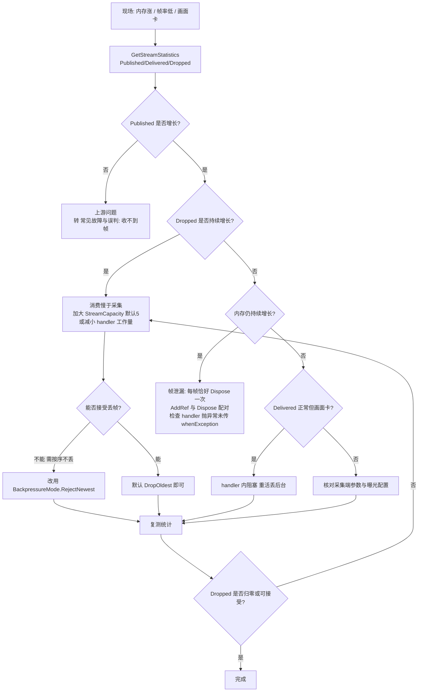

# 性能与内存排查

<cite>
**本文引用的文件**
- [Junevy.EasyCamera/Vendors/HikVision/HikFrameWrapper.cs](file://Junevy.EasyCamera/Vendors/HikVision/HikFrameWrapper.cs)
- [Junevy.EasyCamera/Vendors/HikVision/HikCamera.cs](file://Junevy.EasyCamera/Vendors/HikVision/HikCamera.cs)
- [Junevy.EasyCamera/Common/CameraStream.cs](file://Junevy.EasyCamera/Common/CameraStream.cs)
- [Junevy.EasyCamera/Common/CameraService.cs](file://Junevy.EasyCamera/Common/CameraService.cs)
- [Junevy.EasyCamera/Common/StreamOptions.cs](file://Junevy.EasyCamera/Common/StreamOptions.cs)
- [Junevy.EasyCamera.Core/Abstractions/FrameStreamStatistics.cs](file://Junevy.EasyCamera.Core/Abstractions/FrameStreamStatistics.cs)
- [Junevy.EasyCamera.Core/Common/BackpressureMode.cs](file://Junevy.EasyCamera.Core/Common/BackpressureMode.cs)
- [Junevy.EasyCamera.Core/Abstractions/IFrame.cs](file://Junevy.EasyCamera.Core/Abstractions/IFrame.cs)
- [Junevy.EasyCamera.Core/Abstractions/ICameraStream.cs](file://Junevy.EasyCamera.Core/Abstractions/ICameraStream.cs)
- [Junevy.EasyCamera.Tests/Common/CameraStreamBackpressureTests.cs](file://Junevy.EasyCamera.Tests/Common/CameraStreamBackpressureTests.cs)
- [AGENTS.md](file://AGENTS.md)
</cite>

## 目录
1. [诊断顺序](#诊断顺序)
2. [第一步永远是统计](#第一步永远是统计)
3. [容量与背压调参](#容量与背压调参)
4. [handler 该做什么](#handler-该做什么)
5. [库侧已有的少分配设计](#库侧已有的少分配设计)
6. [已知未实施的后续优化](#已知未实施的后续优化)
7. [帧泄漏定位](#帧泄漏定位)
8. [相机关闭为何不瞬时](#相机关闭为何不瞬时)
9. [性能诊断流程](#性能诊断流程)

## 诊断顺序

不要一上来就调 `StreamCapacity` 或加内存。先确认三件事，顺序错了会在错误的方向上反复调参：**丢没丢帧？** —— `GetStreamStatistics` 看 `Published/Delivered/Dropped`。**是采集慢还是消费慢？** —— `Published` 不增长是上游问题；`Published` 正常而 `Dropped` 增长是消费慢。**是不是帧泄漏？** —— 内存持续增长但统计正常，优先查引用配对。

## 第一步永远是统计

```csharp
var stats = cameraService.GetStreamStatistics(cameraKey);
// stats.Published / stats.Delivered / stats.Dropped
```

| 观察 | 结论 | 下一步 |
| --- | --- | --- |
| `Published` 为 0 | 一帧都没发布 | 上游问题：没 `StartGrab`、key 不匹配、触发模式无信号。转 [[故障排查/常见故障与误判]] 的"收不到帧" |
| `Published` 正常、`Dropped` 持续增长 | 消费慢于采集 | 加大 `StreamCapacity`（默认 5 帧）或减小 handler 工作量 |
| 单订阅者下 `Delivered` 落后 `Published` 但队列不积压 | 正在丢帧（差值 ≈ `Dropped`） | 属预期行为（背压生效），不是错误。多订阅者时 `Delivered`/`Dropped` 按（帧 × 订阅者）累计，口径见 [[并发与资源/背压与丢帧统计]] |
| 三个数都正常但内存涨 | 不是背压问题 | 转"帧泄漏定位" |

`GetStreamStatistics` 在相机未打开、从未订阅、或流管理器已释放时返回 `FrameStreamStatistics.Empty`（全 0）。看到全 0 先怀疑 key 写错，而不是"库坏了"。统计累计值只增不减、不重置，要看瞬时速率需自行做差分。

**章节来源**
- [AGENTS.md](file://AGENTS.md)
- [Junevy.EasyCamera/Common/CameraService.cs](file://Junevy.EasyCamera/Common/CameraService.cs)
- [Junevy.EasyCamera.Core/Abstractions/FrameStreamStatistics.cs](file://Junevy.EasyCamera.Core/Abstractions/FrameStreamStatistics.cs)

## 容量与背压调参

`IStreamOptions.StreamCapacity` 默认 **5**（单位是帧数，不是字节）：`SubscribeFrameStream(..., capacity)` 传 `<= 0` → 回落到 `StreamOptions.StreamCapacity`；流层再兜一次，`capacity < 1` 抬为 1。

`BackpressureMode` 两种策略**都不阻塞 SDK 采集线程**（宁可丢帧，绝不拖慢采集），区别只在丢哪一帧：

| 策略 | 行为 | 适用 |
| --- | --- | --- |
| `DropOldest`（默认） | 淘汰最旧帧，保留最新画面 | 实时预览、状态判定 |
| `RejectNewest` | 拒收新到的帧，按序处理已入队帧 | 线阵测量、缺陷计数等"每帧都必须按顺序处理、不能丢也不能乱序"的场景 |

> [!warning]
> 库**刻意不提供"丢新帧"模式**。实测 .NET `System.Threading.Channels` 的 `BoundedChannelFullMode.DropNewest` 与 `DropOldest` 行为完全一致（都淘汰最旧帧、保留最新帧），暴露该选项只会名不副实。如果你的场景确实需要"丢新保旧"，正确做法是用 `RejectNewest`。另外不要把 `CameraBufferCapacity` 与 `StreamCapacity` 混为一谈：前者是**相机 SDK 侧**的采集缓冲，仅对实现 `IBufferConfigurable` 的相机生效，加大它只会让 SDK 侧积更多帧、内存更高。

**章节来源**
- [Junevy.EasyCamera/Common/StreamOptions.cs](file://Junevy.EasyCamera/Common/StreamOptions.cs)
- [Junevy.EasyCamera.Core/Common/BackpressureMode.cs](file://Junevy.EasyCamera.Core/Common/BackpressureMode.cs)

## handler 该做什么

- **handler 是订阅 worker 的同步体**。在里面做重活（磁盘 IO、网络上报、同步等待 UI）会直接拖慢消费速度，表现为 `Dropped` 增长。把重活丢到后台线程。返回的 `Task` 会被 await；返回 `Task.CompletedTask` 表示同步处理完。
- **`Delivered` 在调用 handler 之前就计数了**，它表示"已投递给消费者"，不代表消费完成。所以 `Delivered` 正常但画面卡，一定是 handler 内部阻塞。
- **需要跨线程处理就先 `frame.AddRef()`，用完对应 `Dispose()`**。把帧带出 handler 而不 `AddRef`，则它可能在归你处理之前就被释放。
- **始终提供 `whenException`**。不提供时 handler 抛异常会终止该订阅并自动摘除，之后永远收不到帧——现场表现像"相机掉线"，实则是自己的 handler 抛了异常。

> [!tip]
> 心跳式监控：固定间隔采样 `GetStreamStatistics` 并做差分，得到 `published/s`、`delivered/s`、`dropped/s` 三条曲线。这比"看内存占用"更早发现问题——丢帧率持续不为 0 时就该扩容量或提速 handler。

**章节来源**
- [Junevy.EasyCamera/Common/CameraStream.cs](file://Junevy.EasyCamera/Common/CameraStream.cs)
- [Junevy.EasyCamera.Core/Abstractions/ICameraStream.cs](file://Junevy.EasyCamera.Core/Abstractions/ICameraStream.cs)

## 库侧已有的少分配设计

帧约 5MB+/帧，所以库在设计上刻意压低分配：

| 手段 | 效果 |
| --- | --- |
| 每帧**仅在相机回调内克隆一次** | 订阅者数量增加不带来 SDK 缓冲拷贝 |
| 多订阅者引用计数**浅共享**同一克隆 | 不逐订阅者深拷贝（订阅者是只读消费者） |
| 克隆缓冲由**最后一个归零的引用持有者**物理释放 | 不固定为发布者，否则其余浅引用悬空 |
| `HikFrameWrapper` 构造期**快照**元数据 | 宽高/步长/像素格式/大小此后全是字段读取，不再每帧穿透 SDK，也消除了"先判已释放再读原生内存"的 check-then-use 竞态 |
| `Data` **懒缓存** | SDK 的 `PixelData` 可能每次访问重新拷贝；缓存为一次性成本。已缓存后重复访问返回同一实例（用例 `HikFrameWrapper_Data_ReturnsSameInstanceOnRepeatedAccess`） |
| 背压淘汰/拒收的帧**立即释放** | 绝不排队等待，也绝不阻塞采集线程 |

> [!danger]
> 这些设计的前提是"**订阅者只读**"。如果你在 handler 里修改了帧内容、或把帧对象长期持有做缓冲队列，多订阅者浅共享同一缓冲意味着你的修改会影响其他订阅者，且帧可能被提前释放。跨线程处理请走 `AddRef()`/`Dispose()` 配对，不要另存引用。

**章节来源**
- [Junevy.EasyCamera/Vendors/HikVision/HikFrameWrapper.cs](file://Junevy.EasyCamera/Vendors/HikVision/HikFrameWrapper.cs)
- [AGENTS.md](file://AGENTS.md)

## 已知未实施的后续优化

`IFrame.Data` 返回的是**托管副本**（`byte[]`），5MB 级的数组会落在 LOH（Large Object Heap）上，给 GC 带来持续压力。已知优化方向是改用 `ArrayPool<byte>.Shared` 租用数组。

**尚未实施**，原因是契约未定：`IFrame.Data` 返回的数组长度契约没定——返回的数组可能大于实际数据（SDK 按行对齐分配的 `ImageSize / height` 步长），而池化要求归还的数组与原数组是同一个对象，调用方如果按 `Data.Length` 切片处理，语义会变。定这个契约需要先确认所有消费方的使用方式。

> [!warning]
> 在契约明确前不要自行改 `Data` 的返回语义。当前已验证的行为是：已释放帧若**已缓存过** `Data`，副本仍可安全读取；若**从未访问过**就释放了，返回 `Array.Empty<byte>()`——**不触达已释放的原生内存**。这两条都有用例守护。

**章节来源**
- [Junevy.EasyCamera/Vendors/HikVision/HikFrameWrapper.cs](file://Junevy.EasyCamera/Vendors/HikVision/HikFrameWrapper.cs)
- [Junevy.EasyCamera.Tests/Vendors/HikVisionRegressionTests.cs](file://Junevy.EasyCamera.Tests/Vendors/HikVisionRegressionTests.cs)

## 帧泄漏定位

优先核对两条：**每收到一帧恰好 `Dispose` 一次**（典型泄漏写法是 handler 里忘了 `using (frame)`，或 `AddRef` 了但某条异常路径没 `Dispose`）；**`AddRef` 与 `Dispose` 配对**。

三个已修复的库侧泄漏路径（都有用例守护，现场若出现说明用法或版本有问题）：

| 路径 | 旧缺陷后果（现已修复） | 守护用例 |
| --- | --- | --- |
| handler 抛异常且未传 `whenException` | 旧版订阅被摘除后，已入队的历史帧滞留；现由 worker `finally` 排空并释放 | `HandlerFailure_WithoutExceptionCallback_DoesNotInvokeNullCallback` |
| 订阅者被取消后仍收到 `Publish` | 帧无人释放 | `Publish_OnceSubscriberUnsubscribed_ShouldDisposeFrame` |
| 无订阅者时发布 | 发布方的初始引用没人还 | `Publish_WithoutSubscriber_ShouldDisposeFrame` |

**一个尚未修复的路径**：handler 抛 `OperationCanceledException`/`TaskCanceledException` 且未传 `whenException` 时，订阅者不会被摘除，通道里最多 `capacity` 帧（默认 5 帧 ≈ 25MB+）会一直被持有到退订或流释放（2026-10-06 实测，无用例覆盖，见 [[架构设计/帧数据流与生命周期]]）。现场表现是"某路订阅停止消费，该路占用的内存涨到约 `capacity` 帧后持平（`DropOldest` 下后续帧会淘汰通道里的旧帧）"，规避办法是始终传 `whenException`。

兜底机制：`HikFrameWrapper` 有终结器，引用方忘记 `Dispose` 时由 GC 释放克隆帧的非托管缓冲。但终结器意味着非托管内存要等一次 GC 才回收——表现为"内存延迟下降"而不是"立即下降"，不要据此判断泄漏是否已修好。

**章节来源**
- [Junevy.EasyCamera.Tests/Abstractions/CameraStreamTests.cs](file://Junevy.EasyCamera.Tests/Abstractions/CameraStreamTests.cs)
- [Junevy.EasyCamera.Tests/Abstractions/CameraStreamRegressionTests.cs](file://Junevy.EasyCamera.Tests/Abstractions/CameraStreamRegressionTests.cs)
- [Junevy.EasyCamera.Tests/Common/CameraStreamBackpressureTests.cs](file://Junevy.EasyCamera.Tests/Common/CameraStreamBackpressureTests.cs)

## 相机关闭为何不瞬时

`HikCamera` 的关闭/销毁是分步的，**不是瞬时的**：解绑采集回调 → 停流（`StopGrabbing`）→ 等待在途回调结束（`CallbackDrainTimeout`，上限 5 秒）→ 关闭设备。

第 3 步是在途回调与 `Dispose` 的竞态保护：不等就释放设备，SDK 回调线程会访问已释放对象。SDK 回调挂死时会记录 `LastError`，但**不会永久阻塞**——这是有意为之（上限 5 秒），代价是极端情况下仍有极小的回调访问已释放对象的风险。因此现场看到"关闭相机花了 1~2 秒"属正常，不是卡死。

**章节来源**
- [Junevy.EasyCamera/Vendors/HikVision/HikCamera.cs](file://Junevy.EasyCamera/Vendors/HikVision/HikCamera.cs)
- [Junevy.EasyCamera.Tests/Vendors/HikVisionRegressionTests.cs](file://Junevy.EasyCamera.Tests/Vendors/HikVisionRegressionTests.cs)

## 性能诊断流程



**图表来源**
- [Junevy.EasyCamera/Common/CameraService.cs](file://Junevy.EasyCamera/Common/CameraService.cs)
- [Junevy.EasyCamera/Common/StreamOptions.cs](file://Junevy.EasyCamera/Common/StreamOptions.cs)
- [Junevy.EasyCamera/Common/CameraStream.cs](file://Junevy.EasyCamera/Common/CameraStream.cs)
- [Junevy.EasyCamera.Core/Common/BackpressureMode.cs](file://Junevy.EasyCamera.Core/Common/BackpressureMode.cs)