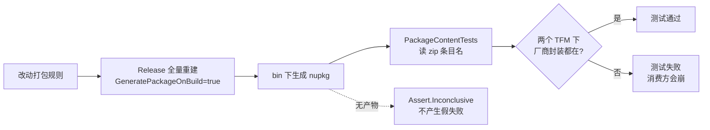

# 包内容守卫

<cite>
**本文引用的文件**
- [Junevy.EasyCamera.Tests/Packaging/PackageContentTests.cs](file://Junevy.EasyCamera.Tests/Packaging/PackageContentTests.cs)
- [Junevy.EasyCamera.Tests/Junevy.EasyCamera.Tests.csproj](file://Junevy.EasyCamera.Tests/Junevy.EasyCamera.Tests.csproj)
- [Junevy.EasyCamera/Junevy.EasyCamera.csproj](file://Junevy.EasyCamera/Junevy.EasyCamera.csproj)
- [Directory.Packages.props](file://Directory.Packages.props)
- [docs/代码审查报告-2026-10-06.md](file://docs/代码审查报告-2026-10-06.md)
- [CHANGELOG.md](file://CHANGELOG.md)
</cite>

## 目录
1. [为什么需要它](#为什么需要它)
2. [两个测试](#两个测试)
3. [定位产物的三个步骤](#定位产物的三个步骤)
4. [找不到产物时的 Inconclusive](#找不到产物时的-inconclusive)
5. [net48 的额外依赖](#net48-的额外依赖)
6. [有效性已验证](#有效性已验证)
7. [编译清单登记](#编译清单登记)

## 为什么需要它

`PackageContentTests.cs`（2026-10-06 新增，2 个测试）是打包内容的回归守卫。它存在的唯一理由是一类特殊的缺陷：**本仓库 build/test 全绿、消费方必崩**。



> [!warning]
> 这类缺陷单元测试天然测不到——它不体现在任何类型、任何行为上，只体现在"包里有几个文件"。因此守卫必须直接校验**打包产物**，而不是校验代码或 csproj 文本。

## 两个测试

测试类 `Junevy.EasyCamera.Tests.Packaging.PackageContentTests`，共享一个必需程序集清单（按包内路径断言，字符串比较，`OrdinalIgnoreCase`）：

| 常量/测试 | 断言 |
| --- | --- |
| `RequiredVendorAssemblies` | `lib/net48/MvCameraControl.Net.dll`、`lib/net8.0/MvCameraControl.Net.dll`、`lib/net48/MVSDK_Net.dll`、`lib/net8.0/MVSDK_Net.dll` |
| `Package_ShouldContainVendorManagedAssembliesForEveryTargetFramework` | 上述四条全部存在于包内 |
| `Package_ShouldContainLibraryForEveryTargetFramework` | `lib/net48/Junevy.EasyCamera.dll` 与 `lib/net8.0/Junevy.EasyCamera.dll` 均存在 |

厂商程序集缺失时的失败消息里直接写了消费方的症状（`TypeInitializationException`、`FileNotFoundException('MvCameraControl.Net')`）和处理方向（检查 `Pack` 项、`PackagePath` 必须逐 TFM 写全），避免后来者重新推一遍。

## 定位产物的三个步骤

`FindPackagedLibrary()` → `FindRepositoryRoot()` → `ReadEntryNames()`：

1. **找仓库根**：从 `AppContext.BaseDirectory` 逐级向上，取第一个含 `Junevy.EasyCamera.sln` 的目录。找不到返回 `null`。
2. **取最新包**：在 `<repoRoot>/Junevy.EasyCamera/bin` 下递归搜 `Junevy.EasyCamera.*.nupkg`，按 `LastWriteTimeUtc` 降序取第一个。注意是**递归 + 最新**，`bin/Debug` 与 `bin/Release` 下的多个历史版本都会进候选集。
3. **读条目名**：用 `System.IO.Compression.ZipFile.OpenRead`，把每个 entry 的 `FullName` 中的 `\` 换成 `/` 后装进 `HashSet<string>`（`OrdinalIgnoreCase`），再用 `Contains` 断言。

第 3 步只读条目名，不解压内容，代价很低。

## 找不到产物时的 Inconclusive

两个测试在 `package == null` 时都调 `Assert.Inconclusive`（消息提示"请先执行 Release 构建"），**不产生假失败**。

这是必要的：`GeneratePackageOnBuild=true` 意味着 Release 构建后一定有产物，但增量/局部构建、只跑 `dotnet test` 不重建、或 CI 上顺序不同都可能没有。此时报红只是噪声，会训练人忽略这个守卫。

## net48 的额外依赖

`PackageContentTests` 用到 `ZipFile` / `ZipArchive`，在 net48 下必须显式引用 BCL 程序集。`Junevy.EasyCamera.Tests.csproj` 中：

```xml
<ItemGroup Condition="'$(TargetFramework)' == 'net48'">
    <Reference Include="System.IO.Compression" />
    <Reference Include="System.IO.Compression.FileSystem" />
</ItemGroup>
```

net8.0 已内置于共享框架，无需处理。

## 有效性已验证

移除 `Junevy.EasyCamera.csproj` 的 `Pack` 项后，该测试**立即失败**。这是判断守卫还有效的唯一标准——与 1.1.0 的 `Close` per-key 锁守卫（移除后 2 个锁竞争测试失败）同属一类"有效性可证"的回归测试。

改动打包规则（尤其是任何"顺手简化" `PackagePath` 的想法）后，必须先确认这个测试仍然通过；反之，若你认为某条规则该被移除，就要能接受这个测试变红并说明理由。

## 编译清单登记

`PackageContentTests.cs` 已登记在 `Junevy.EasyCamera.Tests.csproj` 的 `<Compile>` 清单中（`Packaging\PackageContentTests.cs`）。该项目 `EnableDefaultCompileItems=false`，**新增测试文件必须手工加入该清单**，否则不会被编译、更不会执行——2026-10-06 曾因此让 6 个探测测试"绿色地缺席"（仓库实有 98 个 `[TestMethod]`，只执行了 92 个）。

验收时应核对"仓库内 `[TestMethod]` 总数 == 执行数"：

```powershell
(Get-ChildItem .\Junevy.EasyCamera.Tests -Recurse -Filter *.cs | Where-Object { $_.FullName -notmatch '\\(bin|obj)\\' } | Select-String -Pattern '\[TestMethod\]' | Measure-Object).Count
```

（用递归写法而不是 `-Path .\Junevy.EasyCamera.Tests\*\*\*.cs`：测试文件只有两级深，三层通配实测返回 **0**，会误导成"一个测试都没有"。）

1.1.1 发布基线：仓库内 124 个 `[TestMethod]`，net48 与 net8.0 各执行 124/124（其后链路探测回退修复新增 6 项，当前 130/130，该守卫仍通过且未 Inconclusive）。

**章节来源**
- [Junevy.EasyCamera.Tests/Packaging/PackageContentTests.cs](file://Junevy.EasyCamera.Tests/Packaging/PackageContentTests.cs)
- [Junevy.EasyCamera.Tests/Junevy.EasyCamera.Tests.csproj](file://Junevy.EasyCamera.Tests/Junevy.EasyCamera.Tests.csproj)
- [Junevy.EasyCamera/Junevy.EasyCamera.csproj](file://Junevy.EasyCamera/Junevy.EasyCamera.csproj)
- [docs/代码审查报告-2026-10-06.md](file://docs/代码审查报告-2026-10-06.md)
- [CHANGELOG.md](file://CHANGELOG.md)

**图表来源**
- [Junevy.EasyCamera.Tests/Packaging/PackageContentTests.cs](file://Junevy.EasyCamera.Tests/Packaging/PackageContentTests.cs)
- [Junevy.EasyCamera/Junevy.EasyCamera.csproj](file://Junevy.EasyCamera/Junevy.EasyCamera.csproj)
