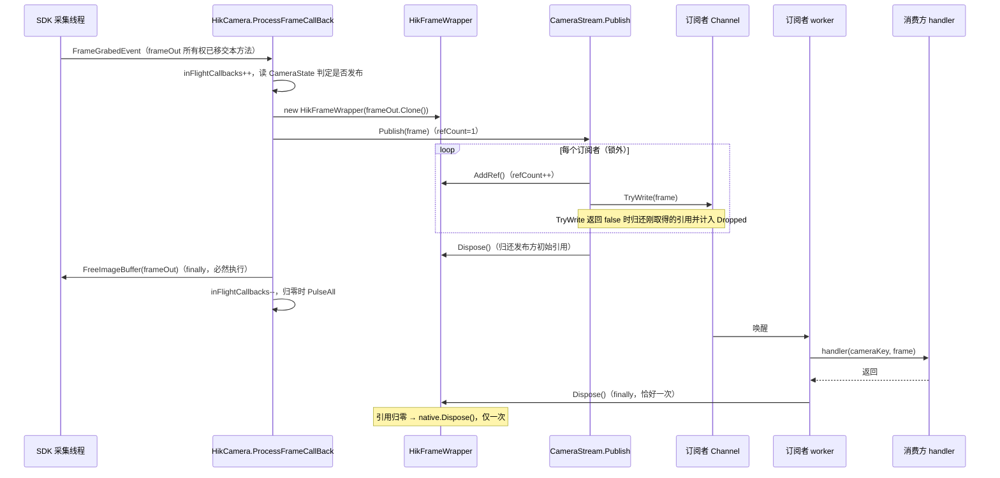
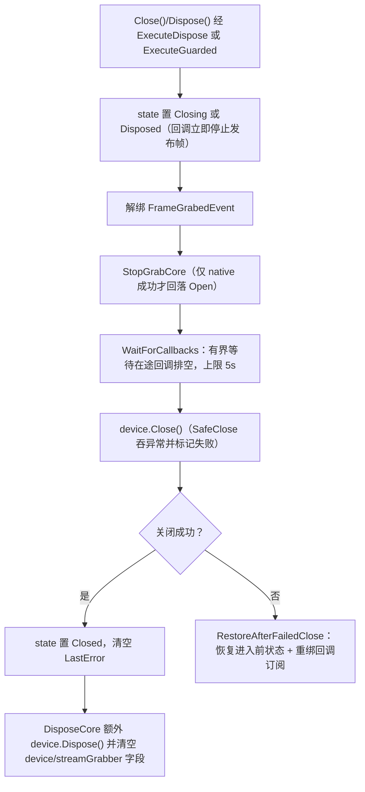

# 帧数据流与生命周期

<cite>
**本文引用的文件**   
- [Junevy.EasyCamera/Vendors/HikVision/HikCamera.cs](file://Junevy.EasyCamera/Vendors/HikVision/HikCamera.cs)
- [Junevy.EasyCamera/Vendors/HikVision/HikFrameWrapper.cs](file://Junevy.EasyCamera/Vendors/HikVision/HikFrameWrapper.cs)
- [Junevy.EasyCamera/Common/CameraStream.cs](file://Junevy.EasyCamera/Common/CameraStream.cs)
- [Junevy.EasyCamera/Common/CameraStreamSubscriber.cs](file://Junevy.EasyCamera/Common/CameraStreamSubscriber.cs)
- [Junevy.EasyCamera/Common/StreamManager.cs](file://Junevy.EasyCamera/Common/StreamManager.cs)
- [Junevy.EasyCamera/Common/CameraService.cs](file://Junevy.EasyCamera/Common/CameraService.cs)
- [Junevy.EasyCamera.Core/Abstractions/IFrame.cs](file://Junevy.EasyCamera.Core/Abstractions/IFrame.cs)
- [Junevy.EasyCamera.Core/Abstractions/ICameraStream.cs](file://Junevy.EasyCamera.Core/Abstractions/ICameraStream.cs)
- [Junevy.EasyCamera.Core/Abstractions/FrameStreamStatistics.cs](file://Junevy.EasyCamera.Core/Abstractions/FrameStreamStatistics.cs)
- [AGENTS.md](file://AGENTS.md)
</cite>

## 目录
1. [一帧的完整路径](#一帧的完整路径)
2. [采集回调时序](#采集回调时序)
3. [引用计数规则](#引用计数规则)
4. [发布与背压](#发布与背压)
5. [订阅者 worker 与自摘除](#订阅者-worker-与自摘除)
6. [订阅者释放顺序](#订阅者释放顺序)
7. [相机关闭主线](#相机关闭主线)
8. [丢帧可观测性](#丢帧可观测性)
9. [帧的读取方式](#帧的读取方式)

## 一帧的完整路径

帧数据主线（每帧仅克隆一次，多订阅者浅共享）：

1. SDK 采集线程触发 `HikCamera.ProcessFrameCallBack`；回调内 `inFlightCallbacks++`，读状态判定是否发布（`Open`/`Grabbing` 才发布；`Closing`/`Disposed`/`Closed` 一律不发布）。
2. `frameOut.Clone()` 得到**独立缓冲区的克隆帧**（克隆非空但类型不符时立即释放，避免克隆帧泄漏），包成 `new HikFrameWrapper(clonedFrame)` 后 `stream.Publish(frame)`，所有权移交数据流。
3. `finally` 中立即 `(callbackGrabber ?? fallbackGrabber)?.FreeImageBuffer(frameOut)` 归还 SDK 缓冲——**无论相机是否正在 Dispose**，都用回调来源取流器或进入回调时捕获的取流器，不依赖可能已被清空的 `device` 字段。
4. `CameraStream.Publish`：锁内只取订阅者快照，锁外对每个订阅者 `AddRef + TryWrite`。
5. 每订阅者 worker `WaitToReadAsync` + `TryRead` → `handler(cameraKey, frame)` → `finally DisposeFrame(frame, whenException)`；引用归零时由最后一个释放者物理释放非托管缓冲（约 5MB+/帧）。

**图表来源**
- [Junevy.EasyCamera/Vendors/HikVision/HikCamera.cs](file://Junevy.EasyCamera/Vendors/HikVision/HikCamera.cs)
- [Junevy.EasyCamera/Vendors/HikVision/HikFrameWrapper.cs](file://Junevy.EasyCamera/Vendors/HikVision/HikFrameWrapper.cs)
- [Junevy.EasyCamera/Common/CameraStream.cs](file://Junevy.EasyCamera/Common/CameraStream.cs)
- [Junevy.EasyCamera/Common/CameraStreamSubscriber.cs](file://Junevy.EasyCamera/Common/CameraStreamSubscriber.cs)

## 采集回调时序

`ProcessFrameCallBack` 的四条硬性规则：

| 规则 | 实现要点 |
|---|---|
| 回调内不得抛异常 | `catch { frame?.Dispose(); }`——异常外泄会中断 SDK 采集 |
| SDK 缓冲必须归还 | `finally` 中 `FreeImageBuffer`，异常也只记 `LastError` 不外泄 |
| 归还用具的取流器 | `(callbackGrabber ?? fallbackGrabber)`；`fallbackGrabber` 是进入回调时在 `stateLock` 内捕获的 |
| 在途计数配对 | `inFlightCallbacks++` / `--`，归零时 `Monitor.PulseAll(stateLock)` 唤醒等待方 |

`Device.Open()` 成功后绑定回调时用"先解绑再绑定"（`-=` 后 `+=`），避免重复打开时回调被注册多次导致每帧重复发布。

## 引用计数规则

| 规则 | 说明 |
|---|---|
| 初始为 1 | 发布方持有，由流在 `Publish` 末尾释放 |
| 每入队一个订阅者 +1 | `Publish` 中 `AddRef` 成功后 `TryWrite`；`TryWrite` 失败则立刻归还该引用 |
| 消费/淘汰/取消时各释放一次 | worker 的 `finally`、背压淘汰回调、`Unsubscribe` 后的排空 |
| 归零者物理释放 | 由**最后一个释放者**释放非托管缓冲，**不得**固定为发布者，否则其余浅引用悬空；且仅释放一次（`Interlocked.Exchange(ref disposed, 1)`） |
| `AddRef` 必须在 handler 返回前完成 | 否则可能与最后一次 `Dispose` 并发，导致访问已释放的原生内存；已释放帧再 `AddRef` 抛 `ObjectDisposedException` |
| 终结器兜底 | 忘记 `Dispose` 时由 GC 释放克隆帧的非托管缓冲，避免永久泄漏 |

## 发布与背压

`CameraStream.Publish` 的锁纪律（`operationLock` 只保护订阅者注册表）：

- 锁内：判断 `disposed`/`subscribers.Count`，取 `subscribers.Values.ToArray()` 快照。
- 锁外：`AddRef`、`TryWrite`、被拒收帧的引用归还与 `Dropped` 递增、5MB 帧的实际释放。
- 无订阅者（或流已释放）时：`Dropped++` 并立即释放该帧；订阅者在锁外被释放时 `TryWrite` 返回 false，引用照常归还，不会泄漏。

通道配置：`Channel.CreateBounded<IFrame>(new BoundedChannelOptions(capacity) { FullMode = ToFullMode(options.BackpressureMode), SingleReader = true, SingleWriter = false, AllowSynchronousContinuations = false }, frame => OnFrameDropped(frame, whenException))`。`capacity < 1` 按 1 处理；`CameraService.SubscribeFrameStream` 的 `capacity <= 0` 时改用 `IStreamOptions.StreamCapacity`。

> [!warning]
> 采集线程上的任何耗时操作都会直接拉低帧率：handler 里不要做重活（落盘、UI 同步阻塞、复杂计算）。重活请配合 `frame.AddRef()` 移交到其他线程，并保证对应的 `Dispose()`。

## 订阅者 worker 与自摘除

`ConsumeAsync` 的控制流：外层 `while (await channel.Reader.WaitToReadAsync(cts.Token))`、内层 `while (channel.Reader.TryRead(out frame))`，每帧 `Delivered++` → `await handler(cameraKey, frame)`，`finally` 中 `DisposeFrame(frame, whenException)`。

- 未提供 `whenException` 时，handler 异常会**终止该 worker**，并在 `finally` 中置 `terminated = true` → `RemoveDeadSubscriber(subscriberKey, self)`：把订阅者从字典移除并 `Dispose` 其资源。
- 这条自愈逻辑是必需的：否则 `Publish` 会持续向已死订阅者的通道写入帧，造成帧滞留泄漏与订阅静默失效；`RemoveDeadSubscriber` 只在字典中**仍是该实例**时才移除（`ReferenceEquals`），避免误删同 Key 的重新订阅。
- `finally` 中先 `TryRead` 排空并释放通道内剩余帧，再做自摘除——确保任何退出路径都不漏帧。
- `OperationCanceledException`（退订/流释放触发取消）不算终止，不自摘除。

> [!bug] 已知缺陷：handler 抛"取消类"异常且未传 `whenException` 时订阅变成僵尸
> `ConsumeAsync` 里 `catch (OperationCanceledException)` 排在 `catch (Exception)` 之前，且只有后两类分支才置 `terminated = true`。因此 handler 若抛出 `OperationCanceledException` 或其派生类 `TaskCanceledException`（`HttpClient`/`Task.Delay` 带已取消令牌时很常见），内层 `catch` 因无 `whenException` 而 `throw`，随后被外层当作"退订取消"静默吞掉：**worker 已退出，订阅者却仍留在字典里**。实测（2026-10-06，net8.0，容量 3、连续发布 6 帧）：`InvalidOperationException` 时 `SubscriberCount=0`、6 帧全部释放；`TaskCanceledException`/`OperationCanceledException` 时 `SubscriberCount=1`、只处理了第 1 帧、通道里 3 帧（约 3×5MB）一直被持有，直到退订或流释放。无用例覆盖，尚未修复；规避办法仍是**始终传 `whenException`**（传了则任何异常都只通知、不终止）。

> [!tip]
> 生产代码始终传 `whenException`：否则 handler 抛一次异常，订阅就静默消失（表现为"帧不来了"），现场几乎无法定位。

## 订阅者释放顺序

`CameraStreamSubscriber.Dispose()`（`Unsubscribe`、同 Key 替换、流释放三条路径共用）：

1. `Channel.Writer.TryComplete()`（完成写入，让 worker 排空剩余帧后退出）。
2. `Cts.Cancel()`。
3. **CTS 延迟到 worker 退出后再释放**：`AttachCtsCleanup` 用 `worker.ContinueWith(..., ExecuteSynchronously, TaskScheduler.Default)`；worker 已完成或尚未启动时立即释放（幂等，由 `ctsDisposed` 保证只做一次）。若在 worker 仍使用 Token 时释放 CTS，`WaitToReadAsync` 会抛 `ObjectDisposedException`。
4. `StartWorker` 的竞态兜底：若 `Dispose` 先于 `StartWorker`，`StartWorker` 内部检测到 `disposed == 1` 会补挂 CTS 延迟释放。

## 相机关闭主线

`HikCamera.CloseCore` / `DisposeCore`：

**图表来源**
- [Junevy.EasyCamera/Vendors/HikVision/HikCamera.cs](file://Junevy.EasyCamera/Vendors/HikVision/HikCamera.cs)

要点：

- 进入 `Closing` 后 `Publish` 的状态判定立即为 false，停止发布；`StopGrabCore` 中只有当当前状态**确实**是 `Grabbing` 时才回落到 `Open`，否则会在 Close 期间把状态改回 `Open` 让回调又开始发布。
- `WaitForCallbacks` 用 `Monitor.Wait(stateLock, remaining)` 等待，deadline 为 `CallbackDrainTimeout`（5 秒）；超时记 `LastError`（"Timed out waiting for N in-flight frame callback(s) to drain."）但**不阻塞**关闭。
- 任何失败路径（含原生异常）都经 `RestoreAfterFailedClose` 回滚状态与回调订阅，相机仍可重试关闭或继续使用。历史缺陷：显式失败分支会回滚而 `catch` 分支不会，导致相机永久停在"关闭中"——`IsConnected` 仍为 true 却一帧都不再下发（静默丢帧且无任何报错）。
- `DisposeCore` 先置终态再解绑，且**即使 `Close` 失败也继续 `Dispose`**，确保资源尽量回收（`CameraManager.DisposeCamera` 同样如此）；门面层 `CameraService.Close(cameraKey)` 持 per-key 锁后调用 `cameraManager.Remove(cameraKey)`，把 `CameraRemoveStatus` 映射为 `CameraResult`（`Removed`→成功、`NotFound`→失败、`ReleaseFailed`→失败并带 `LastError`）。

## 丢帧可观测性

`FrameStreamStatistics`（只读值拷贝）三个计数：

| 计数 | 递增时机 |
|---|---|
| `Published` | 每次 `Publish` 收到非空帧（不含空帧） |
| `Delivered` | 投递给订阅者 handler 之前 |
| `Dropped` | 无订阅者；`TryWrite` 返回 false（`RejectNewest` 拒收或通道已关闭）；`DropOldest` 背压淘汰（通道的 item-dropped 回调）；`AddRef` 成功后 `TryWrite` 意外抛异常。**`AddRef` 本身抛异常不计入**（见下） |

**计数口径**：`Published` 按**帧**计（每次 `Publish` 一次），`Delivered`/`Dropped` 按**（帧 × 订阅者）**计，无订阅者时按帧计一次 `Dropped`。因此单订阅者时可近似 `Published ≈ Delivered + Dropped + 在途`，多订阅者时 `Delivered` 与 `Dropped` 会成倍累计，不满足该等式，也可能 `Delivered > Published`。`frame.AddRef()` 抛异常（仅当帧已被释放，正常路径不会出现——发布期间发布方仍持有初始引用）时，该订阅者被静默跳过：没有取得引用所以无需归还，**也不会计入 `Dropped`**，是统计盲区。

读取入口：`ICameraStream.Statistics` 与 `ICameraService.GetStreamStatistics(cameraKey)`；相机未打开、从未订阅或流管理器已释放时返回 `FrameStreamStatistics.Empty`。现场排查口诀：`Dropped` 持续增长 = 消费慢于采集，应加大 `StreamCapacity` 或减小 handler 工作量（策略选型见 [[架构设计/核心设计模式]]）。

## 帧的读取方式

`Width`/`Height`/`Stride`/`PixelType`/`ImageSize` 构造时快照、安全；`Data` 是托管副本（首次访问时缓存，已释放且从未访问过时返回空数组）；`GetBitmap()` 返回独立 GDI+ 位图副本、由调用方 Dispose、帧已释放时返回 `null`；`PixelDataPtr` 是逃生舱，帧释放后返回 `IntPtr.Zero`，**禁止**保存或跨 handler 使用。订阅者是只读消费者：发布方不得修改帧数据。

**章节来源**
- [Junevy.EasyCamera/Vendors/HikVision/HikCamera.cs](file://Junevy.EasyCamera/Vendors/HikVision/HikCamera.cs)
- [Junevy.EasyCamera/Vendors/HikVision/HikFrameWrapper.cs](file://Junevy.EasyCamera/Vendors/HikVision/HikFrameWrapper.cs)
- [Junevy.EasyCamera/Common/CameraStream.cs](file://Junevy.EasyCamera/Common/CameraStream.cs)
- [AGENTS.md](file://AGENTS.md)
- [CHANGELOG.md](file://CHANGELOG.md)
