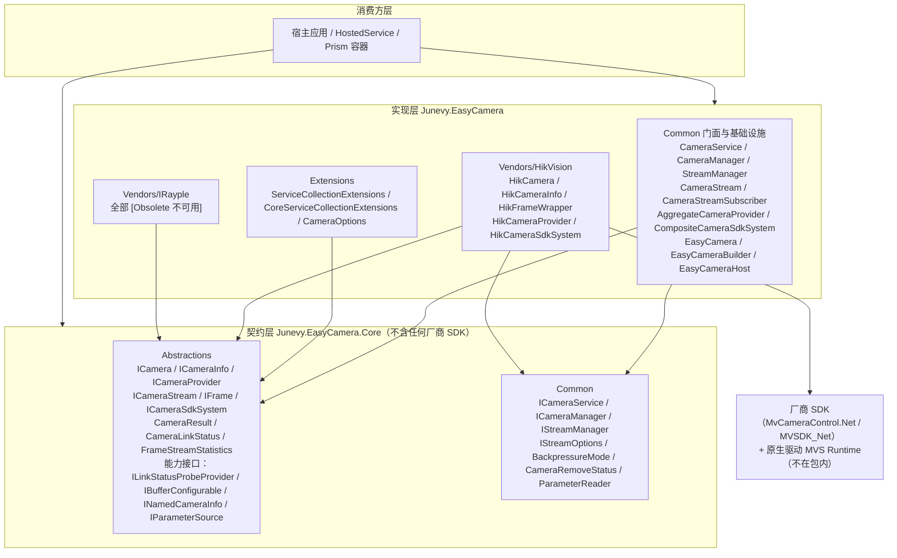
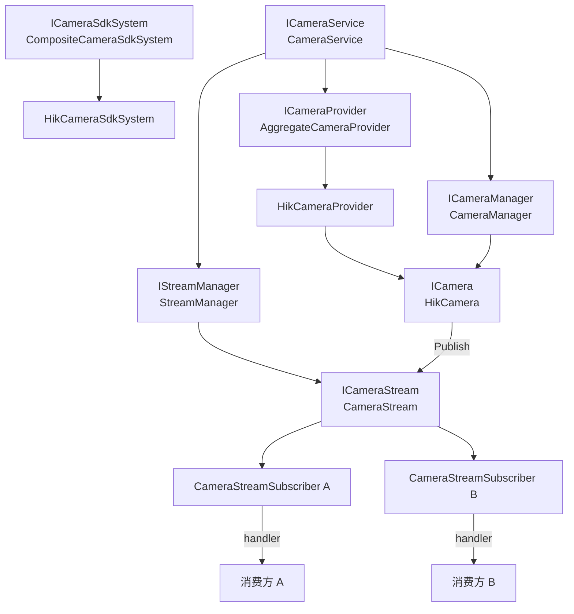

# 整体架构概览

<cite>
**本文引用的文件**   
- [AGENTS.md](file://AGENTS.md)
- [Junevy.EasyCamera/Common/CameraService.cs](file://Junevy.EasyCamera/Common/CameraService.cs)
- [Junevy.EasyCamera/Common/CameraManager.cs](file://Junevy.EasyCamera/Common/CameraManager.cs)
- [Junevy.EasyCamera/Common/StreamManager.cs](file://Junevy.EasyCamera/Common/StreamManager.cs)
- [Junevy.EasyCamera/Common/CameraStream.cs](file://Junevy.EasyCamera/Common/CameraStream.cs)
- [Junevy.EasyCamera/Common/AggregateCameraProvider.cs](file://Junevy.EasyCamera/Common/AggregateCameraProvider.cs)
- [Junevy.EasyCamera/Common/CompositeCameraSdkSystem.cs](file://Junevy.EasyCamera/Common/CompositeCameraSdkSystem.cs)
- [Junevy.EasyCamera/Vendors/HikVision/HikCamera.cs](file://Junevy.EasyCamera/Vendors/HikVision/HikCamera.cs)
- [Junevy.EasyCamera/Vendors/HikVision/HikCameraProvider.cs](file://Junevy.EasyCamera/Vendors/HikVision/HikCameraProvider.cs)
- [Junevy.EasyCamera/Vendors/HikVision/HikCameraSdkSystem.cs](file://Junevy.EasyCamera/Vendors/HikVision/HikCameraSdkSystem.cs)
</cite>

## 目录
1. [三层依赖与单向引用](#三层依赖与单向引用)
2. [组件职责](#组件职责)
3. [组件协作图](#组件协作图)
4. [两套注册表与 cameraKey](#两套注册表与-camerakey)
5. [并发纪律](#并发纪律)
6. [厂商接入的四个落点](#厂商接入的四个落点)

## 三层依赖与单向引用

**图表来源**
- [AGENTS.md](file://AGENTS.md)
- [Junevy.EasyCamera/Extensions/ServiceCollectionExtensions.cs](file://Junevy.EasyCamera/Extensions/ServiceCollectionExtensions.cs)
- [Junevy.EasyCamera/Common/CameraService.cs](file://Junevy.EasyCamera/Common/CameraService.cs)

依赖方向严格单向：消费方 → Core 契约 → 实现层 → 厂商 SDK。Core 不引用任何厂商 SDK（只有 `System.Drawing.Common`），实现层引用 Core + 厂商 SDK。这条约束保证"新增品牌"不会污染契约包。

## 组件职责

| 组件 | 接口 | 职责与关键实现点 |
|---|---|---|
| `CameraService` | `ICameraService` | 门面。枚举、开关机、取流订阅/退订、参数访问、链路探测、帧流统计。持 per-key 锁（`ConcurrentDictionary<string, object> cameraKeyLocks` + `GetKeyLock`），`OpenCamera`/`Close`/`StartGrab`/`StopGrab`/`SetTrigger` 按 cameraKey 串行；参数访问路径（`SetParam`/`TryGetParam` 等）不经该锁，互斥由厂商相机的 `operationGate` 保证。`ICamera.LastError` 必须透传到 `CameraResult.Message` |
| `CameraManager` | `ICameraManager` | 相机注册表。`TryRegister`/`TryGet`/`Remove`/`Snapshot`/`LastError`；字典锁只保护注册表状态，原生 `Close`/`Dispose` 在锁外执行（避免阻塞其他相机或在回调中形成锁反转）；`Remove` 返回 `CameraRemoveStatus`（`Removed`/`NotFound`/`ReleaseFailed`），成功清理后清空 `LastError` |
| `StreamManager` | `IStreamManager` | 帧流注册表，按 cameraKey 管理 `ICameraStream`。构造参数为 `IStreamOptions`（容量/背压策略），`GetOrCreateStream`/`GetStream`/`RemoveStream`，带 disposed 防护（释放后 `GetOrCreateStream` 抛 `ObjectDisposedException`，竞态新建流就地释放） |
| `CameraStream` | `ICameraStream` | 帧分发。有界 `Channel` + 每订阅者一个 worker；`Publish`/`Subscribe`/`Unsubscribe`/`Statistics`/`SubscriberCount`；`CameraStreamSubscriber` 是 internal 实现细节（封装通道、CTS、worker 生命周期） |
| `AggregateCameraProvider` | `ICameraProvider` + `ILinkStatusProbeProvider` | 多厂商聚合。按 `Supports` 分发 `Create`/`Enumerate`，并以能力探测方式分发链路探测；无厂商具备能力时返回 `CameraLinkStatus.Unknown` |
| `CompositeCameraSdkSystem` | `ICameraSdkSystem` | 组合多个 `ICameraSdkSystem`。`Initialize`/`Release` 逐个调用，单个失败不中断其余，全部处理完后抛 `AggregateException`；`Dispose` 吞掉异常 |
| `HikCamera` | `ICamera` + `IParameterSource` + `IBufferConfigurable` | 海康相机。所有原生访问经 `operationGate`（`ExecuteGuarded`/`TryExecuteGuarded`/`ExecuteDispose` 三个守卫收敛：互斥 + 异常翻译成 `CameraResult` + `LastError` 诊断）；生命周期用单一 `CameraState` 枚举表达 |
| `HikCameraProvider` | `IVendorCameraProvider` + `ILinkStatusProbeProvider` | 枚举（`DeviceEnumerator.EnumDevices`）、创建（`new HikCamera` + 按 `CameraBufferCapacity` 应用缓冲配置）、非侵入可达性探测（重新枚举取新鲜设备信息 + `IsDeviceAccessible` 独占模式） |
| `HikCameraSdkSystem` | `ICameraSdkSystem` | SDK `Initialize`/`Finalize` 按实例引用计数管理（全局静态计数 + 全局锁），归零才真正 Finalize；含 internal 测试 seam 供无硬件单测替换 |
| `EasyCamera`/`EasyCameraBuilder`/`EasyCameraHost` | — | 非 DI 一行式入口与资源作用域（RAII 风格）：`Build` 不做原生调用，`Dispose` 幂等并按"相机 → 帧流 → SDK"释放 |
| `ServiceCollectionExtensions` / `CoreServiceCollectionExtensions` | — | DI 注册（厂商注册 + 核心基础设施），详见 [[架构设计/配置与依赖注入]] |

## 组件协作图

**图表来源**
- [Junevy.EasyCamera/Common/CameraService.cs](file://Junevy.EasyCamera/Common/CameraService.cs)
- [Junevy.EasyCamera/Common/CameraManager.cs](file://Junevy.EasyCamera/Common/CameraManager.cs)
- [Junevy.EasyCamera/Common/StreamManager.cs](file://Junevy.EasyCamera/Common/StreamManager.cs)
- [Junevy.EasyCamera/Common/CameraStream.cs](file://Junevy.EasyCamera/Common/CameraStream.cs)
- [Junevy.EasyCamera/Common/AggregateCameraProvider.cs](file://Junevy.EasyCamera/Common/AggregateCameraProvider.cs)

## 两套注册表与 cameraKey

库内有两张平行的 `cameraKey → 实例` 注册表，由同一个 `CameraService` 门面协调：

| 注册表 | 内容 | 生命周期 |
|---|---|---|
| `CameraManager` | `cameraKey → ICamera` | `Close(key)` 时移除并释放 |
| `StreamManager` | `cameraKey → ICameraStream` | **不随 `Close` 删除**——重开同名 key 后既有订阅自动继续生效；只有 `StreamManager.Dispose()` 或探测路径的 `finally` 清理才移除 |

因此相机与帧流共用同一个 `cameraKey`：`OpenCamera` 时先 `GetOrCreateStream(cameraKey)` 再 `provider.Create(info, stream)`，把流注入相机；订阅时凭同一 key 取出流。这也意味着"相机关了但订阅还在"是正常状态，而不是 bug。

链路探测用的临时 key 前缀为 `probe:{serial}`（常量 `ProbeKeyPrefix`），探测完成后在 `finally` 中同时清理相机与帧流条目——早期实现只清相机，导致每次探测都在 `StreamManager` 里永久留下一条死流。

## 并发纪律

以下四条来自 `AGENTS.md`，新增厂商必须遵守：

| 纪律 | 具体要求 |
|---|---|
| 一切原生访问经厂商相机的 `operationGate` | 唯一例外是 SDK 采集回调线程，它只读状态并归还缓冲区 |
| 生命周期用单一状态枚举 | 海康 `CameraState`：`Closed`/`Open`/`Grabbing`/`Closing`/`Disposed`；不得再引入并行布尔标志位；任何失败路径（含原生异常）必须回滚到进入前的状态，否则会出现"连接还在但一帧不发"的静默丢帧 |
| 门面按 cameraKey 串行 | 新增写操作必须并入 `GetKeyLock(cameraKey)`，否则会重现 use-after-free 竞态（历史上 `Close` 未持锁即造成 native use-after-free） |
| `CameraStream.operationLock` 只保护订阅者注册表 | `AddRef`/`TryWrite`/背压淘汰/5MB 帧释放/用户异常回调一律在锁外执行 |

## 厂商接入的四个落点

新增一个品牌通常只改实现层，Core 契约不动：

1. `Vendors/<Vendor>/`：实现 `IVendorCameraProvider`（枚举/创建/`Supports`）、`ICamera`（生命周期 + 参数）、`IFrame`（帧包装）、`ICameraSdkSystem`（SDK 初始化）。
2. `Extensions/ServiceCollectionExtensions.cs`：加一个 `Enable<Vendor>()` 与注册方法（`TryAddEnumerable(ServiceDescriptor.Singleton<IVendorCameraProvider, XxxCameraProvider>())` 形式）。
3. `Junevy.EasyCamera.csproj`：照抄现有写法追加厂商托管封装的 `<Reference>` 与**无条件** `<None ... Pack="true" PackagePath="lib/net48;lib/net8.0" />`。
4. 若有独有能力，实现独立能力接口（`ILinkStatusProbeProvider` / `IBufferConfigurable` / `INamedCameraInfo` / `IParameterSource`），**不要**加进 `ICameraProvider` 或 `ICamera`。

各模式的展开见 [[架构设计/核心设计模式]]。

**章节来源**
- [AGENTS.md](file://AGENTS.md)
- [Junevy.EasyCamera/Common/CameraService.cs](file://Junevy.EasyCamera/Common/CameraService.cs)
- [Junevy.EasyCamera/Common/CameraManager.cs](file://Junevy.EasyCamera/Common/CameraManager.cs)
- [Junevy.EasyCamera/Common/StreamManager.cs](file://Junevy.EasyCamera/Common/StreamManager.cs)
- [Junevy.EasyCamera/Common/CameraStream.cs](file://Junevy.EasyCamera/Common/CameraStream.cs)
- [Junevy.EasyCamera/Vendors/HikVision/HikCamera.cs](file://Junevy.EasyCamera/Vendors/HikVision/HikCamera.cs)
- [CHANGELOG.md](file://CHANGELOG.md)
