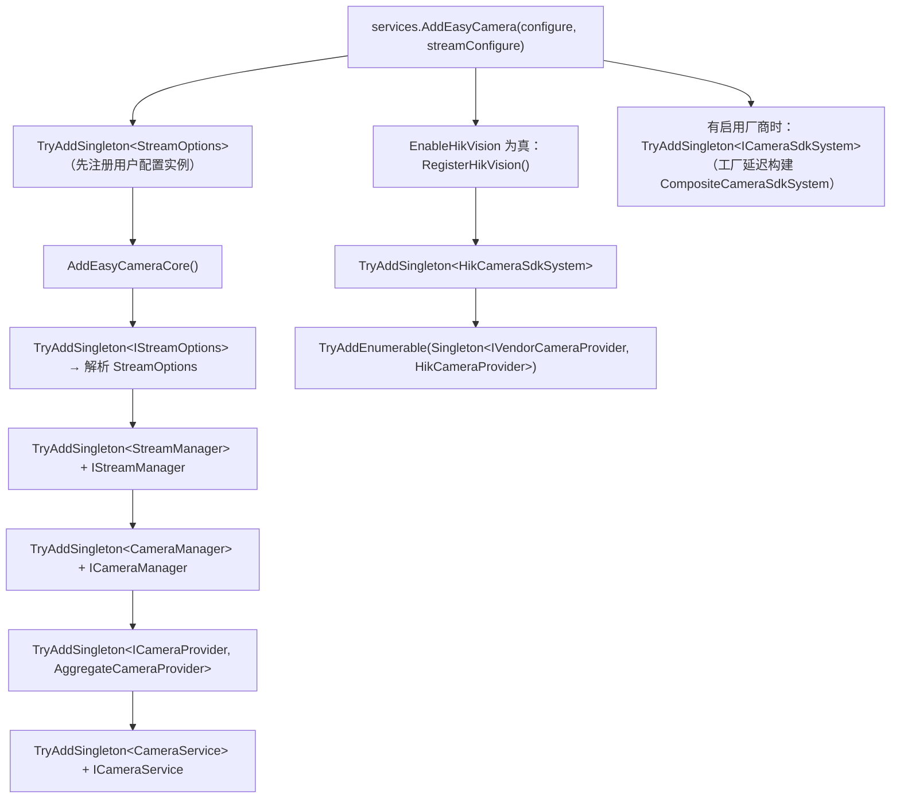

# 配置与依赖注入

<cite>
**本文引用的文件**   
- [Junevy.EasyCamera/Extensions/ServiceCollectionExtensions.cs](file://Junevy.EasyCamera/Extensions/ServiceCollectionExtensions.cs)
- [Junevy.EasyCamera/Extensions/CameraOptions.cs](file://Junevy.EasyCamera/Extensions/CameraOptions.cs)
- [Junevy.EasyCamera/Common/StreamOptions.cs](file://Junevy.EasyCamera/Common/StreamOptions.cs)
- [Junevy.EasyCamera.Core/Common/IStreamOptions.cs](file://Junevy.EasyCamera.Core/Common/IStreamOptions.cs)
- [Junevy.EasyCamera/Common/EasyCameraBuilder.cs](file://Junevy.EasyCamera/Common/EasyCameraBuilder.cs)
- [Junevy.EasyCamera/Common/EasyCameraHost.cs](file://Junevy.EasyCamera/Common/EasyCameraHost.cs)
- [Junevy.EasyCamera/Common/StreamManager.cs](file://Junevy.EasyCamera/Common/StreamManager.cs)
- [Junevy.EasyCamera/Common/CameraService.cs](file://Junevy.EasyCamera/Common/CameraService.cs)
- [Junevy.EasyCamera/Vendors/HikVision/HikCameraProvider.cs](file://Junevy.EasyCamera/Vendors/HikVision/HikCameraProvider.cs)
- [skills/using-junevy-easycamera/SKILL.md](file://skills/using-junevy-easycamera/SKILL.md)
</cite>

## 目录
1. [两个配置对象](#两个配置对象)
2. [StreamOptions 的同一性要求](#streamoptions-的同一性要求)
3. [DI 注册全景](#di-注册全景)
4. [三个注册陷阱](#三个注册陷阱)
5. [服务生命周期](#服务生命周期)
6. [非 DI 路径的装配](#非-di-路径的装配)
7. [新增厂商的注册改动](#新增厂商的注册改动)

## 两个配置对象

| 配置 | 类型 | 成员与默认值 | 作用 |
|---|---|---|---|
| 厂商开关 | `CameraOptions` | `EnableHikVision` / `EnableIRayple` / `EnableBasler`，默认全 `false` | 决定注册哪些厂商服务；未实现的厂商在注册阶段即抛 `NotImplementedException` |
| 帧流配置 | `StreamOptions : IStreamOptions` | `StreamCapacity` = 5（每订阅者有界帧缓存，帧数，<1 按 1 处理）；`CameraBufferCapacity` = 0（0 表示用 SDK 默认值）；`BackpressureMode` = `DropOldest` | 订阅队列容量与背压策略；采集端缓冲配置 |

`CameraBufferCapacity` 只对实现了 `IBufferConfigurable` 的相机生效：`HikCameraProvider.Create` 在创建相机后做能力探测，容量 > 0 时调用 `SetBufferCount`；相机已打开则立即生效，未打开则记录配置、延迟到 `Connect` 成功后应用。厂商不支持时静默忽略，不影响可用性。

DI 与 Builder 两条路径共用同一套默认值；Builder 路径下 `host.Options` 就是本次组装所用的那个 `StreamOptions` 实例（与 `StreamManager`、`CameraService`、`HikCameraProvider` 共享同一对象），**不是只读快照**——源码注释称"修改不再影响已创建的栈"与实现不符：`StreamCapacity`/`BackpressureMode`/`CameraBufferCapacity` 都是在订阅或创建相机的当下读取，构建后再改会影响此后新建的订阅与相机，已建立的订阅不受影响。

## StreamOptions 的同一性要求

> [!warning]
> `StreamManager` 必须拿到**同一份** `StreamOptions` 实例，否则容量与背压策略不生效。`StreamManager(IStreamOptions options = null)` 与 `CameraService(..., IStreamOptions streamOptions = null)` 在传入 `null` 时都会**静默回退**到 `new StreamOptions()`——两份互不相干的对象会各用各的默认值，症状是"我明明配了 `StreamCapacity = 50`，行为却像 5"。Builder 路径已保证同一性（`new StreamManager(this.streamOptions)` 且传给 `CameraService` 的是同一对象）；手工构造时最容易漏。

`HikCameraProvider` 同样需要同一份配置才能应用 `CameraBufferCapacity`。手工构造的正确写法：

```csharp
var options = new StreamOptions { StreamCapacity = 50, BackpressureMode = BackpressureMode.DropOldest };
var streamManager = new StreamManager(options);
var provider = new AggregateCameraProvider(new IVendorCameraProvider[] { new HikCameraProvider(options) });
var service = new CameraService(provider, new CameraManager(), streamManager, options);
```

## DI 注册全景



**图表来源**
- [Junevy.EasyCamera/Extensions/ServiceCollectionExtensions.cs](file://Junevy.EasyCamera/Extensions/ServiceCollectionExtensions.cs)

具体类型（`StreamOptions`、`StreamManager`、`CameraManager`、`CameraService`）与其接口（`IStreamOptions`、`IStreamManager`、`ICameraManager`、`ICameraService`）成对注册，接口用工厂委托回指具体类型，因此需要替换实现时解析具体类型即可。

## 三个注册陷阱

> [!warning]
> **厂商提供器必须用"服务类型 + 实现类型"注册**：`services.TryAddEnumerable(ServiceDescriptor.Singleton<IVendorCameraProvider, HikCameraProvider>())`。若写成工厂委托（`TryAddEnumerable(ServiceDescriptor.Singleton<IVendorCameraProvider>(sp => new HikCameraProvider(...)))`），`TryAddEnumerable` 会按委托签名而非实现类型判重，多厂商场景下只有第一个注册成功，第二个厂商被静默吞掉。

> [!warning]
> **`ICameraSdkSystem` 必须用工厂延迟构建**：`services.TryAddSingleton<ICameraSdkSystem>(provider => new CompositeCameraSdkSystem(sdkSystemFactories.Select(f => f(provider))))`。若直接注册 `IEnumerable<ICameraSdkSystem>` 的实现并从中拼装，容器解析会与自身形成自引用（解析 `ICameraSdkSystem` → 需要 `IEnumerable<ICameraSdkSystem>` → 又包含 `ICameraSdkSystem`）。工厂闭包捕获的是工厂列表，构造时才真正解析。

> [!warning]
> **`StreamOptions` 必须先注册再 `AddEasyCameraCore`**：`AddEasyCamera` 先 `TryAddSingleton<StreamOptions>(streamOptions)` 落用户配置实例，再调 `AddEasyCameraCore()`（内部 `TryAddSingleton` 不会覆盖已有注册）。顺序颠倒时核心层会先注册一个默认 `StreamOptions`，用户配置被无声丢弃。

## 服务生命周期

全部核心服务为**单例**：`ICameraService`、`ICameraManager`、`IStreamManager`、`ICameraProvider`、`StreamOptions`/`IStreamOptions`、`ICameraSdkSystem`、`HikCameraSdkSystem`、`IVendorCameraProvider` 集合。因此可以安全注入 `IHostedService`（或 Prism 的注册实例）长期持有。

`AddEasyCamera` 可重复调用不重复注册：`AddHikVisionCamera()` 与 `AddEasyCamera(options => options.EnableHikVision = true)` 等价，`HikCameraProvider` 因 `TryAddEnumerable` 只注册一份。

`ICameraSdkSystem` 只有在**至少启用一个厂商**时才注册；`HikCameraSdkSystem` 的 `Initialize` 按实例幂等（重复调用只持一个全局引用），全局引用计数归零才真正 `Finalize` SDK，退出流程中调用 `sdk.Dispose()` 即可。

## 非 DI 路径的装配

`EasyCameraBuilder.Build()` 的手工装配等价于上面的 DI 图：

1. `providerFactories` / `sdkFactories` 各生成一个列表（`EnableHikVision()` 分别加入 `new HikCameraProvider(o)` 与 `new HikCameraSdkSystem()`）。
2. `sdkSystems.Count == 1` 时直接用该实例，否则包一层 `CompositeCameraSdkSystem`。
3. `new CameraManager()`、`new StreamManager(this.streamOptions)`、`new CameraService(new AggregateCameraProvider(providers), cameraManager, streamManager, this.streamOptions)`。
4. 返回 `EasyCameraHost(sdk, service, options, cameraManager, streamManager)`，持有 `CameraManager`/`StreamManager` 以便按"相机 → 帧流 → SDK"顺序释放。

约束：`Build()` 前至少启用一个厂商，否则抛 `InvalidOperationException`；`EnableIRayple()`/`EnableBasler()` 直接抛 `NotImplementedException`（与 DI 路径一致）；`Build()` 不做任何原生调用，`Sdk.Initialize()` 必须显式调用。`WithStreamOptions` 可多次调用，效果累计。

> [!warning]
> **1.1.2 起重复调用 `EnableHikVision()` 会被去重**（`enabledVendors` 集合，同一厂商只注册一个提供器与一个 SDK 系统）。此前每次调用都会追加一份 `HikCameraProvider`，`EnumerateCameras()` 会把每台相机列两遍。回归测试：`EasyCameraBuilderTests.EnableHikVision_CalledTwice_RegistersSingleVendor`。DI 路径不受影响（`TryAddEnumerable` 按实现类型判重）。

## 新增厂商的注册改动

1. 在 `CameraOptions` 增加 `EnableXxx` 开关。
2. 在 `ServiceCollectionExtensions.AddEasyCamera` 中：调用 `RegisterXxx(services)`，并把 SDK 工厂加入 `sdkSystemFactories`。
3. `RegisterXxx` 内：`TryAddSingleton<XxxCameraSdkSystem>()` + `TryAddEnumerable(ServiceDescriptor.Singleton<IVendorCameraProvider, XxxCameraProvider>())`。
4. 在 `EasyCameraBuilder` 增加 `EnableXxx()`，加入 provider/sdk 工厂。
5. 在 `Junevy.EasyCamera.csproj` 追加 `<Reference HintPath>` 与**无条件** `<None ... Pack="true" PackagePath="lib/net48;lib/net8.0" />`。
6. 厂商独有能力实现独立能力接口，**不要**改 `ICameraProvider`/`ICamera`。

完整代码路径见 [[项目概述/快速开始指南]]，依赖包与打包细节见 [[项目概述/技术栈概览]]。

**章节来源**
- [Junevy.EasyCamera/Extensions/ServiceCollectionExtensions.cs](file://Junevy.EasyCamera/Extensions/ServiceCollectionExtensions.cs)
- [Junevy.EasyCamera/Extensions/CameraOptions.cs](file://Junevy.EasyCamera/Extensions/CameraOptions.cs)
- [Junevy.EasyCamera/Common/StreamOptions.cs](file://Junevy.EasyCamera/Common/StreamOptions.cs)
- [Junevy.EasyCamera/Common/EasyCameraBuilder.cs](file://Junevy.EasyCamera/Common/EasyCameraBuilder.cs)
- [Junevy.EasyCamera/Vendors/HikVision/HikCameraProvider.cs](file://Junevy.EasyCamera/Vendors/HikVision/HikCameraProvider.cs)
- [skills/using-junevy-easycamera/SKILL.md](file://skills/using-junevy-easycamera/SKILL.md)
