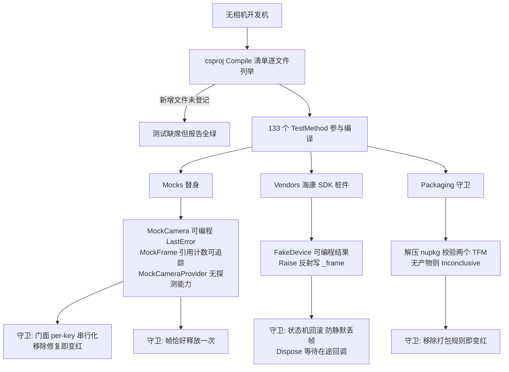

# 回归清单与测试替身

<cite>
**本文引用的文件**
- [Junevy.EasyCamera.Tests/Common/CameraManagerServiceRegressionTests.cs](file://Junevy.EasyCamera.Tests/Common/CameraManagerServiceRegressionTests.cs)
- [Junevy.EasyCamera.Tests/Common/CameraServiceProbeTests.cs](file://Junevy.EasyCamera.Tests/Common/CameraServiceProbeTests.cs)
- [Junevy.EasyCamera.Tests/Common/CameraStreamBackpressureTests.cs](file://Junevy.EasyCamera.Tests/Common/CameraStreamBackpressureTests.cs)
- [Junevy.EasyCamera.Tests/Abstractions/CameraStreamTests.cs](file://Junevy.EasyCamera.Tests/Abstractions/CameraStreamTests.cs)
- [Junevy.EasyCamera.Tests/Abstractions/CameraStreamRegressionTests.cs](file://Junevy.EasyCamera.Tests/Abstractions/CameraStreamRegressionTests.cs)
- [Junevy.EasyCamera.Tests/Vendors/HikCameraStateTests.cs](file://Junevy.EasyCamera.Tests/Vendors/HikCameraStateTests.cs)
- [Junevy.EasyCamera.Tests/Vendors/HikVisionRegressionTests.cs](file://Junevy.EasyCamera.Tests/Vendors/HikVisionRegressionTests.cs)
- [Junevy.EasyCamera.Tests/Vendors/HikCameraSdkSystemTests.cs](file://Junevy.EasyCamera.Tests/Vendors/HikCameraSdkSystemTests.cs)
- [Junevy.EasyCamera.Tests/Packaging/PackageContentTests.cs](file://Junevy.EasyCamera.Tests/Packaging/PackageContentTests.cs)
- [Junevy.EasyCamera.Tests/Mocks/MockCamera.cs](file://Junevy.EasyCamera.Tests/Mocks/MockCamera.cs)
- [Junevy.EasyCamera.Tests/Mocks/MockFrame.cs](file://Junevy.EasyCamera.Tests/Mocks/MockFrame.cs)
</cite>

## 目录
1. [门面 per-key 串行化](#门面-per-key-串行化)
2. [海康状态机与帧包装器](#海康状态机与帧包装器)
3. [帧流与背压](#帧流与背压)
4. [探测语义](#探测语义)
5. [包内容守卫](#包内容守卫)
6. [Mocks 替身](#Mocks-替身)
7. [海康 SDK 桩件](#海康-SDK-桩件)
8. [SDK 生命周期测试 seam](#sdk-生命周期测试-seam)
9. [守卫关系图](#守卫关系图)

## 门面 per-key 串行化

`Common/CameraManagerServiceRegressionTests.cs`（17 个）中的两个并发竞态守卫：

| 用例 | 防住什么 |
| --- | --- |
| `CameraService_Close_WaitsForInFlightOpenOnSameKey` | `Close` 绕过 `GetKeyLock(cameraKey)` 时，会在 `OpenCamera` 的 `Connect()` 执行中途把实例摘出注册表并释放 |
| `CameraService_StartGrab_WaitsForInFlightCloseOnSameKey` | 同上，但在 `StartGrab` 的厂商调用中途释放，随后对已释放实例继续操作 —— native use-after-free |

手法：在测试内的提供器桩件上挂 `SemaphoreSlim`（`ConnectGate` / `CloseGate`），在 `Connect()` / `Close()` 内阻塞制造"进行中"窗口，再从另一线程发起竞争调用，断言其一直挂起直到闸门释放。这两个用例**已验证过**：移除 per-key 锁修复后立即失败。

**章节来源**
- [Junevy.EasyCamera.Tests/Common/CameraManagerServiceRegressionTests.cs](file://Junevy.EasyCamera.Tests/Common/CameraManagerServiceRegressionTests.cs)

## 海康状态机与帧包装器

`Vendors/HikCameraStateTests.cs`（12 个）针对单一 `CameraState` 枚举（`Closed/Open/Grabbing/Closing/Disposed`）：

| 用例 | 防住什么 |
| --- | --- |
| `StateTransitions_FollowConnectGrabStopCloseDispose` | 状态沿合法路径迁移；`StopGrab` 幂等；`Close` 后可重新 `Connect` + `StartGrab` |
| `Close_WhenNativeCloseThrows_RestoresUsableStateAndKeepsPublishing` | 原生关闭抛异常后若不回滚，相机永久停在"关闭中"：`IsConnected` 仍为 true 却一帧都不再下发 —— **静默丢帧且无任何报错** |
| `Close_WhenStopFails_RestoresGrabbingState` | 停流失败必须保留 `Grabbing`，不得谎报已停 |
| `ParameterAccess_AfterDispose_ReturnsFailureWithoutThrowing` | 参数路径曾完全在互斥之外，与 `Dispose` 并发时抛 `NullReferenceException` 穿透到调用方，破坏"失败一律走 `CameraResult`"契约 |
| `ParameterAccess_WhenConnectedButVendorHasNoParameterNode_ReturnsFailure` | 厂商未暴露参数节点（桩件 `Parameters` 为 `null`）时不得报成功假象 |
| `Operations_AfterDispose_FailFast` / `Callback_AfterDispose_DoesNotPublish` | 释放后各操作快速失败且幂等；释放后 SDK 回调不得再发布帧 |
| `IsConnected_IsPureStateRead_NeverCallsNativeDevice` | 1.1.2：公开 `IsConnected` 只读状态，不得调用原生 `IsConnected`（`FakeDevice.IsConnectedCalls` 不增加） |
| `IsConnectedAndParamAccess_RacingDispose_NeverThrow` | 1.1.2：200 轮并发，一线程反复读 `IsConnected`/调 `SetParam`，另一线程 `Dispose`，任何一方都不得抛异常。这是守卫而非确定性复现：旧实现的窗口极窄，旧代码在本次验证中未必触发 |
| `Close_WhenAlreadyClosed_IsIdempotentWithoutNativeClose` | 1.1.2：已关闭后再次 `Close` 幂等成功，且 `CloseCalls` 不增加 |
| `Close_WhenNeverConnected_IsIdempotentSuccess` | 1.1.2 起原名 `Close_WhenNeverConnected_StillReportsNotInitialized`；1.2.0 验收修正：从未 `Connect` 过的相机 `Close` 幂等成功，且不创建原生句柄（工厂调用次数为 0） |
| `Close_AfterDisconnect_CalledTwice_BothSucceedAndReleaseOnce` | 1.2.0 验收修正：掉线 → `Close` → `Close`，两次都成功，句柄只释放一次，第二次不触达原生层 |
| `Facade_ReconnectFailsWhenFactoryThrows_CloseByKeyStillRemovesCamera` | 1.2.0 验收修正：掉线后重连时工厂抛异常 → `Connect` 失败 → 门面 `Close(key)` 返回成功并移除相机（不报 `ReleaseFailed`） |
| `Close_WhenDisconnectedDuringStopGrab_ReleasesDeviceAndReturnsSuccess` | 1.2.0 验收修正：停流期间掉线（`StopHook`）且停流失败 → `Close` 成功、句柄释放、不派发 `Disconnected`，之后可重新 `Connect` |
| `Close_WhenDisconnectedDuringNativeClose_ReleasesDeviceAndReturnsSuccess` | 1.2.0 验收修正：原生关闭期间掉线（`CloseHook`）且关闭返回失败 → 同上；验证 `Closing → Lost` 不被回滚覆盖 |
| `Disconnect_WhileGrabbing_MarksLostAndNotifiesOnce` | 1.2.0：掉线后 `IsConnected`/`IsGrabbing` 为 false、`LastError` 含 `disconnected`、`StartGrab` 失败；`Disconnected` 在 2 秒内派发，连续两次掉线只通知一次 |
| `Disconnect_WhileGrabbing_FrameCallbackStopsPublishingButReturnsBuffer` | 1.2.0：掉线后帧回调不再发布，但到达的帧仍归还（`FakeStreamGrabber.FreeCalls` 增加） |
| `StopGrab_AfterDisconnect_ReturnsSuccessAndAttemptsNativeStop` | 1.2.0：掉线后 `StopGrab` 返回成功，并尽力调用原生 `StopGrabbing`（`StopCalls` 增加），掉线原因保留 |
| `Close_AfterDisconnect_ReleasesDeviceAndReturnsSuccess` | 1.2.0：掉线后 `Close` 成功，句柄被销毁（`DisposeCalls` 为 1），`LastError` 清空 |
| `Connect_AfterDisconnect_RebuildsDeviceHandleAndGrabs` | 1.2.0：掉线后直接 `Connect` 成功，`deviceFactory` 被第二次调用（旧句柄不复用），重连后取流帧可发布 |
| `DeviceException_AfterCloseOrDispose_RaisesNoNotification` | 1.2.0：关闭或释放后的设备异常不产生通知（负向断言，正确实现下无需等待） |
| `Disconnected_HandlerException_DoesNotBreakCloseOrReconnect` | 1.2.0：订阅者抛异常被吞掉，之后 `Close`/`Connect` 仍成功 |
| `DeviceException_WhileDisposeWaitsForInFlightCallback_DoesNotDeadlock` | 1.2.0：守卫。`Dispose` 持门并等待在途回调时，掉线回调必须在 2 秒内返回（不得进入 `operationGate`），释放回调后 `Dispose` 完成 |
| `CameraService_CameraDisconnected_ForwardsCameraKey` | 1.2.0：门面转发掉线事件并填充 `CameraKey`，掉线后相机仍注册 |
| `CameraService_CameraDisconnected_SubscriberException_DoesNotStopOtherSubscribers` | 1.2.0：门面订阅者异常被隔离，其它订阅者仍收到通知 |
| `CameraService_StopGrab_DisconnectedButRegistered_ReturnsSuccess` | 1.2.0：已注册但掉线的相机，门面 `StopGrab` 交给相机层并返回成功；未注册 key 仍失败 |
| `CameraService_OpenCamera_AfterDisconnect_ReconnectsSameKeyWithoutNewCamera` | 1.2.0：同 key 再次 `OpenCamera` 为重连，复用注册实例（`CreateCount` 仍为 1） |
| `Camera_ImplementsOptionalCapabilityInterfaces` | 同时是 `IParameterSource` 与 `IBufferConfigurable`（见 [[公共契约/能力接口与扩展点]]） |

`Vendors/HikVisionRegressionTests.cs`（9 个）覆盖缓冲与帧包装器：

| 用例 | 防住什么 |
| --- | --- |
| `HikCamera_Dispose_WaitsForInFlightCallbackAndReturnsBuffer` / `HikCamera_CallbackException_StillReturnsBuffer` | 关闭时不等在途回调就释放设备 → SDK 缓冲泄漏；`Publish` 抛异常时帧缓冲必须在回调内归还，异常不得外泄 |
| `HikCamera_Close_WhenStopFails_DoesNotReportSuccessOrCloseDevice` | 停流失败时不得继续 `Close` 设备（`CloseCalls` 必须为 0）；失败诊断经 `LastError` 透出 |
| `HikFrameWrapper_CannotAddReferenceAfterDispose` | 已释放帧不得重新 `AddRef` |
| `HikFrameWrapper_Data_ReturnsSameInstanceOnRepeatedAccess` / `...Data_AfterDispose_ReturnsCachedOrEmpty` | `Data` 必须缓存（SDK `PixelData` 可能每次访问重新拷贝，5MB+/次）；已缓存副本仍可读，未缓存过则返回空数组而不触达已释放原生内存 |
| `HikCameraProvider_TransportMapping_CoversGenTlAndDoesNotExpandUnknown` / `HikCamera_Int32Conversion_OutOfRangeReturnsFailure` | `Unknown` 不得展开成全量位掩码；long → int 受检转换越界按失败处理 |

**章节来源**
- [Junevy.EasyCamera.Tests/Vendors/HikCameraStateTests.cs](file://Junevy.EasyCamera.Tests/Vendors/HikCameraStateTests.cs)
- [Junevy.EasyCamera.Tests/Vendors/HikVisionRegressionTests.cs](file://Junevy.EasyCamera.Tests/Vendors/HikVisionRegressionTests.cs)

## 帧流与背压

`Abstractions/CameraStreamTests.cs`（11）+ [CameraStreamRegressionTests.cs](file://Junevy.EasyCamera.Tests/Abstractions/CameraStreamRegressionTests.cs)（6）：

| 用例 | 防住什么 |
| --- | --- |
| `Publish_WithoutSubscriber_ShouldDisposeFrame` / `Publish_OnceSubscriberUnsubscribed_ShouldDisposeFrame` | 无订阅者、或订阅者已退订时发布方持有的帧必须释放，否则每帧泄漏 5MB |
| `Subscribe_DuplicateKey_ShouldReplaceSubscriberAtomically` | 同 Key 重复订阅必须原子替换，不得两个 worker 抢同一帧；`Dispose_*` 系列另验证释放后拒绝新订阅并清理已发布帧 |
| `Dispose_RacingSubscribe_DoesNotLeaveAWorkerRegistered` / `ConcurrentSubscribe_SameKey_LeavesOnlyOneSubscription` | 释放与订阅竞态不留悬挂 worker |
| `HandlerFailure_WithoutExceptionCallback_DoesNotInvokeNullCallback` | 未提供 `whenException` 时 handler 异常终止该订阅并自动摘除，**不得空引用崩溃** |
| `Subscribe_ZeroCapacity_ShouldFallbackToSingleSlot` / `...DropsOldestFrameAndDisposesIt` | 容量下限 1；`DropOldest` 淘汰的帧必须被释放 |
| `DeadSubscriber_FramesPublishedAroundWorkerDeath_AreAllReleased` | 1.1.2：订阅者首帧即抛异常后 worker 终止，发布线程持续发布；`finally` 第一步 `TryComplete` 关闭写入端后，所有帧都必须被消费或释放，不得滞留在无人消费的通道中 |

"handler 抛异常 → 订阅被自动摘除 → 历史帧滞留"是 2026-09-15 前的缺陷形态（死订阅者通道里滞留已入队帧），现由 worker 的 `finally` 排空并释放、`RemoveDeadSubscriber` 摘除，上述用例守护的就是这一点；相关排查见 [[故障排查/性能与内存排查]]。**未覆盖**：handler 抛 `OperationCanceledException`/`TaskCanceledException` 且未传 `whenException` 的路径——实测该路径下订阅者不会被摘除（见 [[架构设计/帧数据流与生命周期]]）。`Common/CameraStreamBackpressureTests.cs`（7 个）另覆盖 `DropOldest` 淘汰计数、`RejectNewest` 拒收后帧引用归还、`Published/Delivered/Dropped` 统计、`StreamManager` 把配置透传给流；流层实现见 [[并发与资源/背压与丢帧统计]]。

**章节来源**
- [Junevy.EasyCamera.Tests/Abstractions/CameraStreamTests.cs](file://Junevy.EasyCamera.Tests/Abstractions/CameraStreamTests.cs)
- [Junevy.EasyCamera.Tests/Common/CameraStreamBackpressureTests.cs](file://Junevy.EasyCamera.Tests/Common/CameraStreamBackpressureTests.cs)

## 探测语义

`Common/CameraServiceProbeTests.cs`（14 个）。文件头注释写明：厂商真实可达性查询依赖硬件，由 `HikCameraProvider` 覆盖；本文件用桩提供器验证**门面策略**。

| 用例 | 防住什么 |
| --- | --- |
| `Probe_SelfHeldCamera_ReturnsConnectedWithoutVendorProbe` | 自持早退：独占模式下厂商可达性检查必然失败，必须先查注册表 |
| `Probe_VendorAccessibilityReportedIdle` / `...Occupied` / `...Unreachable` | 厂商返回值原样透出；`Unreachable` 必须与 `Occupied` 区分 |
| `Probe_AggregateWithoutCapability_UnknownFallsBackToInvasiveProbe` | 1.1.2：生产组合（聚合层）在无厂商具备能力时返回 `Unknown`，门面必须回退侵入式探测（断言 `Idle`、`CreateCount == 1`，探测连接与帧流都不残留） |
| `Probe_NullInfoOrEmptySerial_ReturnsUnknown` / `CameraLinkStatus_UnknownIsTheDefaultMember` | 无法判定时返回 `Unknown` 且不触发厂商探测；`default(CameraLinkStatus)` 必须是 `Unknown`（0） |
| `Probe_VendorThrows_FallsBackInsteadOfPropagating` / `Probe_FallbackReportsOccupiedWhenOpenFails` / `Probe_Cancelled_ThrowsOperationCanceled` | 厂商探测异常不得外泄到界面线程而应降级为侵入式回退；打开失败按"被占用"保守表达；取消令牌必须真的抛 `OperationCanceledException` |
| `Probe_VendorWithoutCapability_FallsBackToInvasiveProbeAndCleansUp` | 回退后**相机注册表与帧流表都无残留**。此前每次探测都在 `StreamManager` 里永久留下一条 `probe:{serial}` 的帧流 |
| `AggregateProvider_WithoutProbeCapability_ReportsUnknown` / `...DispatchesProbeToCapableVendor` / `IsSerialConnected_MatchesRegisteredSerialOnly` | 能力探测式分发与自持匹配 |

**生产组合（`CameraService` + `AggregateCameraProvider`）用例**（2026-10-06 补齐，此前是未覆盖的缺口——聚合层返回 `Unknown` 与不经聚合层的 provider 回退两类用例各自通过，组合实测却得到 `Unknown`）：

| 用例 | 防住什么 |
| --- | --- |
| `Probe_Aggregate_VendorWithoutCapability_FallsBackToInvasiveProbeAndCleansUp` | 聚合层下厂商无能力 → 必须执行 1 次侵入式打开得 `Idle`，且相机注册表与 `probe:{serial}` 帧流都无残留。**修复前失败**（得到 `Unknown`） |
| `Probe_Aggregate_VendorWithoutCapability_OpenFails_ReportsOccupied` | 同上，打开失败按 `Occupied` 保守表达且无残留。**修复前失败** |
| `Probe_Aggregate_CapableVendorReportsUnknown_StaysUnknownWithoutOpenAttempt` | 护栏：能力厂商如实报告 `Unknown` 是终态，**0 次**侵入式打开，不创建探测帧流（防止修复过度回退）。前后均通过 |
| `Probe_Aggregate_OnlyNonMatchingVendorCapable_FallsBack` | 混合厂商：仅有的能力厂商 `Supports(info)=false` → 对这台相机等于无人能探测 → 回退，且不得调用该厂商探测。**修复前失败** |
| `Probe_Aggregate_CapableVendorThrows_StillFallsBack` | 护栏：能力厂商探测抛异常经聚合层仍降级回退而不外泄。前后均通过 |
| `AggregateCameraProviderTests`（`ProbeLinkStatus` 相关用例，如 `AggregateProvider_WithoutProbeCapability_ReportsUnknown`） | 聚合层无能力时仍返回 `Unknown`（公共契约不变）；门面层的回退由 `CameraServiceProbeTests` 覆盖 |

这组用例用两个文件内私有桩：`CountingVendor`（无能力，可编程 `CreateThrows`/`Matches`，记录 `CreateCount`=侵入式打开次数）与派生的 `CountingProbeVendor`（具备 `ILinkStatusProbeProvider`，可编程 `ProbeResult`/`ProbeThrows`，记录 `ProbeCalls`）。机制见 [[公共契约/能力接口与扩展点]]。

枚举定义见 [[公共契约/数据模型与枚举]]；现场表现见 [[故障排查/常见故障与误判]] 第 8 条。

**章节来源**
- [Junevy.EasyCamera.Tests/Common/CameraServiceProbeTests.cs](file://Junevy.EasyCamera.Tests/Common/CameraServiceProbeTests.cs)

## 包内容守卫

`Packaging/PackageContentTests.cs`（2 个）：`Package_ShouldContainVendorManagedAssembliesForEveryTargetFramework` 断言包内含 `lib/net48` 与 `lib/net8.0` 各自的 `MvCameraControl.Net.dll`、`MVSDK_Net.dll`；`Package_ShouldContainLibraryForEveryTargetFramework` 断言两个 TFM 下都有 `Junevy.EasyCamera.dll`。实现是定位仓库根（向上找 sln）→ 取最新 nupkg → `ZipFile.OpenRead` 校验条目名，**找不到产物时 `Assert.Inconclusive`**。

> [!warning]
> 这类缺陷单元测试天然测不到：本仓库 build/test 全绿，消费方还原后必崩。所以守卫直接检查打包产物。改动 `Junevy.EasyCamera.csproj` 的 `Pack` 项后必须确认它仍通过——已验证**移除打包规则后立即失败**。两条硬约束：`PackagePath` 必须逐 TFM 写全（写 `"lib/"` 会被 NuGet 整体忽略）；打包 `ItemGroup` 不能按 `$(TargetFramework)` 分条件（外层构建时该变量为空，条件恒不成立）。

**章节来源**
- [Junevy.EasyCamera.Tests/Packaging/PackageContentTests.cs](file://Junevy.EasyCamera.Tests/Packaging/PackageContentTests.cs)

## Mocks 替身

| 文件 | 关键点 |
| --- | --- |
| `Mocks/MockCamera.cs` | 可编程 `LastError`（验证诊断透出）与 `SerialNumberToReport`；`Close()` 只置 `IsConnected = false`，`IsDisposed` 只由 `Dispose()` 设置——两者分离才能验证"关闭后可重新连接" |
| `Mocks/MockFrame.cs` | 可追踪引用计数：初值 1，`AddRef` 递增，`Dispose` 递减，归零时 `IsDisposed` 为 true。用于断言"每帧恰好 Dispose 一次" |
| `Mocks/MockCameraProvider.cs` | 持 `MockCameraInfo` 列表，`Create` 产出 `MockCamera` 并记入 `CreatedCameras`。**未实现 `ILinkStatusProbeProvider`**，正好用来触发侵入式回退分支 |
| `Mocks/MockCameraInfo.cs` / `Mocks/FakeCameraInfo.cs` | 全属性可编程；前者 `InterfaceType` 默认 `Unknown`，后者默认 `GigE`（聚合提供器多厂商场景）。`FakeVendorProvider` 另有 `VendorName` 与 `CreateCount`（断言分发次数） |

> [!tip]
> `MockCameraProvider` 刻意不做探测能力——不是遗漏，而是让"厂商无能力 → 走侵入式回退"这条分支天然可达。覆盖厂商探测分支用 `CameraServiceProbeTests.cs` 内的 `ProbeRecordingProvider`（带 `ProbeResult` / `ProbeThrows` / `ProbeCalls`）。

**章节来源**
- [Junevy.EasyCamera.Tests/Mocks/MockCamera.cs](file://Junevy.EasyCamera.Tests/Mocks/MockCamera.cs)
- [Junevy.EasyCamera.Tests/Mocks/MockFrame.cs](file://Junevy.EasyCamera.Tests/Mocks/MockFrame.cs)
- [Junevy.EasyCamera.Tests/Mocks/MockCameraProvider.cs](file://Junevy.EasyCamera.Tests/Mocks/MockCameraProvider.cs)

## 海康 SDK 桩件

写在 `Vendors/HikVisionRegressionTests.cs` 与 `Vendors/HikCameraStateTests.cs` 的私有嵌套类（两份同构），实现 `MvCameraControl` 的接口，因此**不需要相机硬件**：

| 桩件 | 可编程项 / 行为 |
| --- | --- |
| `FakeDeviceInfo : IDeviceInfo` | `SerialNumber` 等可写；`TLayerType` 默认 `MvGigEDevice` |
| `FakeDevice : IDevice` | `OpenResult` / `CloseResult` / `StopResult` / `CloseCalls` / `Disposed` / `IsConnected` 可编程；**`Parameters` 故意返回 `null`**（验证参数节点缺失必报失败）。状态测试版另有 `CloseThrows` 分支；1.1.2 起计数 `IsConnectedCalls`（公开 `IsConnected` 触达原生层的次数）与 `CloseCalls`；1.2.0 起计数 `DisposeCalls`，`FakeStreamGrabber` 计数 `StopCalls` / `FreeCalls`；验收修正起另有 `CloseResult` / `CloseHook`（一次性关闭钩子，模拟关闭过程中掉线并返回失败）与 `StopHook`（一次性停流钩子）。`DeviceExceptionArgs` 的构造函数在 SDK 中为 internal，测试经 `CreateDisconnectArgs()` 反射调用它 |
| `FakeStreamGrabber : IStreamGrabber` | `Raise(IFrameOut)` 手动触发帧回调；统计 `FreeCalls` |
| `FakeFrameOut` / `FakeImage` | `Clone()` 返回新实例（模拟独立缓冲区的克隆帧）；`PixelData` 为 1 字节数组 |

另有三个 SDK 无关的帧流桩：`RecordingStream`（记录已发布帧）、`BlockingStream`（`Publish` 挂起，用 `Entered`/`Release` 两个 `TaskCompletionSource`，验证 Dispose 等待在途回调）、`ThrowingStream`（`Publish` 抛异常，验证回调内异常不外泄、缓冲仍归还）。

> [!warning]
> `Raise` 只能用 `FormatterServices.GetUninitializedObject` 造 `FrameGrabbedEventArgs`（该类型无公开构造器），再用反射写它的私有 `_frame` 字段——这就是 csproj `NoWarn` 必须含 `SYSLIB0050` 的原因。厂商 SDK 升级后若该内部字段改名，桩件会运行时空引用：表现为 `Vendors/` 下回调类用例全红，而 `Mocks/` 与 `Common/` 照常绿。

**章节来源**
- [Junevy.EasyCamera.Tests/Vendors/HikVisionRegressionTests.cs](file://Junevy.EasyCamera.Tests/Vendors/HikVisionRegressionTests.cs)
- [Junevy.EasyCamera.Tests/Vendors/HikCameraStateTests.cs](file://Junevy.EasyCamera.Tests/Vendors/HikCameraStateTests.cs)

## SDK 生命周期测试 seam

`Vendors/HikCameraSdkSystemTests.cs`（6 个）替换 `HikCameraSdkSystem.SdkInitializeAction` / `SdkFinalizeAction`（均为 `Func<int>`，internal，经 `InternalsVisibleTo` 暴露）：`Initialize_Twice_HoldsSingleReference`（同实例重复 Initialize 只持有一个全局引用）、`Release_WithoutInitialize_DoesNotStealOtherInstanceReference`、`Initialize_AfterDispose_ShouldBeNoOp`、`ConcurrentInitializeAndRelease_EveryInitEventuallyFinalized`（200 轮交叉后每次初始化恰好对应一次 Finalize）。替换与恢复在 `[TestInitialize]` / `[TestCleanup]` 中完成，恢复时**只赋值不调用**——调用真实 `Finalize` 会影响同进程内其他测试类的全局引用计数。`Common/EasyCameraBuilderTests.cs`（8 个）用同一套 seam 验证 `EasyCamera.Create` 的组件组装、`StreamOptions` 应用、`EnableIRayple`/`EnableBasler` 抛 `NotImplementedException`、两个 host 相互独立。

**章节来源**
- [Junevy.EasyCamera.Tests/Vendors/HikCameraSdkSystemTests.cs](file://Junevy.EasyCamera.Tests/Vendors/HikCameraSdkSystemTests.cs)
- [Junevy.EasyCamera.Tests/Common/EasyCameraBuilderTests.cs](file://Junevy.EasyCamera.Tests/Common/EasyCameraBuilderTests.cs)

> [!warning] 1.1.2 起 seam 的返回值即 SDK 错误码：桩必须返回 `MV_OK`（0）。旧版测试桩把 `Interlocked.Increment` 的计数当返回值，一旦 `Initialize` 检查返回码就会被误判为初始化失败。新增用例：`Initialize_WhenSdkReturnsError_ThrowsAndRollsBackReference`（返回码非 0 → 抛 `InvalidOperationException` 且计数回退）、`Release_WhenSdkFinalizeThrows_RethrowsOnceAndKeepsCountBalanced`（Finalize 抛异常后不二次递减）；`EasyCameraBuilderTests.EnableHikVision_CalledTwice_RegistersSingleVendor` 验证 builder 去重。

## 守卫关系图

**图表来源**
- [Junevy.EasyCamera.Tests/Junevy.EasyCamera.Tests.csproj](file://Junevy.EasyCamera.Tests/Junevy.EasyCamera.Tests.csproj)
- [Junevy.EasyCamera.Tests/Packaging/PackageContentTests.cs](file://Junevy.EasyCamera.Tests/Packaging/PackageContentTests.cs)