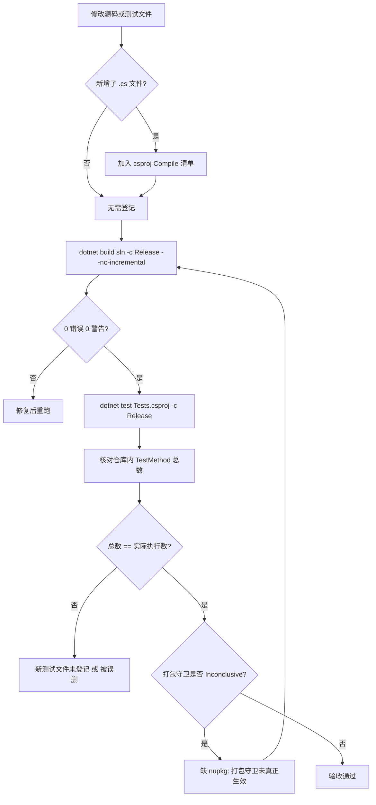

# 测试工程与运行方式

<cite>
**本文引用的文件**
- [Junevy.EasyCamera.Tests/Junevy.EasyCamera.Tests.csproj](file://Junevy.EasyCamera.Tests/Junevy.EasyCamera.Tests.csproj)
- [Junevy.EasyCamera.Tests/Properties/PlatformCompatibility.cs](file://Junevy.EasyCamera.Tests/Properties/PlatformCompatibility.cs)
- [Junevy.EasyCamera.Tests/Properties/AssemblyInfo.cs](file://Junevy.EasyCamera.Tests/Properties/AssemblyInfo.cs)
- [Directory.Packages.props](file://Directory.Packages.props)
- [global.json](file://global.json)
- [README.md](file://README.md)
- [AGENTS.md](file://AGENTS.md)
</cite>

## 目录
1. [工程定位与关键设置](#工程定位与关键设置)
2. [依赖包](#依赖包)
3. [条件引用](#条件引用)
4. [NoWarn 与其正当理由](#noWarn-与其正当理由)
5. [平台标注](#平台标注)
6. [运行与验收](#运行与验收)
7. [无硬件依赖是怎么做到的](#无硬件依赖是怎么做到的)
8. [构建测试流程](#构建测试流程)

## 工程定位与关键设置

| 设置 | 值 | 理由 |
| --- | --- | --- |
| 框架 | MSTest（`MSTest.TestAdapter` / `MSTest.TestFramework`） | 仓库既有选择 |
| `TargetFrameworks` | `net48;net8.0` | 与两个类库双目标对齐，两类宿主各验证一次 |
| `PlatformTarget` | `x64` | 海康/华睿 SDK 是 AMD64 专用；测试宿主必须与之一致，否则 `BadImageFormatException` |
| `LangVersion` | `latest` | 用到文件-scoped namespace、`new()`、switch 表达式等新语法 |
| `OutputType` / `IsTestProject` | `Library` / `true` | 测试工程不需要 exe；启用 VSTest 集成 |
| `CopyLocalLockFileAssemblies` | `true` | NuGet 包的运行时资产必须复制到输出目录，否则 net8.0 testhost 的依赖清单校验失败 |
| `GenerateAssemblyInfo` | `false` | 程序集特性手写在 `Properties/AssemblyInfo.cs`，避免与 SDK 自动生成冲突 |
| `EnableDefaultCompileItems` | `false` | 见下方"编译清单"警告 |

**章节来源**
- [Junevy.EasyCamera.Tests/Junevy.EasyCamera.Tests.csproj](file://Junevy.EasyCamera.Tests/Junevy.EasyCamera.Tests.csproj)

### 编译清单：这是本工程最大的坑

csproj 用一整段 `<ItemGroup>` 逐个列出 `<Compile Include>`（当前 24 个文件：16 个测试文件 + 6 个 `Mocks/` 替身 + 2 个 `Properties/` 文件）。文件被列进来才会被编译；没列进来的 `.cs` 文件**不产生任何错误**，只是安静地躺在磁盘上。

> [!danger]
> 新增测试文件后忘记加入清单，`dotnet test` 依然全绿、依然报 130/130，只是新用例一次都没跑。2026-10-06 审查发现的 `CameraServiceProbeTests.cs` 就是这样"绿色地缺席"了 6 个用例（实测当时仓库有 98 个 `[TestMethod]`、只执行 92 个），而 CHANGELOG 里当时写着"全量通过"。对应修复见 [[测试/测试]] 的"验收纪律"。

**章节来源**
- [Junevy.EasyCamera.Tests/Junevy.EasyCamera.Tests.csproj](file://Junevy.EasyCamera.Tests/Junevy.EasyCamera.Tests.csproj)

## 依赖包

版本由根目录 `Directory.Packages.props`（中央包管理）统一维护，测试工程不写 `Version`。

| 包 | 版本 | 用途 |
| --- | --- | --- |
| `Microsoft.NET.Test.Sdk` | 17.14.1 | 提供 testhost 与 VSTest 集成 targets |
| `MSTest.TestAdapter` / `MSTest.TestFramework` | 3.6.4 | 测试发现与执行；`TestClass` / `TestMethod` / `TestInitialize` / `TestCleanup` / `Assert` |
| `Microsoft.Extensions.DependencyInjection` (+ `.Abstractions`) | 8.0.0 | `ServiceCollectionExtensionsTests` 直接构造容器（不能只靠 Abstractions）与注册断言 |
| `Newtonsoft.Json` | 13.0.3 | **不是业务依赖**：SDK 10 的 testhost `additional-deps` 需要它解析，随测试输出落盘才能通过依赖校验 |
| `Microsoft.ApplicationInsights` | 2.22.0 | **不是业务依赖**：修 MSTest 3.x net8.0 testhost 依赖清单校验失败（该程序集未复制到输出目录） |
| `System.Drawing.Common` | 8.0.0 | 仅 net8.0；`IFrame.GetBitmap()` 返回 `Bitmap` |

后两项看起来突兀，但都是 testhost 侧的硬需求，不是可以随手删掉的冗余包。

**章节来源**
- [Junevy.EasyCamera.Tests/Junevy.EasyCamera.Tests.csproj](file://Junevy.EasyCamera.Tests/Junevy.EasyCamera.Tests.csproj)
- [Directory.Packages.props](file://Directory.Packages.props)

## 条件引用

net48 额外引用框架程序集（不是包）：`System`、`System.Core`、`System.Drawing`、`System.IO.Compression`、`System.IO.Compression.FileSystem`。后两个是 `PackageContentTests` 用 `ZipFile.OpenRead` 读 nupkg 所需的，net8.0 的共享框架已内置。

net8.0 额外引用 `System.Drawing.Common` 与 `Microsoft.ApplicationInsights`。

工程还无条件引用 `..\Libs\MvCameraControl.Net.dll`（带 `SpecificVersion=False`）——只为了能写出实现 `IDevice` / `IStreamGrabber` / `IFrameOut` / `IImage` 的桩件。桩件存在的意义是"不调用任何原生入口"，因此不需要相机硬件，也不需要厂商运行时。

**章节来源**
- [Junevy.EasyCamera.Tests/Junevy.EasyCamera.Tests.csproj](file://Junevy.EasyCamera.Tests/Junevy.EasyCamera.Tests.csproj)

## NoWarn 与其正当理由

```xml
<NoWarn>NU1605;SYSLIB0011;SYSLIB0050;CS0067</NoWarn>
```

| 码 | 为什么必须压 |
| --- | --- |
| `NU1605` | 降级还原告警，由中央包管理的解析结果决定，与本工程无关 |
| `SYSLIB0011` | `BinaryFormatter` 系列旧 API 的 obsoletion 提示，测试桩用不到 |
| `SYSLIB0050` | **构造 SDK 的 `FrameGrabbedEventArgs` 只能走 `FormatterServices.GetUninitializedObject`**：该类型没有公开构造器，桩件必须反射写它的私有 `_frame` 字段才能造出事件参数 |
| `CS0067` | 厂商 SDK 接口要求桩类型保留事件成员（如 `StreamExceptionEvent`），桩件里声明但不触发属预期 |

> [!warning]
> `SYSLIB0050` 压掉的是"该 API 已 obsoletion"的告警，不是编译错误。若哪天 SDK 换掉 `FrameGrabbedEventArgs` 的内部结构，反射写 `_frame` 会变成运行时空引用——那时桩件会静默失效，表现为 `Vendors/` 下的回调类用例全部失败。升级厂商 SDK 时优先跑这两个文件。

**章节来源**
- [Junevy.EasyCamera.Tests/Junevy.EasyCamera.Tests.csproj](file://Junevy.EasyCamera.Tests/Junevy.EasyCamera.Tests.csproj)
- [Junevy.EasyCamera.Tests/Vendors/HikVisionRegressionTests.cs](file://Junevy.EasyCamera.Tests/Vendors/HikVisionRegressionTests.cs)

## 平台标注

`Properties/PlatformCompatibility.cs` 只有六行，内容是 `#if NET8_0_OR_GREATER` 包住的 `[assembly: SupportedOSPlatform("windows")]`。net8.0 下测试代码会调用标注了 windows-only 的类库成员，不声明就会集体触发 CA1416。net48 没有平台标注体系，所以用条件编译隔开。

> [!tip]
> 放在独立文件而不是 csproj 的 `<AssemblyAttribute>` 项，是因为本工程（连同两个类库）都设了 `GenerateAssemblyInfo=false`——那会连带跳过 csproj 提供的 `<AssemblyAttribute>` 项，平台标注静默失效。同一个坑在两个类库上都踩过，见 [[故障排查/常见故障与误判]] 第 12 条。

**章节来源**
- [Junevy.EasyCamera.Tests/Properties/PlatformCompatibility.cs](file://Junevy.EasyCamera.Tests/Properties/PlatformCompatibility.cs)

## 运行与验收

```powershell
dotnet build .\Junevy.EasyCamera.sln -c Release -v:minimal --no-incremental
dotnet test .\Junevy.EasyCamera.Tests\Junevy.EasyCamera.Tests.csproj -c Release --logger "console;verbosity=minimal"
```

- `--no-incremental`：验收时强制全量重建，避免增量缓存掩盖问题。
- SDK 版本由 `global.json` 固定为 9.0.316，保证可复现。
- 期望结果：构建 0 错误 0 警告；net48 与 net8.0 各 149/149。
- `dotnet test` 会跑两个 TFM，因此日志里应出现两组相同的通过数。

打包守卫 `PackageContentTests` 需要 Release 构建产出的 `Junevy.EasyCamera/bin/**/Junevy.EasyCamera.*.nupkg`。找不到时断言为 **Inconclusive**（不计入失败，也不算通过）。要真正验证它，必须先跑完整 build。

> [!tip]
> 只跑 `dotnet test` 不跑 `dotnet build` 时，两条打包守卫会是 Inconclusive，报告里既不红也不绿。核对测试总数时把 Inconclusive 单独拎出来看，别把它当"通过"。

**章节来源**
- [README.md](file://README.md)
- [Junevy.EasyCamera.Tests/Packaging/PackageContentTests.cs](file://Junevy.EasyCamera.Tests/Packaging/PackageContentTests.cs)

## 无硬件依赖是怎么做到的

| 层次 | 替换手段 | 位置 |
| --- | --- | --- |
| 公共层实现 | 6 个替身（`MockCamera` / `MockFrame` / `MockCameraProvider` / `MockCameraInfo` / `FakeCameraInfo` / `FakeVendorProvider`） | `Mocks/` |
| 厂商 SDK | 私有嵌套桩件 `FakeDeviceInfo` / `FakeDevice` / `FakeStreamGrabber` / `FakeFrameOut` / `FakeImage`，另加 SDK 无关的 `RecordingStream` / `BlockingStream` / `ThrowingStream` | `Vendors/HikVisionRegressionTests.cs`、`Vendors/HikCameraStateTests.cs` |
| 原生 SDK 生命周期 | internal seam `HikCameraSdkSystem.SdkInitializeAction` / `SdkFinalizeAction`（`Func<int>`），经 `InternalsVisibleTo` 暴露 | `Vendors/HikCameraSdkSystemTests.cs`、`Common/EasyCameraBuilderTests.cs` |

各替身的职责与用法见 [[测试/回归清单与测试替身]]。结论是：**在没有相机、没有装 MVS 运行时的开发机上，`dotnet test` 应能全绿**。若某天发现测试必须在装好厂商运行时的机器上才能过，说明有人把真实 SDK 调用漏进了测试路径。

**章节来源**
- [Junevy.EasyCamera.Tests/Mocks/MockCamera.cs](file://Junevy.EasyCamera.Tests/Mocks/MockCamera.cs)
- [Junevy.EasyCamera.Tests/Vendors/HikVisionRegressionTests.cs](file://Junevy.EasyCamera.Tests/Vendors/HikVisionRegressionTests.cs)
- [Junevy.EasyCamera.Tests/Vendors/HikCameraStateTests.cs](file://Junevy.EasyCamera.Tests/Vendors/HikCameraStateTests.cs)
- [Junevy.EasyCamera.Tests/Vendors/HikCameraSdkSystemTests.cs](file://Junevy.EasyCamera.Tests/Vendors/HikCameraSdkSystemTests.cs)

## 构建测试流程



**图表来源**
- [Junevy.EasyCamera.Tests/Junevy.EasyCamera.Tests.csproj](file://Junevy.EasyCamera.Tests/Junevy.EasyCamera.Tests.csproj)
- [Junevy.EasyCamera.Tests/Packaging/PackageContentTests.cs](file://Junevy.EasyCamera.Tests/Packaging/PackageContentTests.cs)