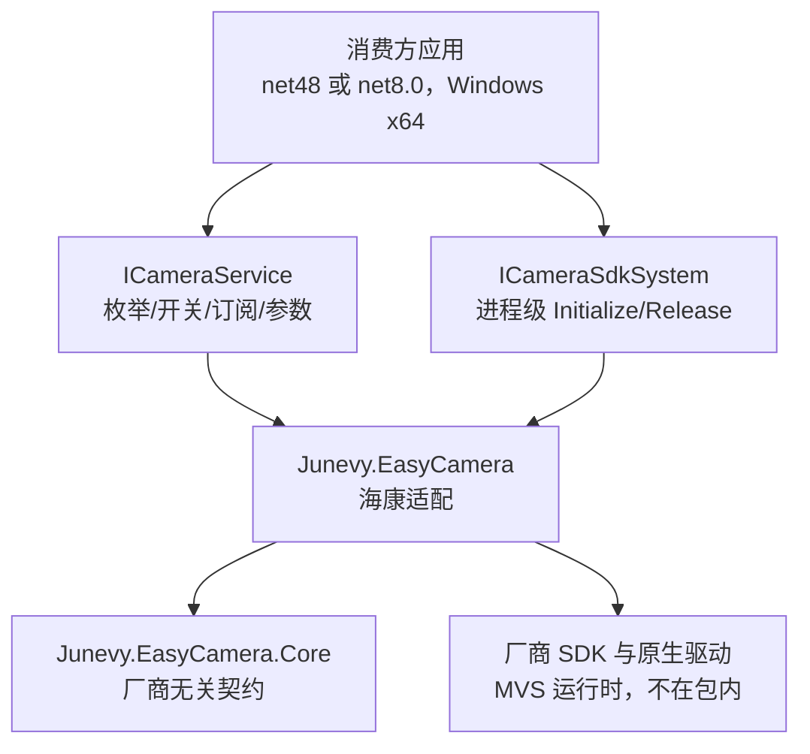

# 项目介绍与目标

<cite>
**本文引用的文件**   
- [README.md](file://README.md)
- [AGENTS.md](file://AGENTS.md)
- [CHANGELOG.md](file://CHANGELOG.md)
- [Junevy.EasyCamera.sln](file://Junevy.EasyCamera.sln)
- [Junevy.EasyCamera/Junevy.EasyCamera.csproj](file://Junevy.EasyCamera/Junevy.EasyCamera.csproj)
- [Junevy.EasyCamera.Core/Junevy.EasyCamera.Core.csproj](file://Junevy.EasyCamera.Core/Junevy.EasyCamera.Core.csproj)
- [Junevy.EasyCamera.Tests/Junevy.EasyCamera.Tests.csproj](file://Junevy.EasyCamera.Tests/Junevy.EasyCamera.Tests.csproj)
- [skills/using-junevy-easycamera/SKILL.md](file://skills/using-junevy-easycamera/SKILL.md)
</cite>

## 目录
1. [库定位与要解决的问题](#库定位与要解决的问题)
2. [品牌支持现状](#品牌支持现状)
3. [解决方案结构与工程分工](#解决方案结构与工程分工)
4. [使用侧视角](#使用侧视角)
5. [版本策略与包分发](#版本策略与包分发)
6. [验收基线与权威文档](#验收基线与权威文档)

## 库定位与要解决的问题

Junevy.EasyCamera 的定位是**工业相机统一操作类库**：以一套抽象封装不同品牌工业相机 SDK。它明确要解决三件事：

| 目标 | 含义 | 库内落点 |
|---|---|---|
| 快速接入 | 第三方项目用几个接口就能枚举、开关相机、订阅帧流、写参数 | `ICameraService` 门面 + `ICameraSdkSystem` |
| 无缝换硬件 | 业务代码只依赖接口，换品牌不改编业务 | `ICamera` / `ICameraProvider` 契约 + `ICameraInfo` 抽象 |
| 帧流可管理 | 帧的背压、丢弃、引用计数有统一规则，不泄漏 | `ICameraStream` + `CameraStream` + `IFrame` 引用计数 |

> [!tip]
> 消费方拿到的稳定面只有两个类型：`ICameraService`（业务操作）与 `ICameraSdkSystem`（进程级 SDK 生命周期）。其余抽象（`ICameraManager`、`IStreamManager`、`ICameraProvider`）主要服务于库内部装配与扩展厂商。

设计前提写在 `AGENTS.md`：厂商 SDK 底层多为 C++，存在大量非托管资源（图像 `IntPtr` 等），开发时必须严防泄漏；单帧图像常达 5MB+，性能上要求"少分配图像与非托管资源"，且帧克隆应深拷贝以免打满厂商缓存队列导致丢帧。

## 品牌支持现状

| 品牌 | 状态 | 说明 |
|---|---|---|
| 海康 HikVision | 可用 | 基于 `Libs/MvCameraControl.Net.dll`，含完整生命周期/并发回归测试 |
| 华睿 IRayple | 未完成 | `Vendors/IRayple/*` 全部类型标记 `[Obsolete("未开发完毕", true)]`；`EnableIRayple` 直接抛 `NotImplementedException`，运行时不可达 |
| Basler | 预留 | 仅在 `CameraOptions` 留开关，启用即抛 `NotImplementedException` |
| Cognex | 规划中 | 仅在 README 路线图中预留扩展点（未在代码中确认存在对应开关） |

IRayple 的"保留但加固"策略值得注意：代码未删除，并按与海康一致的纪律补齐了 `operationGate` 串行化原生访问、`LastError`、释放前排空在途回调、同一原生句柄只绑定一次帧回调等，因此未来补齐时不会重蹈并发缺陷。

## 解决方案结构与工程分工

解决方案含三个工程，均为 SDK 风格 csproj、双目标 `net48;net8.0`。

| 工程 | 角色 | 关键目录 | 目标平台 |
|---|---|---|---|
| `Junevy.EasyCamera.Core` | 契约层：厂商无关的抽象与服务契约 | `Abstractions/`（`ICamera`、`ICameraInfo`、`ICameraProvider`、`IVendorCameraProvider`、`ICameraStream`、`ICameraSdkSystem`、`IFrame`、`CameraResult`、`CameraLinkStatus`、`CameraInterfaceType`、`FrameStreamStatistics`、能力接口）、`Common/`（`ICameraService`、`ICameraManager`、`IStreamManager`、`IStreamOptions`、`BackpressureMode`、`CameraRemoveStatus`、`ParameterReader`） | 双目标，未设 `PlatformTarget` |
| `Junevy.EasyCamera` | 实现层：厂商适配与公共实现 | `Common/`（`CameraService`、`CameraManager`、`StreamManager`、`CameraStream`、`CameraStreamSubscriber`、`AggregateCameraProvider`、`CompositeCameraSdkSystem`、`EasyCamera`/`EasyCameraBuilder`/`EasyCameraHost`、`StreamOptions`）、`Extensions/`（`ServiceCollectionExtensions`、`CoreServiceCollectionExtensions`、`CameraOptions`）、`Vendors/HikVision/*`、`Vendors/IRayple/*` | `PlatformTarget=x64` |
| `Junevy.EasyCamera.Tests` | 测试工程：MSTest，回归与并发守卫 | `Abstractions/`、`Common/`、`Extensions/`、`Vendors/`、`Mocks/`、`Packaging/` | `PlatformTarget=x64`（测试宿主必须 x64） |

`Libs/` 目录存放厂商 SDK 的托管封装（`MvCameraControl.Net.dll`、`MVSDK_Net.dll`），全部工程统一从该目录引用，保证构建自包含。

> [!warning]
> `Extensions/CoreServiceCollectionExtensions.cs` 并不是独立文件：`CoreServiceCollectionExtensions` 类与 `ServiceCollectionExtensions` 同处 `Junevy.EasyCamera/Extensions/ServiceCollectionExtensions.cs`，命名空间为 `Junevy.EasyCamera.Core.Extensions`（沿用旧命名空间以维持对外契约）。

## 使用侧视角



**图表来源**
- [README.md](file://README.md)
- [AGENTS.md](file://AGENTS.md)
- [Junevy.EasyCamera/Common/CameraService.cs](file://Junevy.EasyCamera/Common/CameraService.cs)
- [Junevy.EasyCamera/Vendors/HikVision/HikCameraSdkSystem.cs](file://Junevy.EasyCamera/Vendors/HikVision/HikCameraSdkSystem.cs)

Core 不引用任何厂商 SDK，实现层引用 Core + 厂商 SDK，依赖方向严格单向，详见 [[架构设计/整体架构概览]]。

## 版本策略与包分发

- 当前版本 **1.2.0**；`PackageVersion`（csproj `<Version>`）与 `AssemblyVersion`/`FileVersion`（手写 `Properties/AssemblyInfo.cs`，值 `1.2.0.0`）已同步，两个类库一致。**本库版本共四处必须同步**：`Junevy.EasyCamera.csproj` 与 `Junevy.EasyCamera.Core.csproj` 各自的 `<Version>`，以及两个类库各自的 `Properties/AssemblyInfo.cs`；`Directory.Packages.props` 只管第三方包版本。此外 `skills/using-junevy-easycamera/SKILL.md` 的 frontmatter `description` 带版本提示（如 `v1.1.1+`），发版时一并更新。
- 主包 `Junevy.EasyCamera` 的 nuspec 声明对 `Junevy.EasyCamera.Core` 的**同版本**依赖，两个包必须一起发、一起升（本地 feed 验证时也要同时放入两个 nupkg，见 [[构建与发布/消费方端到端验证]]）。
- 版本递增是硬性要求：NuGet 按 `id + version` 缓存，同版本重发不会被消费方采用，修复打包类问题必须升版本并在升级说明里写明"清理缓存"。
- 1.1.1 的核心变更：厂商**托管**封装（`MvCameraControl.Net.dll`、`MVSDK_Net.dll`）打进 NuGet 包的 `lib/net48` 与 `lib/net8.0`，消费方只需正常 `PackageReference`，不需要手工拷 DLL。
- 厂商**原生**驱动（如 `MvCameraControl.dll`）**不在包内**，属消费方环境前置条件，详见 [[项目概述/运行与安装前置条件]]。

## 验收基线与权威文档

验收命令（来自 `AGENTS.md`）：

```powershell
dotnet build .\Junevy.EasyCamera.sln -c Release -v:minimal --no-incremental
dotnet test .\Junevy.EasyCamera.Tests\Junevy.EasyCamera.Tests.csproj -c Release --logger "console;verbosity=minimal"
```

验收基线（2026-10-09，1.2.0 验收修正后）：全量重建 0 错误 0 警告；net48 与 net8.0 各 **149/149** 通过（仓库内 `[TestMethod]` 计数为 149，与执行数一致）。

关键文档：`README.md`（现状/快速上手/推荐用法/链路状态）、`AGENTS.md`（开发约定、并发纪律、公共契约要点）、`CHANGELOG.md`（逐版本变更与验收）、`skills/using-junevy-easycamera/SKILL.md`（面向消费方 Agent 的包使用说明书）、`docs/` 下三份审查报告（`代码审查报告-2026-10-06.md`、`代码审查报告-2026-10-05.md`、`稳定性审查报告-2026-09-15.md`）。

**章节来源**
- [README.md](file://README.md)
- [AGENTS.md](file://AGENTS.md)
- [CHANGELOG.md](file://CHANGELOG.md)
- [skills/using-junevy-easycamera/SKILL.md](file://skills/using-junevy-easycamera/SKILL.md)
- [docs/代码审查报告-2026-10-06.md](file://docs/代码审查报告-2026-10-06.md)
- [Junevy.EasyCamera.sln](file://Junevy.EasyCamera.sln)
- [Junevy.EasyCamera.Tests/Junevy.EasyCamera.Tests.csproj](file://Junevy.EasyCamera.Tests/Junevy.EasyCamera.Tests.csproj)
